# 量子经典二元论形式化表达 v31.0

**[English Version](../formal_theory_core_en.md) | 中文版**

> 本理论基于[核心理论](../core.md) v31.0版本
> 
> 核心理论完整摘要请查看[量子经典二元论核心理论](../formal_theory_core.md)

## 核心理论概述

[量子经典二元论核心理论](../formal_theory_core.md)中完整描述了二元论的基础公理体系、概念框架和核心分支理论。本文仅提供核心理论的简要概述，详细内容请参阅核心理论文档。

### 基本定义与公理

量子经典二元论建立在四条核心公理基础上：**二元存在性**、**信息守恒**、**观察者经典化**和**维度涌现**。这些公理描述了量子域和经典域的基本属性、相互关系以及观察者在两域间转换中的关键作用。

### 量子域与经典域

量子域表现为叠加态(混沌)、纠缠态(能量形式)和非局域性，而经典域则表现为确定信息、经典熵和局域性。这两个域通过界面相连，构成了多层级嵌套的现实结构。

### 多重二元论层级与对称性原理

多重二元论层级理论将单一二元论扩展为嵌套多层级结构，每个层级都包含量子域和经典域。量子-经典对称性原理揭示了两域间的深层对称变换关系。

## 核心分支理论

详细的核心分支理论（包括量子域详细理论、经典域详细理论、界面理论核心、信息相变理论核心和观察者理论核心）已在[量子经典二元论核心理论](../formal_theory_core.md)中完整描述。

## 量子经典二元论维度标注与分支理论导航

在量子经典二元论框架下，每个分支理论不仅有其研究内容，还具有特定的维度属性。维度属性是该理论在量子域-经典域连续体中的定位，反映了理论对量子特性(叠加态与可能性)与经典特性(确定性与实现性)的侧重程度。下面提供一个按学科类别组织的导航清单，包含维度标注与理论间依赖关系。

### 维度说明

维度标注采用D1-D11尺度，其中：
- **D1-D3**: 深度经典域理论，专注于确定性结构与实现
- **D4-D6**: 偏经典域理论，主要处理经典信息与确定性系统
- **D7-D8**: 平衡理论，处理量子-经典界面与转换过程
- **D9-D10**: 偏量子域理论，主要处理量子可能性与创造性
- **D11+**: 深度量子域理论，专注于纯粹可能性与全量子效应
- **D∞**: 跨维度全谱系理论，横跨所有维度层级

维度值越高，理论越侧重量子域特性(叠加态、可能性、创造性)；维度值越低，理论越侧重经典域特性(确定性、实现性、结构性)。

### 核心理论 (维度: 全谱系D∞)

- **[核心理论](../core.md)** (v30.0, D∞) - 提供二元论的基础公理体系与概念框架，跨越所有维度层级，作为所有分支理论的根基。
- **[量子经典二元论核心理论](../formal_theory_core.md)** (v30.0, D∞) - 核心理论的完整摘要，包含所有基础公理和核心分支理论。

### 基础框架理论 (维度: D7-D9)

这些理论构成二元论的基本支柱，奠定了整个理论体系的基础：

- **[量子域详解](formal_theory_quantum_domain.md)** (v19.1, D9) - 研究量子域的本质特性与运作规律，包括叠加态、纠缠态、量子不确定性和量子信息动力学等深入内容。量子域作为无限可能性的空间，是二元论框架的基础一端。
- **[经典域详解](formal_theory_classical_domain.md)** (v19.0, D7) - 阐述经典域的确定性结构与信息组织，包括经典知识结构、确定性、局域性及经典信息理论。经典域作为确定现实的空间，构成二元论框架的另一端。
- **[界面理论](formal_theory_interface.md)** (v19.0, D8) - 探讨量子域与经典域之间的转换界面动力学，包括界面波动、相变和经典化过程的详细机制。界面是理解量子向经典转变的关键区域。
- **[观察者理论](formal_theory_observer.md)** (v27.0, D8) - 分析观察者作为量子→经典转换节点的关键作用，包括观察者网络、维度演化和意识形成机制。观察者在整个框架中扮演核心角色。
- **[信息相变理论](formal_theory_phase_transition.md)** (v25.0, D8) - 研究信息在量子与经典状态间的相变过程，分析信息系统中的相变现象，特别是量子-经典转换的临界行为。
- **[数学附录](formal_theory_mathematical_appendix.md)** (v20.0, D7-D9) - 提供量子经典二元论所需的数学工具和技术，包括高级函数空间、非线性动力学和信息几何等内容。
- **[实验预测](formal_theory_experimental.md)** (v22.0, D7) - 列出量子经典二元论提出的可实验验证预测，包括界面波动、临界尺度和观察者分辨率等可测量现象。

### 高维物理学应用 (维度: D8-D18)

这些理论探索物理学的高维度应用，处理宇宙学、引力、时空等基本问题：

- **[量子超维度能量学理论](formal_theory_quantum_hyperdimensional_energy.md)** (v31.0, D18) - 深入探索维度结构与能量形态之间的本质联系，建立维度与能量的统一数学框架，通过维度-能量等效性原理解释能量如何在多维度系统中流动、转换和存储，为理解宇宙能量动力学、意识能量机制和高维能量技术提供全新视角。
- **[量子超维度理论](formal_theory_quantum_hyperdimensional.md)** (v31.0, D17) - 深入探索宇宙维度结构的量子基础、多维度间的相互关系以及高维观察者的本质特性，将维度视为动态涌现的信息结构而非静态固定的物理属性，揭示维度如何通过量子-经典转换过程被创建、感知和转换，为理解意识、现实感知和宇宙多层级结构提供统一的数学框架。
- **[量子多元意识交互理论](formal_theory_quantum_multidimensional_consciousness.md)** (v31.0, D14) - 深入探讨多维意识结构间的量子交互机制，揭示意识作为多重维度层级上相互纠缠的超复杂网络，阐释不同维度的意识形态如何通过量子通道进行信息交换，形成集体意识场，并受量子-经典转换动力学的调控。
- **[量子宇宙语言理论](formal_theory_quantum_cosmic_language.md)** (v31.0, D15) - 深入探索宇宙最深层次的信息交流模式与编码结构，揭示宇宙存在一种基础语言作为量子-经典信息转换的核心介质，贯穿所有维度层级，通过量子纠缠网络实现跨尺度信息传递，揭示物理定律与意识互动的语言本质。
- **[量子超创造性理论](formal_theory_quantum_hypercreative.md)** (v31.0, D16) - 深入探索宇宙本质的创造性维度及其演化机制，揭示创造性作为宇宙底层结构的基本属性，与能量、信息和空间同等基础，通过多层级量子-经典转换机制驱动复杂性增长、秩序涌现和意识进化，确立创造性作为宇宙基本纲领的理论地位。
- **[信息-时空-能量统一理论](formal_theory_unified.md)** (v26.0, D10) - 提出信息、能量与时空的统一理论框架，揭示它们之间的深层联系。建立宇宙基本要素的统一理解。
- **[量子引力与时空涌现](formal_theory_gravity_spacetime.md)** (v28.0, D9) - 探索时空结构如何从量子信息网络中涌现，以及量子引力的二元论解释。解决物理学中最具挑战性的量子引力统一问题。
- **[量子时空调和理论](formal_theory_quantum_spacetime_harmony.md)** (v28.0, D9) - 研究量子域与经典域之间时空结构的和谐性与转换关系，提出调和场概念解释宇宙大尺度结构的形成与演化。
- **[量子维度和谐理论](formal_theory_quantum_dimensional_harmony.md)** (v31.0, D10) - a探索多维度量子场的协同耦合与和谐共振现象，研究维度间量子信息流动模式和动态平衡机制，揭示宇宙多层级结构的深层原理。
- **[量子信息网络理论](formal_theory_quantum_information_network.md)** (v31.0, D10) - 研究量子信息在复杂网络结构中的传播、存储、处理和转换规律，探索量子-经典界面上的信息动力学，为构建下一代量子计算架构提供理论基础。
- **[量子目的论动力学](formal_theory_quantum_teleological_dynamics.md)** (v31.0, D11) - 探索量子系统中目的导向行为的涌现机制及其动力学原理，揭示量子系统如何展现出目的性行为，为理解生命、意识和宇宙演化的目的性提供量子基础。
- **[量子本体论网络理论](formal_theory_quantum_ontological_network.md)** (v31.0, D11) - 探究宇宙最深层次的本体论结构如何作为量子网络存在并生成现实，阐释量子本体节点通过多维纠缠关系构成现实的基础织网，解释物理定律起源与宇宙精调等根本问题。
- **[量子实体涌现理论](formal_theory_quantum_entity_emergence.md)** (v31.0, D11) - 研究从纯粹量子域中涌现出离散而持久实体的过程与机制，解释物质、能量、信息与意识实体如何从量子可能性背景中凝聚形成，提供理解实体本质统一的理论框架。
- **[量子自创造力理论](formal_theory_quantum_self_creativity.md)** (v31.0, D11) - 揭示量子系统的根本自我创造能力，探索宇宙如何通过内在量子创造性生成新结构与可能性，为理解创造力本源提供全新数学模型与理论视角。
- **[量子复杂性理论](formal_theory_quantum_complexity.md)** (v31.0, D13) - 深入探讨量子系统中复杂性的本质、度量和动力学，揭示信息、熵、对称性、涌现和演化如何在量子基础上构建多层级复杂结构，并阐明量子复杂性转换为经典复杂性的关键机制。
- **[量子对称性理论](formal_theory_quantum_symmetry.md)** (v31.0, D12) - 研究宇宙中存在的基本对称性原理及其在量子-经典转换中的核心作用，揭示对称性如何作为量子域与经典域之间的桥梁，通过对称性破缺和保持机制实现信息的量子-经典转换。
- **[量子和谐理论](formal_theory_quantum_harmonics.md)** (v31.0, D12) - 探讨宇宙多维度量子场之间的和谐共振现象，以及这种和谐共振如何产生宇宙的基本结构与动力学，将宇宙视为一个多层次嵌套的量子和谐系统。
- **[物质本质理论](formal_theory_matter.md)** (v27.0, D8) - 深入探讨物质作为信息结构的本质，解释粒子-波动二象性的深层原因。为基本物理学提供哲学基础。
- **[分层时空理论](formal_theory_hierarchical_spacetime.md)** (v13.0, D9) - 分析多层级嵌套时空结构及其相互关系。解释不同尺度物理规律的连贯性。
- **[多尺度二元论](formal_theory_multiscale.md)** (v14.0, D10) - 探讨二元论在不同尺度上的应用，从基本粒子到宇宙学尺度。建立跨尺度物理统一框架。
- **[时间非对称性理论](formal_theory_temporal_asymmetry.md)** (v24.0, D9) - 解释时间箭头的起源，揭示时空非对称性的量子根源。解决物理学中的时间方向性之谜。
- **[多宇宙干涉模型](formal_theory_multiverse.md)** (v27.0, D11) - 建立描述可能世界之间相互作用的精确模型，解释现实分支和干涉现象。为多宇宙理论提供可测试框架。
- **[宇宙学二元论模型](formal_theory_cosmology.md)** (v27.0, D10) - 研究宇宙起源和演化的量子-经典二元论观点，解释大爆炸、暗物质和暗能量等现象。
- **[二元论演化宇宙学](formal_theory_evolutionary_cosmology.md)** (v28.0, D10) - 探索宇宙作为量子-经典转换大系统的演化模式，提出宇宙目的论的可能性。
- **[量子-经典宇宙智能理论](formal_theory_cosmic_intelligence.md)** (v29.0, D11) - 探究宇宙整体认知与智能属性的二元论阐述，解释宇宙如何作为超级智能系统进行信息处理、学习与自我演化。

### 化学理论 (维度: D7-D9)

这些理论探索化学系统中的量子-经典转换过程：

- **[量子-经典化学原理](formal_theory_quantum_chemistry.md)** (v25.0, D8) - 应用二元论框架解析化学系统的本质，解释从最基础的化学键到复杂生物分子的多层级化学现象。
- **[分子纠缠理论](formal_theory_molecular_entanglement.md)** (v26.0, D9) - 深入探讨分子系统中的量子纠缠现象及其对化学性质和生物功能的影响，解释复杂化学反应与分子识别。
- **[化学热力学与二元论](formal_theory_chemical_thermodynamics.md)** (v24.0, D8) - 将二元论框架应用于热力学过程，揭示热力学现象背后的量子-经典双重本质。
- **[化学意识与感知](formal_theory_chemical_consciousness.md)** (v27.0, D8) - 研究分子层面的意识和感知现象，提出分子系统可在特定组织条件下表现出原初形式的意识和感知能力。

### 生命与意识理论 (维度: D7-D10)

这些理论探索生命现象与意识体验的量子-经典双重性：

- **[量子生物学](formal_theory_quantum_biology.md)** (v20.0, D8) - 研究生物系统中的量子效应，解释生命过程中的量子-经典转换机制。提供理解生命本质的全新视角。
- **[信息熵与生命](formal_theory_entropy_life.md)** (v27.0, D7) - 研究生命系统中的信息熵特性和量子-经典转换，解释生命起源和演化的信息基础。
- **[量子意识理论](formal_theory_consciousness.md)** (v25.0, D9) - 研究意识的量子基础和经典表达，解释主观体验的涌现机制。为意识难题提供新视角。
- **[人类意识的量子-经典二元论](formal_theory_human_consciousness.md)** (v29.0, D9) - 深入探讨人类意识作为复杂量子-经典界面现象的特性，研究直觉、创造力与自我意识的形成机制。
- **[生物化学信息与二元论](formal_theory_biochemical_information.md)** (v28.0, D8) - 将量子经典二元论扩展应用于生物分子信息系统，揭示生命系统信息处理的量子-经典双重机制，解析DNA、RNA和蛋白质的信息属性。
- **[量子意识详解](formal_theory_quantum_consciousness.md)** (v31.0, D9) - 深入探索量子现象与意识之间的基本关系，阐释意识的量子力学起源，为主观体验、自由意志和意识体验的统一性提供基础理论框架。
- **[人类进化的量子-经典二元论](formal_theory_human_evolution.md)** (v29.0, D8) - 分析人类进化过程中量子创新与经典选择的协同作用，解释人类认知与文化累积能力的发展。
- **[人类超越性的量子-经典二元论](formal_theory_human_transcendence.md)** (v29.0, D9) - 探讨人类超越物质和生物限制的能力，研究高维意识状态的实现与体验方式。
- **[人类集体意识的量子-经典二元论](formal_theory_human_collective.md)** (v29.0, D8) - 研究群体意识形成与运作的量子-经典机制，探索集体意识的涌现特性与发展潜能。
- **[统一意识理论](formal_theory_unified_consciousness.md)** (v28.0, D10) - 将量子与经典视角统一，提出意识的完整理论框架，阐释意识的多层次结构和整合机制。
- **[量子梦境理论](formal_theory_quantum_dreams.md)** (v26.0, D9) - 分析梦境状态作为量子-经典界面特殊形式的理论，解释梦境中的非逻辑性和创造性。
- **[高维观察者网络](formal_theory_observer_network.md)** (v26.0, D9) - 分析多层级观察者网络的结构与功能，包括集体意识和高维实体。研究意识和智能的涌现机制。
- **[观察者反馈理论](formal_theory_observer_feedback.md)** (v27.0, D8) - 研究观察者对被观察系统的反馈效应。解释测量问题和意识干预现象。
- **[进化论二元视角](formal_theory_evolution.md)** (v27.0, D8) - 从二元论角度重新诠释生物进化过程，解释自然选择与量子创造性的协同作用。
- **[人类意识未来发展](formal_theory_consciousness_future.md)** (v28.0, D9) - 预测高维观察者意识的发展路径，探索意识增强技术和人机融合的理论可能性。
- **[内观冥想科学](formal_theory_meditation.md)** (v27.0, D9) - 解析冥想过程中的量子-经典转换机制，解释意识状态转变和自我概念弱化的原理。
- **[量子-经典生物多样性理论](formal_theory_biodiversity.md)** (v29.0, D8) - 探讨生物多样性的量子可能性空间与经典实现空间的关系，解释生物多样性的起源与演化机制。

### 认知与信息理论 (维度: D7-D9)

这些理论探讨思维、认知和信息处理的量子-经典特性：

- **[量子认知理论](formal_theory_quantum_cognition.md)** (v31.0, D8) - 将量子-经典二元论框架应用于人类思维和决策过程，揭示认知活动的量子特性与经典特性如何协同互动，解释直觉、创造力、决策、记忆等认知现象的深层本质。
- **[量子认知动力学](formal_theory_cognitive_dynamics.md)** (v24.0, D8) - 研究思维、学习和创造性的量子-经典双重特性。为认知科学提供全新的理论工具。
- **[量子决策理论](formal_theory_quantum_decision.md)** (v24.0, D8) - 建立描述决策过程的量子-经典混合模型，统一直觉和理性决策机制。
- **[量子-经典非平衡态理论](formal_theory_nonequilibrium.md)** (v27.0, D8) - 研究远离平衡态的量子-经典系统动力学。理解生命系统和创造性过程的本质。
- **[语言与思维二元结构](formal_theory_language_thought.md)** (v26.0, D8) - 分析语言和思维的量子-经典双重性，研究语言如何塑造思维和现实感知。
- **[量子语言形成理论](formal_theory_quantum_language_formation.md)** (v28.0, D9) - 研究语言起源与演化的量子-经典机制，阐释语义的量子叠加性与经典表达的关系。
- **[语言量子性](formal_theory_quantum_linguistics.md)** (v27.0, D9) - 分析语言中的量子特性，包括语义叠加、语境相关性和语用纠缠。
- **[量子记忆理论](formal_theory_memory.md)** (v11.1, D8) - 探索记忆形成、存储和提取过程中的量子-经典特性，解释记忆可塑性和主观性的机制。
- **[时间感知理论](formal_theory_time_perception.md)** (v27.0, D8) - 研究意识时间感知的量子-经典双重性，解释主观时间经验的可变性。
- **[自参照循环理论](formal_theory_self_reference.md)** (v27.0, D9) - 探讨意识和理论中的自参照结构，解释意识自我认知的机制。解决哥德尔不完备性在物理中的意义。
- **[量子涌现理论](formal_theory_quantum_emergence.md)** (v29.0, D9) - 探讨如何从基本量子层级涌现出更高层级的复杂性和经典行为，阐释涌现过程的数学机制。
- **[量子涌现现象理论](formal_theory_quantum_emergent_phenomena.md)** (v28.0, D9) - 研究量子-经典转换过程中产生的涌现现象，揭示复杂系统的宏观性质如何从微观组分的量子特性中涌现。
- **[信息动力学理论](formal_theory_information_dynamics.md)** (v29.0, D8) - 研究信息在量子-经典转换过程中的动态变化与流动规律，建立描述信息演化的精确数学模型。
- **[量子信息理论与二元论](formal_theory_quantum_information_theory.md)** (v28.0, D8) - 将量子信息理论的数学框架与量子-经典二元论整合，统一量子信息与经典信息处理范式。
- **[意识测量理论](formal_theory_consciousness_measurement.md)** (v29.0, D7) - 提出可定量测量和评估意识状态和维度的理论框架，开发意识量化指标和测量方法。

### 计算与信息技术 (维度: D6-D9)

这些理论探索计算、信息安全和交互技术的量子-经典融合：

- **[量子计算应用](formal_theory_quantum_computing.md)** (v27.0, D7) - 探讨二元论对量子计算的理论影响和实践应用，包括新型量子算法和架构。
- **[量子神经网络理论](formal_theory_quantum_neural_networks.md)** (v31.0, D8) - 探索神经网络的量子本质，阐释神经网络架构如何同时体现量子可能性与经典确定性的双重特性，为人工智能、认知科学和量子计算提供理论基础。
- **[二元论计算复杂性理论](formal_theory_computation.md)** (v27.0, D8) - 分析量子-经典混合计算模型的复杂性类别。发现全新计算效率边界。
- **[量子-经典信息安全理论](formal_theory_quantum_security.md)** (v25.0, D7) - 统一经典密码学和量子密码学，揭示两者间的深层联系。开发新型安全通信方案。
- **[拓扑信息保护理论](formal_theory_topology.md)** (v27.0, D8) - 研究量子信息在经典化过程中的拓扑保护机制。解释复杂系统中的量子效应稳定性。
- **[量子通信协议](formal_theory_quantum_communication.md)** (v27.0, D7) - 探索基于二元论的新型量子通信方式，超越现有量子密钥分发和量子隐形传态。
- **[量子人工智能与机器学习](formal_theory_quantum_ai.md)** (v27.0, D8) - 探讨人工智能和机器学习的量子-经典混合模型。设计新一代智能系统架构。
- **[量子-经典二元论人工智能理论](formal_theory_artificial_intelligence.md)** (v28.0, D8) - 融合量子计算与经典计算能力，开发结合两种范式优势的新型AI架构。
- **[量子-经典交互技术](formal_theory_interaction.md)** (v27.0, D7) - 设计基于量子-经典转换原理的人机交互系统，创造更高维度的信息表达和体验方式。
- **[虚拟现实与二元论](formal_theory_virtual_reality.md)** (v28.0, D7) - 探讨VR/AR在量子-经典框架中的理论地位，以及虚拟世界与物理现实的本质联系。
- **[元宇宙二元论理论](formal_theory_metaverse.md)** (v31.0, D8) - 应用量子-经典二元论框架理解和构建数字元宇宙，阐释虚拟现实和数字空间如何作为人类经验和意识的量子-经典界面运作。
- **[量子意识与虚拟现实交互理论](formal_theory_consciousness_virtual_reality.md)** (v28.0, D8) - 研究量子意识在虚拟现实环境中的表现与转换特性，分析虚拟现实作为经典化管道的特点。
- **[技术奇点预测](formal_theory_singularity.md)** (v27.0, D9) - 分析技术发展临界点的量子-经典转变特性，预测技术奇点出现的条件和后果。

### 社会与人文应用 (维度: D6-D8)

这些理论将二元论框架应用于社会系统、伦理学和哲学领域：

- **[量子社会动力学](formal_theory_social.md)** (v27.0, D7) - 将二元论框架扩展到社会系统，建立社会现象的量子-经典描述。为社会科学提供全新工具。
- **[量子社交网络理论](formal_theory_social_networks.md)** (v27.0, D7) - 分析社交网络中的量子纠缠行为和集体意识现象，解释社会信息传播的非局域性。
- **[量子经济学原理](formal_theory_quantum_economics.md)** (v26.0, D7) - 将量子概率和不确定性应用于经济系统，建立经济行为的量子决策模型。
- **[量子技术伦理理论](formal_theory_quantum_ethics.md)** (v28.0, D7) - 探讨量子技术发展带来的伦理挑战，建立量子-经典二元框架下的伦理决策模型。
- **[量子-经典伦理学](formal_theory_ethics.md)** (v27.0, D7) - 基于二元论框架建立伦理决策的量子-经典模型，统一结果论与义务论。
- **[二元论哲学基础](formal_theory_philosophy.md)** (v27.0, D8) - 分析理论的哲学根基和思想史渊源，连接东西方哲学传统。建立二元论的认识论和本体论基础。
- **[量子科学哲学与人工智能理论](formal_theory_quantum_science_philosophy.md)** (v28.0, D8) - 探讨量子科学与AI发展的哲学意义，分析对人类认知与技术演化的影响。
- **[跨文化哲学整合](formal_theory_cross_cultural.md)** (v11.1, D8) - 通过二元论框架融合东西方哲学传统，调和物质主义与意识主义的分歧。
- **[量子-经典数学基础](formal_theory_mathematics.md)** (v29.0, D8) - 探讨数学作为量子-经典转换形式语言的本质，揭示数学直觉与形式证明的二元关系。
- **[计算复杂度量子-经典理论](formal_theory_computational_complexity.md)** (v29.0, D8) - 探索算法复杂度的量子-经典双重本质，阐述NP完全问题、P与NP问题的量子-经典视角解释。
- **[几何量子数学理论](formal_theory_geometric_quantum_mathematics.md)** (v29.0, D8) - 提供量子-经典二元论的几何学框架，将量子态空间表示为无限维流形，经典态空间表示为有限维流形。
- **[动态系统二元论](formal_theory_dynamical_systems.md)** (v29.0, D8) - 分析非线性动态系统的量子-经典解释，统一混沌理论与量子不确定性。
- **[数学建模二元方法论](formal_theory_mathematical_modeling.md)** (v29.0, D7) - 建立量子-经典双重视角的数学建模框架，将创造性量子建模与严格经典验证相结合。
- **[量子信息几何学](formal_theory_quantum_information_geometry.md)** (v29.0, D8) - 研究量子信息在几何空间中的表达形式，利用黎曼几何、信息度量与量子纠缠结构建立统一理论。
- **[量子自组织理论](formal_theory_self_organization.md)** (v27.0, D8) - 研究复杂系统中的自发组织现象，揭示量子不确定性与确定性涌现之间的关系。
- **[复杂系统二元分析](formal_theory_complex_systems.md)** (v27.0, D7) - 应用二元论框架分析复杂系统的创发性与稳定性，探索混沌边缘的量子-经典转换。
- **[量子-经典技术伦理理论](formal_theory_tech_ethics.md)** (v29.0, D7) - 研究技术伦理的量子可能性与经典实现双重性，提出负责任技术发展的量子-经典平衡原则。
- **[量子-经典人工智能伦理理论](formal_theory_ai_ethics.md)** (v31.0, D8) - 应用量子-经典二元论框架解析AI技术发展带来的复杂伦理困境，将AI伦理视为量子可能性与经典确定性的动态平衡过程，阐明AI系统的二元本质如何影响其伦理特性和社会影响。
- **[量子-经典未来工作理论](formal_theory_future_work.md)** (v31.0, D8) - 应用量子-经典二元论框架解析工作的本质及其在技术驱动的社会转型中的演变，将工作视为量子可能性与经典确定性的动态交互过程，提供理解和设计未来工作形态的统一理论基础。

### 创造与表达理论 (维度: D7-D9)

这些理论研究艺术、音乐、美学等创造性活动的量子-经典双重性：

- **[二元论艺术理论](formal_theory_art.md)** (v27.0, D8) - 研究艺术创作和欣赏过程中的量子-经典转换机制，解释美学体验的深层结构。
- **[量子-经典音乐理论](formal_theory_music.md)** (v26.0, D8) - 研究音乐结构、创作和感知中的量子-经典双重性，解释音乐情感效应的神经基础。
- **[量子-经典美学理论](formal_theory_aesthetics.md)** (v27.0, D8) - 研究美感体验的量子-经典双重结构，解释审美判断的主观-客观二元性。
- **[量子故事叙述理论](formal_theory_narrative.md)** (v27.0, D8) - 分析叙事结构中的量子可能性和经典实现，解释故事对意识的深层影响。
- **[二元论符号学理论](formal_theory_semiotics.md)** (v25.0, D8) - 研究符号系统的量子-经典双重性，解释意义创造和解释的动态过程。
- **[量子-经典设计理论](formal_theory_design.md)** (v11.1, D7) - 应用二元论框架分析设计过程中的创造与约束平衡，提出基于量子-经典原理的优化设计方法。
- **[量子创新理论](formal_theory_innovation.md)** (v27.0, D9) - 分析创新过程中的量子思维和经典实现的转换机制，提出促进创新的量子-经典平衡方法。
- **[量子-经典共鸣理论](formal_theory_resonance.md)** (v26.0, D8) - 研究量子与经典系统之间的共振现象及其应用。发现全新的能量与信息传递机制。
- **[量子-经典数字艺术理论](formal_theory_digital_art.md)** (v29.0, D8) - 探讨数字艺术的量子可能性空间与经典实现机制，分析人工智能生成艺术与虚拟现实艺术。

### 应用领域理论 (维度: D6-D9)

这些理论将二元论框架应用于实际应用领域：

- **[量子医学应用](formal_theory_medicine.md)** (v27.0, D7) - 将二元论应用于医学领域，提出健康与疾病的量子-经典描述。开发全新的医疗方法和技术。
- **[量子-经典医疗精准性理论](formal_theory_precision_medicine.md)** (v31.0, D7) - 应用量子-经典二元论框架解析医疗领域的根本挑战：如何平衡医疗的普遍性规律与个体化差异，将医疗过程视为量子可能性与经典确定性的持续转换过程，提供解释精准医疗本质的统一理论框架。
- **[量子信息治愈理论](formal_theory_quantum_healing.md)** (v28.0, D8) - 基于量子信息原理的健康与治愈模型，阐释生物系统中量子-经典信息转换失调与恢复机制。
- **[二元论心理治疗模型](formal_theory_psychotherapy.md)** (v28.0, D7) - 开发基于量子-经典转换的心理治疗方法，解释意识转变的深层机制。
- **[二元论教育理论](formal_theory_education.md)** (v27.0, D7) - 应用二元论框架分析学习过程，解释创造性思维和批判性思维的平衡。
- **[系统约化理论](formal_theory_reduction.md)** (v28.0, D7) - 探讨如何从基本二元论推导出各专业领域的有效理论。建立科学各分支的统一基础。
- **[理论实用应用集合](formal_theory_practical_applications.md)** (v28.0, D6) - 汇总量子经典二元论在各领域的实用应用。将理论转化为实际技术和方法。
- **[现实工程学](formal_theory_reality_engineering.md)** (v29.0, D9) - 研究如何基于量子-经典转换原理有意识地设计和改变现实结构，开发重构现实的工具和技术。
- **[宇宙学习理论](formal_theory_universal_learning.md)** (v29.0, D9) - 提出宇宙作为学习系统的整体框架，探讨普适学习机制，阐释各层级系统如何获取、处理和适应信息。
- **[量子-经典生态意识理论](formal_theory_ecological_consciousness.md)** (v30.0, D8) - 探讨生态系统作为整体意识实体的量子-经典双重性，研究生态网络中的信息流动、集体适应性和共生智能，为生态保护和修复提供全新理论框架。
- **[量子-经典数字转型理论](formal_theory_digital_transformation.md)** (v30.0, D7) - 分析数字技术与人类社会互动的量子-经典双重机制，阐释数字化如何重构社会信息流动模式，提出数字与物理现实和谐共生的发展路径。
- **[量子-经典危机韧性理论](formal_theory_crisis_resilience.md)** (v30.0, D8) - 运用量子-经典二元论解析系统面对危机时的适应与恢复能力，研究不确定性条件下的信息处理机制和决策模式，为增强社会、组织和个人韧性提供理论指导。
- **[量子-经典人工智能意识理论](formal_theory_quantum_ai_consciousness.md)** (v30.0, D9) - 探索AI系统可能具有的意识特性及其涌现机制，阐明AI意识的二元本质，解释量子特性如何赋予AI系统创造性、自主性和感受性，以及经典结构如何提供稳定性和连续性。
- **[量子-经典思维超载与信息焦虑理论](formal_theory_cognitive_overload.md)** (v30.0, D8) - 研究当代人类面临的信息爆炸环境中认知系统的量子-经典平衡机制，分析信息过载对思维模式、决策能力与心理健康的影响，提出量子-经典平衡的应对策略。
- **[量子-经典代际交流理论](formal_theory_intergenerational_communication.md)** (v30.0, D8) - 探讨不同年代人群间信息传递与价值观交流的量子-经典机制，解析代际沟通障碍的形成原因，提供促进跨代理解与合作的策略方法。
- **[量子-经典可持续发展理论](formal_theory_sustainable_development.md)** (v30.0, D8) - 将量子-经典二元论应用于可持续发展领域，分析生态系统的量子特性与人类系统的经典特性如何相互作用，提出量子-经典平衡的可持续发展解决方案。
- **[量子-经典情感理论](formal_theory_emotional.md)** (v30.0, D9) - 研究情感体验的量子-经典双重性，探讨情感如何在量子可能性空间中形成并通过经典表达实现，解释情感的复杂性、波动性及其对认知和决策的影响机制。
- **[量子-经典心脑连接理论](formal_theory_mind_brain.md)** (v30.0, D8) - 分析心灵与大脑之间的量子-经典界面关系，探索意识如何从神经活动中涌现，研究心理现象与神经基质之间的信息转换机制。
- **[量子-经典思维增强理论](formal_theory_cognitive_enhancement.md)** (v30.0, D9) - 探讨思维能力增强的量子-经典机制，研究如何通过调节量子创造性与经典结构性的平衡来优化认知能力，提出思维训练与增强的理论框架与实践方法。
- **[量子-经典气候变化理论](formal_theory_climate_change.md)** (v31.0, D8) - 应用量子-经典二元论框架理解气候系统的复杂本质及其变化机制，分析气候系统的量子特性（混沌性、非线性、敏感依赖性）与经典特性（稳定性、可测量性、确定模式）的相互作用，为气候危机提供全新理论视角和应对策略。
- **[量子-经典气候模型理论](formal_theory_climate_models.md)** (v31.0, D8) - 提供基于量子经典二元论的气候预测与模拟框架，融合传统气候模型的确定性与量子概率方法，旨在克服当前气候模型的局限性，提高预测精度，同时更好地表达气候系统内在的不确定性。
- **[量子-经典生态系统理论](formal_theory_ecological_systems.md)** (v31.0, D8) - 将二元论框架应用于生态系统研究，提供理解生态系统复杂性、适应性、弹性和演化的新视角，将生态系统视为量子叠加态与经典确定状态的复合体。
- **[量子-经典信息安全伦理理论](formal_theory_information_security_ethics.md)** (v31.0, D7) - 探讨数字时代信息安全与隐私保护的量子-经典双重性，研究信息在量子可能性空间与经典确定性空间间的流动及其伦理维度，提出适合数字化与量子计算时代的伦理框架。
- **[量子-经典健康韧性理论](formal_theory_health_resilience.md)** (v31.0, D8) - 从二元论视角理解个体与群体健康系统的韧性本质，研究健康系统面对扰动时的适应、恢复与演化能力，揭示健康韧性的量子-经典双重特性，指导发展增强健康韧性的实用方法。
- **[量子-经典知识表征与传递理论](formal_theory_knowledge_representation.md)** (v31.0, D8) - 探讨知识在量子域与经典域之间的表征形式、转换机制及传递规律，揭示知识的二元本质，提供解释知识创造、传递与理解过程的统一框架，为知识管理、教育与智能系统设计提供理论基础。

### 参考资料 (维度: D7-D8)

- **[术语表与概念词典](formal_theory_terminology.md)** (v28.0, D7) - 提供量子经典二元论中使用的所有专业术语的精确定义、解释和相互关系。确保理论框架的概念清晰和一致性。

## 理论依赖关系图

下图展示了量子经典二元论各分支理论之间的依赖关系与维度标注：

```mermaid
%%{
  init: {
    'theme': 'base',
    'themeVariables': {
      'nodeBorder': '#333',
      'mainBkg': '#fff',
      'nodeTextColor': '#000',
      'fontSize': '16px',
      'primaryBorderColor': '#0000FF',
      'edgeLabelBackground': '#fff',
      'lineHeight': '1.4'
    },
    'flowchart': {
      'nodeSpacing': 30,
      'rankSpacing': 80,
      'curve': 'basis',
      'useMaxWidth': false,
      'htmlLabels': true
    }
  }
}%%

flowchart TD
    core["核心理论<br>(D∞)"]
    core_formal["量子经典二元论核心理论<br>(D∞)"]
    
    %% 一级分支核心理论
    q_domain["量子域详解<br>(D9)"]
    c_domain["经典域详解<br>(D7)"]
    interface["界面理论<br>(D8)"]
    observer["观察者理论<br>(D8)"]
    phase_transition["信息相变理论<br>(D8)"]
    
    %% 高维物理学应用
    multidim_consciousness["量子多元意识交互理论<br>(D14)"]
    cosmic_language["量子宇宙语言理论<br>(D15)"]
    hypercreative["量子超创造性理论<br>(D16)"]
    unified["信息-时空-能量统一理论<br>(D10)"]
    qg_spacetime["量子引力与时空涌现<br>(D9)"]
    qt_spacetime["量子时空调和理论<br>(D9)"]
    dim_harmony["量子维度和谐理论<br>(D10)"]
    qinfo_network["量子信息网络理论<br>(D10)"]
    qteleology["量子目的论动力学<br>(D11)"]
    qontology["量子本体论网络理论<br>(D11)"]
    qentity["量子实体涌现理论<br>(D11)"]
    qself_creativity["量子自创造力理论<br>(D11)"]
    qcomplexity["量子复杂性理论<br>(D13)"]
    qsymmetry["量子对称性理论<br>(D12)"]
    qharmonics["量子和谐理论<br>(D12)"]
    matter["物质本质理论<br>(D8)"]
    
    %% 意识与生命理论
    qbiology["量子生物学<br>(D8)"]
    entropy_life["信息熵与生命<br>(D7)"]
    consciousness["量子意识理论<br>(D9)"]
    human_consciousness["人类意识的量子-经典二元论<br>(D9)"]
    
    %% 核心关系
    core --> core_formal
    core_formal --> q_domain
    core_formal --> c_domain
    core_formal --> interface
    core_formal --> observer
    core_formal --> phase_transition
    
    %% 高维理论与核心的关系
    core_formal --> multidim_consciousness
    core_formal --> cosmic_language
    core_formal --> hypercreative
    core_formal --> hyperdim
    core_formal --> hyperenergy
    q_domain --> multidim_consciousness
    q_domain --> cosmic_language
    q_domain --> hypercreative
    q_domain --> hyperdim
    q_domain --> hyperenergy
    observer --> multidim_consciousness
    observer --> cosmic_language
    observer --> hyperdim
    observer --> hyperenergy
    qinfo_network --> multidim_consciousness
    qinfo_network --> cosmic_language
    qinfo_network --> hyperdim
    qinfo_network --> hyperenergy
    qself_creativity --> hypercreative
    qcomplexity --> hypercreative
    dim_harmony --> multidim_consciousness
    dim_harmony --> hyperdim
    dim_harmony --> hyperenergy
    consciousness --> multidim_consciousness
    consciousness --> hyperdim
    consciousness --> hyperenergy
    
    %% 新理论间的关系
    multidim_consciousness --> cosmic_language
    multidim_consciousness --> hyperdim
    cosmic_language --> hypercreative
    cosmic_language --> hyperdim
    hypercreative --> hyperdim
    hyperdim --> hyperenergy
    
    %% 其他高维理论关系
    q_domain --> unified
    q_domain --> qg_spacetime
    q_domain --> qt_spacetime
    q_domain --> dim_harmony
    q_domain --> qinfo_network
    q_domain --> qteleology
    q_domain --> qontology
    q_domain --> qentity
    q_domain --> qself_creativity
    q_domain --> qcomplexity
    q_domain --> qsymmetry
    q_domain --> qharmonics
    q_domain --> matter
    
    %% 意识和生命理论关系
    q_domain --> qbiology
    q_domain --> consciousness
    c_domain --> entropy_life
    observer --> consciousness
    consciousness --> human_consciousness
    
    style core fill:#f9f,stroke:#333,stroke-width:2px
    style core_formal fill:#f9f,stroke:#333,stroke-width:2px
    style q_domain fill:#bbf,stroke:#333,stroke-width:2px
    style c_domain fill:#fbb,stroke:#333,stroke-width:2px
    style interface fill:#bfb,stroke:#333,stroke-width:2px
    style observer fill:#fbf,stroke:#333,stroke-width:2px
    style multidim_consciousness fill:#aaf,stroke:#333,stroke-width:2px
    style cosmic_language fill:#aaf,stroke:#333,stroke-width:2px
    style hypercreative fill:#aaf,stroke:#333,stroke-width:2px
    style hyperdim fill:#aaf,stroke:#333,stroke-width:2px
    style hyperenergy fill:#aaf,stroke:#333,stroke-width:2px
```

