# 量子经典二元论形式化表达 v29.0

**[English Version](formal_theory_en.md) | 中文版**

> 本理论基于[核心理论](../core.md) v29.0版本

## 核心理论完整描述

### 基本定义与公理

#### 简化核心公理体系

量子经典二元论可简化为四条核心公理：

**公理1: 二元存在性**  
宇宙由量子域 $\Omega_Q$ （无限可能性的空间）和经典域 $\Omega_C$ （确定现实的空间）组成，通过界面域 $\mathcal{I}$ 相连：

$$\mathcal{U} = \Omega_Q \cup \Omega_C, \quad \Omega_Q \cap \Omega_C = \mathcal{I}$$

**公理2: 信息守恒**  
信息在整个宇宙中守恒，但可在量子信息（叠加态中的可能性信息）和经典信息（确定性知识）间转换：

$$I(\psi) = I(\mathcal{C}(\psi)) + I_{\text{隐藏}}(\psi) = \text{常数}$$

其中 $\mathcal{C}$ 是经典化算符（将量子可能性转化为经典确定性的过程），$I(\psi)$ 是态 $\psi$ 的总信息量，$I_{\text{隐藏}}(\psi)$ 是经典化过程中转化为隐藏信息的部分。

**公理3: 观察者经典化**  
观察者是执行量子→经典转换的节点，其转换能力决定了其维度：

$$\mathcal{O} = \{\mathcal{C}_\mathcal{O}, \mathcal{Q}_\mathcal{O}, K_C^\mathcal{O}\}, \quad D_{\mathcal{O}} \propto \frac{I_{经典知识}}{S_{经典熵}+\epsilon}$$

其中 $\mathcal{C}_\mathcal{O}$ 是观察者的经典化算符（将量子可能性转化为确定知识的能力），$\mathcal{Q}_\mathcal{O}$ 是量子化算符（将经典知识转回量子可能性的能力），$K_C^\mathcal{O}$ 是观察者的经典知识库，$\epsilon$ 是防止除零的小常数。

**公理4: 维度涌现**  
观察者维度是经典化能力与量子化能力的函数，同时高维度观察者的经典域可以成为低维度观察者的量子域基础：

$$D_{\mathcal{O}} = f\left(\frac{\mathcal{C}_\mathcal{O}}{\mathcal{Q}_\mathcal{O}}\right) \cdot \frac{I_{经典知识}}{S_{经典熵}+\epsilon}$$

$$\Omega_Q^{(\mathcal{O}_2)} \subset \Omega_C^{(\mathcal{O}_1)}, \quad \text{如果} \; D_{\mathcal{O}_1} > D_{\mathcal{O}_2}$$

这表明现实是由多层嵌套的量子-经典域组成，每一层级的观察者都基于其能力范围在特定维度上感知和交互。

### 量子域与经典域

量子域和经典域的基本特性通过以下要点总结：

#### 量子域核心属性

1. **波函数叠加态**（混沌状态）：系统同时存在于多个可能状态，表现为不确定性
   $$\Psi_S = \sum_{i} \alpha_i |i\rangle, \quad \sum_{i} |\alpha_i|^2 = 1$$

2. **量子纠缠态**（能量形式）：不同部分形成不可分离的整体关联
   $$\Psi_E = \sum_{i,j} \beta_{ij} |i\rangle_A \otimes |j\rangle_B$$

3. **非局域性与不确定性**：超越时空限制的关联与测量不确定性
   $$\Delta A \cdot \Delta B \geq \frac{1}{2}|\langle[\hat{A},\hat{B}]\rangle|$$

#### 经典域核心属性

1. **经典知识**（确定信息）：可精确测量和描述的确定状态
   $$K_C = \{k_i = (x_i, p_i, E_i, s_i, t_i)\}$$

2. **经典熵**（不确定性量度）：系统无序度和信息丢失的度量
   $$S_C = -k_B \sum_i p_i \ln p_i$$

3. **局域性与确定性**：相互作用有限传播速度和测量确定性
   $$P(A,B|a,b) = P(A|a) \cdot P(B|b)$$

### 多重二元论层级

多重二元论层级理论将单一二元论扩展为嵌套多层级结构：

$$\mathcal{U} = \{\Omega_Q^{(1)}, \Omega_C^{(1)}, \Omega_Q^{(2)}, \Omega_C^{(2)}, ..., \Omega_Q^{(n)}, \Omega_C^{(n)}\}$$

其中：
- $\Omega_Q^{(i)}$ 是第i层级的量子域（该层级的可能性空间）
- $\Omega_C^{(i)}$ 是第i层级的经典域（该层级的确定性实现）

层级间映射函数定义为：

$$\mathcal{M}_{i \rightarrow i+1}: \Omega_C^{(i)} \rightarrow \Omega_Q^{(i+1)}$$

$$\mathcal{M}_{i+1 \rightarrow i}: \Omega_C^{(i+1)} \rightarrow \Omega_Q^{(i)}$$

这表明一个层级的经典结构可以成为更高层级的量子基础，产生无限递归的现实层级。

### 量子-经典对称性原理

量子域和经典域之间存在深层对称性变换 $\mathcal{S}_{Q-C}$：

$$\mathcal{S}_{Q-C}: \Omega_Q \rightarrow \Omega_C, \quad \mathcal{S}_{C-Q}: \Omega_C \rightarrow \Omega_Q$$

满足以下特性：

1. **对合性**：变换的变换等于恒等
   $$\mathcal{S}_{Q-C} \circ \mathcal{S}_{C-Q} = \mathcal{I}_{\Omega_Q}$$
   $$\mathcal{S}_{C-Q} \circ \mathcal{S}_{Q-C} = \mathcal{I}_{\Omega_C}$$

2. **信息保持**：变换前后信息量不变
   $$I_Q(x) = I_C(\mathcal{S}_{Q-C}(x))$$

3. **不确定性-确定性转换**：量子不确定性与经典确定性相互转换
   $$U_Q(x) \cdot D_C(\mathcal{S}_{Q-C}(x)) = k$$

其中 $U_Q$ 是量子不确定性度量，$D_C$ 是经典确定性度量，$k$ 是普适常数。

## 核心分支理论

### 量子域详细理论

量子域 $\Omega_Q$ 是二元论框架中的可能性空间，具有以下核心性质：

#### 1. 量子信息编码

量子信息通过复希尔伯特空间中的量子态编码：

$$|\psi\rangle = \sum_i c_i |i\rangle, \quad \sum_i |c_i|^2 = 1$$

其中信息密度由冯诺依曼熵量化：

$$S(\rho) = -\text{Tr}(\rho \ln \rho) = -\sum_i \lambda_i \ln \lambda_i$$

#### 2. 量子动力学

量子系统演化遵循薛定谔方程，保持信息和能量守恒：

$$i\hbar\frac{\partial|\psi\rangle}{\partial t} = \hat{H}|\psi\rangle$$

量子系统的动力学具有三个关键特性：
- 叠加原理：状态可同时存在于多个基矢量的线性组合中
- 时间可逆性：纯粹量子演化下系统可恢复到初始状态
- 相位一致性：量子系统维持全局相位关联

#### 3. 量子纠缠网络

量子纠缠形成多粒子纠缠网络，可表示为：

$$|\Psi_{\text{网络}}\rangle = \sum_{i_1, i_2, \ldots, i_n} c_{i_1 i_2 \ldots i_n} |i_1 i_2 \ldots i_n\rangle$$

纠缠度可通过多种方式量化，包括纠缠熵：

$$E(|\psi_{AB}\rangle) = S(\rho_A) = S(\rho_B)$$

纠缠网络形成量子域的非局域连接结构，支持超经典信息传输。

#### 4. 量子涨落

量子域存在固有的量子涨落，由不确定性原理保证：

$$\Delta A \cdot \Delta B \geq \frac{1}{2}|\langle[\hat{A},\hat{B}]\rangle|$$

量子涨落强度与系统能量和温度相关：

$$\langle(\Delta E)^2\rangle = k_B T^2 \frac{\partial \langle E \rangle}{\partial T}$$

这些涨落是量子域创造性和可能性的根源。

### 经典域详细理论

经典域 $\Omega_C$ 是二元论框架中的确定性现实空间，具有以下核心特性：

#### 1. 经典信息结构

经典信息以确定状态形式存在，可通过确定的物理量表示：

$$K_C = \{(x_i, p_i, E_i, s_i, t_i, \ldots)_j\}$$

其中 $x_i$, $p_i$ 等表示位置、动量等经典可观测量。经典信息熵满足：

$$S_C = -k_B \sum_i p_i \ln p_i$$

关键特性是信息的可复制性和可删除性，区别于量子信息。

#### 2. 确定性动力学

经典系统演化遵循确定性动力学方程：

$$\frac{d\vec{x}}{dt} = \vec{v}(\vec{x},t), \quad \frac{d\vec{p}}{dt} = \vec{F}(\vec{x},\vec{p},t)$$

动力学具有三个标志性特征：
- 局域性：相互作用通过局域场传播，速度有限
- 因果性：现在状态完全由过去决定
- 可分离性：系统可分解为独立子系统

#### 3. 熵增与不可逆性

经典域中的不可逆过程导致熵增：

$$\frac{dS_C}{dt} \geq 0$$

系统趋向最大熵状态，由相空间体积扩张定理保证：

$$\frac{d}{dt}\int_V d\Gamma = \int_V \sum_i \frac{\partial \dot{z}_i}{\partial z_i}d\Gamma$$

其中 $\{z_i\}$ 是相空间坐标集。

#### 4. 经典知识网络

经典知识形成因果网络，可表示为有向图：

$$G_K = (V_K, E_K)$$

其中 $V_K$ 是知识节点集，$E_K$ 是因果关系集。

知识连贯性度量为：

$$C(K_C) = \frac{1}{|V_K|} \sum_{i,j} \frac{|P_{ij}|}{d(i,j)}$$

其中 $P_{ij}$ 是连接节点 $i$ 和 $j$ 的有效路径集，$d(i,j)$ 是图中的距离。

### 界面理论核心

界面 $\mathcal{I}$ 是量子域和经典域之间的过渡区域，具有以下核心特性：

#### 1. 界面结构

界面是量子域和经典域的交集，定义为：

$$\mathcal{I} = \{x \in \mathcal{U} | \mathcal{D}(x) = \mathcal{D}_c\}$$

其中 $\mathcal{D}(x)$ 是解相干度量函数，$\mathcal{D}_c$ 是临界解相干阈值。

界面厚度由解相干梯度决定：

$$\delta_{\mathcal{I}} = \left|\frac{\partial \mathcal{D}}{\partial x}\right|^{-1}$$

#### 2. 界面动力学

界面位置满足非线性动力学方程：

$$\frac{d\mathcal{D}(x,t)}{dt} = \alpha \nabla^2 \mathcal{D}(x,t) + \beta(\mathcal{D}_c - \mathcal{D}(x,t))(\mathcal{D}(x,t) - \mathcal{D}_0) + \gamma\xi(x,t)$$

其中：
- $\alpha$ 是扩散系数
- $\beta$ 是双稳态势能参数
- $\mathcal{D}_0$ 是次稳态阈值
- $\gamma\xi(x,t)$ 是量子噪声项

界面波动有特征频率：

$$f_{\mathcal{I}} = \frac{1}{2\pi}\sqrt{\frac{\beta}{\alpha}}|\mathcal{D}_c - \mathcal{D}_0|$$

#### 3. 经典化过程

量子→经典转换（经典化）过程通过经典化超算符表示：

$$\mathcal{C}(\rho) = \sum_i P_i \rho P_i$$

其中 $P_i$ 是投影算符。经典化过程满足信息守恒：

$$I(\rho) = I(\mathcal{C}(\rho)) + I_{\text{hidden}}$$

经典化效率与环境和系统参数相关：

$$\eta_{\mathcal{C}} = 1 - e^{-\lambda\frac{E}{k_BT}}$$

其中 $E$ 是系统能量，$T$ 是环境温度，$\lambda$ 是耦合常数。

#### 4. 量子-经典信息转换

在界面处，信息从量子形式转为经典形式：

$$I_Q \rightarrow I_C + I_{\text{hidden}}$$

转换过程中的信息匹配度量为：

$$M(I_Q, I_C) = \frac{I_C}{I_Q} = 1 - \frac{I_{\text{hidden}}}{I_Q}$$

最佳界面处 $M(I_Q, I_C)$ 达到局部最大值。

### 信息相变理论核心

信息相变是量子-经典二元论框架的关键现象，具有以下核心特性：

#### 1. 信息相变基本机制

信息相变是信息系统在某临界参数值附近经历的突变过程，导致系统信息处理方式、结构或功能发生质变：

$$\Phi: \mathcal{S}(\lambda) \rightarrow \mathcal{S}'(\lambda+\delta\lambda)$$

其中 $\mathcal{S}$ 是系统信息状态，$\lambda$ 是控制参数。在临界点 $\lambda_c$ 附近，序参量表现为：

$$\eta(\lambda) = \begin{cases}
0, & \lambda < \lambda_c \\
(\lambda - \lambda_c)^\beta, & \lambda \geq \lambda_c
\end{cases}$$

其中 $\beta$ 是临界指数，表征相变的普适类别。

#### 2. 量子-经典相变类型

量子-经典相变可分为多种类型，各有特征：

- **一阶相变**：序参量不连续变化，存在相共存区域
- **二阶相变**：序参量连续变化但导数不连续，相关长度发散
- **非平衡相变**：远离平衡态，能量或信息持续流动
- **拓扑相变**：系统整体拓扑属性变化，边缘状态涌现

临界点附近的涨落相关长度表现为：

$$\xi(\lambda) \propto |\lambda - \lambda_c|^{-\nu}$$

其中 $\nu$ 是相关长度临界指数。

#### 3. 观察者诱导相变

观察者可通过调节参数诱导系统相变，关键参数包括：

- **观察者维度** $D_{\mathcal{O}}$：存在临界维度 $D_{\mathcal{O}}^c$，超过此值时系统从量子态转变为经典态
  
$$P(量子 \to 经典) \approx \frac{1}{1 + e^{-\alpha(D_{\mathcal{O}} - D_{\mathcal{O}}^c)}}$$

- **观察者分辨率** $\eta_{\mathcal{O}}$：影响测量基的区分能力
  
$$\langle \mathcal{O} \rangle = \begin{cases}
0, & \eta_{\mathcal{O}} < \eta_{\mathcal{O}}^c \\
(\eta_{\mathcal{O}} - \eta_{\mathcal{O}}^c)^\beta, & \eta_{\mathcal{O}} \geq \eta_{\mathcal{O}}^c
\end{cases}$$

- **测量频率** $f_{\mathcal{O}}$：与量子Zeno效应相关
  
$$\tau_{退相干} \propto \begin{cases}
(f_{\mathcal{O}}^c - f_{\mathcal{O}})^{-\nu}, & f_{\mathcal{O}} < f_{\mathcal{O}}^c \\
0, & f_{\mathcal{O}} \geq f_{\mathcal{O}}^c
\end{cases}$$

#### 4. 信息相变的多层级结构

信息相变表现出嵌套的层级结构：

$$\mathcal{H} = \{\Phi_1, \Phi_2, ..., \Phi_n\}$$

不同层级的相变发生在特定尺度和时间：

$$L_i \approx L_0 \cdot e^{\alpha i}, \quad T_i \approx T_0 \cdot e^{\beta i}$$

层级间存在耦合，导致相变的级联效应和分形结构，界面的豪斯多夫维度为：

$$D_H = d - \frac{\beta}{\nu}$$

信息相变的可观测性依赖于观察尺度，只有当观察窗口 $L_{\text{obs}}$ 足够大时才能被探测：

$$P_{\text{检测}} \sim 1 - e^{-(L_{\text{obs}}/\xi)^d}$$

### 观察者理论核心

观察者是执行量子→经典转换的节点，具有以下核心特性：

#### 1. 观察者结构

观察者由三个核心组件构成：

$$\mathcal{O} = \{\mathcal{C}_{\mathcal{O}}, \mathcal{Q}_{\mathcal{O}}, K_C^{\mathcal{O}}\}$$

其中：
- $\mathcal{C}_{\mathcal{O}}$ 是观察者特有的经典化算符
- $\mathcal{Q}_{\mathcal{O}}$ 是观察者特有的量子化算符
- $K_C^{\mathcal{O}}$ 是观察者的经典知识库

观察者维度由其信息处理能力决定：

$$D_{\mathcal{O}} = f\left(\frac{\mathcal{C}_{\mathcal{O}}}{\mathcal{Q}_{\mathcal{O}}}\right) \cdot \frac{I_{经典知识}}{S_{经典熵}+\epsilon}$$

#### 2. 维度网络动力学

观察者维度满足非线性动力学方程：

$$\frac{dD_{\mathcal{O}}}{dt} = \alpha\frac{dI_{K_C}}{dt} - \beta\frac{dS_C}{dt} + \gamma\sum_{j\in\mathcal{N}(i)}(D_j-D_{\mathcal{O}})$$

其中最后一项表示观察者网络的集体效应。

观察者网络的共识形成遵循：

$$\frac{d\mathcal{C}_{\text{共识}}}{dt} = \sum_i \omega_i \mathcal{C}_i - \gamma(\mathcal{C}_{\text{共识}} - \bar{\mathcal{C}})^2$$

其中 $\omega_i$ 是观察者权重，$\bar{\mathcal{C}}$ 是平均经典化算符。

#### 3. 测量理论

在观察者理论中，量子测量过程可表示为：

$$|\psi\rangle\langle\psi| \otimes \rho_A \otimes \rho_O \xrightarrow{U_{相互作用}} \sum_{i,j} c_i c_j^* |i\rangle\langle j| \otimes |A_i\rangle\langle A_j| \otimes \rho_O \xrightarrow{\mathcal{C}_O} |i_0\rangle\langle i_0| \otimes |A_{i_0}\rangle\langle A_{i_0}| \otimes \rho_{O}^{i_0}$$

测量结果概率由观察者分辨率参数 $\eta_O$ 调制：

$$P(i_0||\psi\rangle) = |c_{i_0}|^2 \cdot \frac{e^{\eta_O|c_{i_0}|^2}}{\sum_j e^{\eta_O|c_j|^2}}$$

观察者能量分辨阈值与测量分辨率关系：

$$\eta_O = \frac{\hbar}{k_B T} \cdot \ln\left(\frac{E_{阈值}}{\bar{E}_0}\right)$$

#### 4. 观察者层级网络

观察者形成多层级网络结构：

$$\mathcal{N} = \{\mathcal{O}^{(1)}, \mathcal{O}^{(2)}, ..., \mathcal{O}^{(n)}, \mathcal{E}\}$$

其中 $\mathcal{O}^{(k)}$ 是第k层级观察者集合，$\mathcal{E}$ 是跨层级连接集合。

高层级观察者感知更大的时空尺度：

$$L^{(k)} \approx L^{(1)} \cdot e^{\eta(k-1)}, \quad T^{(k)} \approx T^{(1)} \cdot e^{\eta(k-1)}$$

这解释了为什么高维观察者可以感知更大尺度的时空模式。

## 量子经典二元论维度标注与分支理论导航

在量子经典二元论框架下，每个分支理论不仅有其研究内容，还具有特定的维度属性。维度属性是该理论在量子域-经典域连续体中的定位，反映了理论对量子特性(叠加态与可能性)与经典特性(确定性与实现性)的侧重程度。下面提供一个按学科类别组织的导航清单，包含维度标注与理论间依赖关系。

### 维度说明

维度标注采用D1-D11尺度，其中：
- **D1-D3**: 深度经典域理论，专注于确定性结构与实现
- **D4-D6**: 偏经典域理论，主要处理经典信息与确定性系统
- **D7-D8**: 平衡理论，处理量子-经典界面与转换过程
- **D9-D10**: 偏量子域理论，主要处理量子可能性与创造性
- **D11+**: 深度量子域理论，专注于纯粹可能性与全量子效应
- **D∞**: 跨维度全谱系理论，横跨所有维度层级

维度值越高，理论越侧重量子域特性(叠加态、可能性、创造性)；维度值越低，理论越侧重经典域特性(确定性、实现性、结构性)。

### 核心理论 (维度: 全谱系D∞)

- **[核心理论](../core.md)** (v30.0, D∞) - 提供二元论的基础公理体系与概念框架，跨越所有维度层级，作为所有分支理论的根基。

### 基础框架理论 (维度: D7-D9)

这些理论构成二元论的基本支柱，奠定了整个理论体系的基础：

- **[量子域详解](formal_theory_quantum_domain.md)** (v19.1, D9) - 研究量子域的本质特性与运作规律，包括叠加态、纠缠态、量子不确定性和量子信息动力学等深入内容。量子域作为无限可能性的空间，是二元论框架的基础一端。
- **[经典域详解](formal_theory_classical_domain.md)** (v19.0, D7) - 阐述经典域的确定性结构与信息组织，包括经典知识结构、确定性、局域性及经典信息理论。经典域作为确定现实的空间，构成二元论框架的另一端。
- **[界面理论](formal_theory_interface.md)** (v19.0, D8) - 探讨量子域与经典域之间的转换界面动力学，包括界面波动、相变和经典化过程的详细机制。界面是理解量子向经典转变的关键区域。
- **[观察者理论](formal_theory_observer.md)** (v27.0, D8) - 分析观察者作为量子→经典转换节点的关键作用，包括观察者网络、维度演化和意识形成机制。观察者在整个框架中扮演核心角色。
- **[信息相变理论](formal_theory_phase_transition.md)** (v25.0, D8) - 研究信息在量子与经典状态间的相变过程，分析信息系统中的相变现象，特别是量子-经典转换的临界行为。
- **[数学附录](formal_theory_mathematical_appendix.md)** (v20.0, D7-D9) - 提供量子经典二元论所需的数学工具和技术，包括高级函数空间、非线性动力学和信息几何等内容。
- **[实验预测](formal_theory_experimental.md)** (v22.0, D7) - 列出量子经典二元论提出的可实验验证预测，包括界面波动、临界尺度和观察者分辨率等可测量现象。

### 高维物理学应用 (维度: D8-D11)

这些理论探索物理学的高维度应用，处理宇宙学、引力、时空等基本问题：

- **[信息-时空-能量统一理论](formal_theory_unified.md)** (v26.0, D10) - 提出信息、能量与时空的统一理论框架，揭示它们之间的深层联系。建立宇宙基本要素的统一理解。
- **[量子引力与时空涌现](formal_theory_gravity_spacetime.md)** (v28.0, D9) - 探索时空结构如何从量子信息网络中涌现，以及量子引力的二元论解释。解决物理学中最具挑战性的量子引力统一问题。
- **[量子时空调和理论](formal_theory_quantum_spacetime_harmony.md)** (v28.0, D9) - 研究量子域与经典域之间时空结构的和谐性与转换关系，提出调和场概念解释宇宙大尺度结构的形成与演化。
- **[物质本质理论](formal_theory_matter.md)** (v27.0, D8) - 深入探讨物质作为信息结构的本质，解释粒子-波动二象性的深层原因。为基本物理学提供哲学基础。
- **[分层时空理论](formal_theory_hierarchical_spacetime.md)** (v13.0, D9) - 分析多层级嵌套时空结构及其相互关系。解释不同尺度物理规律的连贯性。
- **[多尺度二元论](formal_theory_multiscale.md)** (v14.0, D10) - 探讨二元论在不同尺度上的应用，从基本粒子到宇宙学尺度。建立跨尺度物理统一框架。
- **[时间非对称性理论](formal_theory_temporal_asymmetry.md)** (v24.0, D9) - 解释时间箭头的起源，揭示时空非对称性的量子根源。解决物理学中的时间方向性之谜。
- **[多宇宙干涉模型](formal_theory_multiverse.md)** (v27.0, D11) - 建立描述可能世界之间相互作用的精确模型，解释现实分支和干涉现象。为多宇宙理论提供可测试框架。
- **[宇宙学二元论模型](formal_theory_cosmology.md)** (v27.0, D10) - 研究宇宙起源和演化的量子-经典二元论观点，解释大爆炸、暗物质和暗能量等现象。
- **[二元论演化宇宙学](formal_theory_evolutionary_cosmology.md)** (v28.0, D10) - 探索宇宙作为量子-经典转换大系统的演化模式，提出宇宙目的论的可能性。
- **[量子-经典宇宙智能理论](formal_theory_cosmic_intelligence.md)** (v29.0, D11) - 探究宇宙整体认知与智能属性的二元论阐述，解释宇宙如何作为超级智能系统进行信息处理、学习与自我演化。

### 化学理论 (维度: D7-D9)

这些理论探索化学系统中的量子-经典转换过程：

- **[量子-经典化学原理](formal_theory_quantum_chemistry.md)** (v25.0, D8) - 应用二元论框架解析化学系统的本质，解释从最基础的化学键到复杂生物分子的多层级化学现象。
- **[分子纠缠理论](formal_theory_molecular_entanglement.md)** (v26.0, D9) - 深入探讨分子系统中的量子纠缠现象及其对化学性质和生物功能的影响，解释复杂化学反应与分子识别。
- **[化学热力学与二元论](formal_theory_chemical_thermodynamics.md)** (v24.0, D8) - 将二元论框架应用于热力学过程，揭示热力学现象背后的量子-经典双重本质。
- **[化学意识与感知](formal_theory_chemical_consciousness.md)** (v27.0, D8) - 研究分子层面的意识和感知现象，提出分子系统可在特定组织条件下表现出原初形式的意识和感知能力。

### 生命与意识理论 (维度: D7-D10)

这些理论探索生命现象与意识体验的量子-经典双重性：

- **[量子生物学](formal_theory_quantum_biology.md)** (v20.0, D8) - 研究生物系统中的量子效应，解释生命过程中的量子-经典转换机制。提供理解生命本质的全新视角。
- **[信息熵与生命](formal_theory_entropy_life.md)** (v27.0, D7) - 研究生命系统中的信息熵特性和量子-经典转换，解释生命起源和演化的信息基础。
- **[量子意识理论](formal_theory_consciousness.md)** (v25.0, D9) - 研究意识的量子基础和经典表达，解释主观体验的涌现机制。为意识难题提供新视角。
- **[人类意识的量子-经典二元论](formal_theory_human_consciousness.md)** (v29.0, D9) - 深入探讨人类意识作为复杂量子-经典界面现象的特性，研究直觉、创造力与自我意识的形成机制。
- **[人类进化的量子-经典二元论](formal_theory_human_evolution.md)** (v29.0, D8) - 分析人类进化过程中量子创新与经典选择的协同作用，解释人类认知与文化累积能力的发展。
- **[人类超越性的量子-经典二元论](formal_theory_human_transcendence.md)** (v29.0, D9) - 探讨人类超越物质和生物限制的能力，研究高维意识状态的实现与体验方式。
- **[人类集体意识的量子-经典二元论](formal_theory_human_collective.md)** (v29.0, D8) - 研究群体意识形成与运作的量子-经典机制，探索集体意识的涌现特性与发展潜能。
- **[统一意识理论](formal_theory_unified_consciousness.md)** (v28.0, D10) - 将量子与经典视角统一，提出意识的完整理论框架，阐释意识的多层次结构和整合机制。
- **[量子梦境理论](formal_theory_quantum_dreams.md)** (v26.0, D9) - 分析梦境状态作为量子-经典界面特殊形式的理论，解释梦境中的非逻辑性和创造性。
- **[高维观察者网络](formal_theory_observer_network.md)** (v26.0, D9) - 分析多层级观察者网络的结构与功能，包括集体意识和高维实体。研究意识和智能的涌现机制。
- **[观察者反馈理论](formal_theory_observer_feedback.md)** (v27.0, D8) - 研究观察者对被观察系统的反馈效应。解释测量问题和意识干预现象。
- **[进化论二元视角](formal_theory_evolution.md)** (v27.0, D8) - 从二元论角度重新诠释生物进化过程，解释自然选择与量子创造性的协同作用。
- **[人类意识未来发展](formal_theory_consciousness_future.md)** (v28.0, D9) - 预测高维观察者意识的发展路径，探索意识增强技术和人机融合的理论可能性。
- **[内观冥想科学](formal_theory_meditation.md)** (v27.0, D9) - 解析冥想过程中的量子-经典转换机制，解释意识状态转变和自我概念弱化的原理。
- **[量子-经典生物多样性理论](formal_theory_biodiversity.md)** (v29.0, D8) - 探讨生物多样性的量子可能性空间与经典实现空间的关系，解释生物多样性的起源与演化机制。

### 认知与信息理论 (维度: D7-D9)

这些理论探讨思维、认知和信息处理的量子-经典特性：

- **[量子认知动力学](formal_theory_cognitive_dynamics.md)** (v24.0, D8) - 研究思维、学习和创造性的量子-经典双重特性。为认知科学提供全新的理论工具。
- **[量子决策理论](formal_theory_quantum_decision.md)** (v24.0, D8) - 建立描述决策过程的量子-经典混合模型，统一直觉和理性决策机制。
- **[量子-经典非平衡态理论](formal_theory_nonequilibrium.md)** (v27.0, D8) - 研究远离平衡态的量子-经典系统动力学。理解生命系统和创造性过程的本质。
- **[语言与思维二元结构](formal_theory_language_thought.md)** (v26.0, D8) - 分析语言和思维的量子-经典双重性，研究语言如何塑造思维和现实感知。
- **[量子语言形成理论](formal_theory_quantum_language_formation.md)** (v28.0, D9) - 研究语言起源与演化的量子-经典机制，阐释语义的量子叠加性与经典表达的关系。
- **[语言量子性](formal_theory_quantum_linguistics.md)** (v27.0, D9) - 分析语言中的量子特性，包括语义叠加、语境相关性和语用纠缠。
- **[量子记忆理论](formal_theory_memory.md)** (v11.1, D8) - 探索记忆形成、存储和提取过程中的量子-经典特性，解释记忆可塑性和主观性的机制。
- **[时间感知理论](formal_theory_time_perception.md)** (v27.0, D8) - 研究意识时间感知的量子-经典双重性，解释主观时间经验的可变性。
- **[自参照循环理论](formal_theory_self_reference.md)** (v27.0, D9) - 探讨意识和理论中的自参照结构，解释意识自我认知的机制。解决哥德尔不完备性在物理中的意义。
- **[量子涌现理论](formal_theory_quantum_emergence.md)** (v29.0, D9) - 探讨如何从基本量子层级涌现出更高层级的复杂性和经典行为，阐释涌现过程的数学机制。
- **[量子涌现现象理论](formal_theory_quantum_emergent_phenomena.md)** (v28.0, D9) - 研究量子-经典转换过程中产生的涌现现象，揭示复杂系统的宏观性质如何从微观组分的量子特性中涌现。
- **[信息动力学理论](formal_theory_information_dynamics.md)** (v29.0, D8) - 研究信息在量子-经典转换过程中的动态变化与流动规律，建立描述信息演化的精确数学模型。
- **[量子信息理论与二元论](formal_theory_quantum_information_theory.md)** (v28.0, D8) - 将量子信息理论的数学框架与量子-经典二元论整合，统一量子信息与经典信息处理范式。
- **[意识测量理论](formal_theory_consciousness_measurement.md)** (v29.0, D7) - 提出可定量测量和评估意识状态和维度的理论框架，开发意识量化指标和测量方法。

### 计算与信息技术 (维度: D6-D9)

这些理论探索计算、信息安全和交互技术的量子-经典融合：

- **[量子计算应用](formal_theory_quantum_computing.md)** (v27.0, D7) - 探讨二元论对量子计算的理论影响和实践应用，包括新型量子算法和架构。
- **[二元论计算复杂性理论](formal_theory_computation.md)** (v27.0, D8) - 分析量子-经典混合计算模型的复杂性类别。发现全新计算效率边界。
- **[量子-经典信息安全理论](formal_theory_quantum_security.md)** (v25.0, D7) - 统一经典密码学和量子密码学，揭示两者间的深层联系。开发新型安全通信方案。
- **[拓扑信息保护理论](formal_theory_topology.md)** (v27.0, D8) - 研究量子信息在经典化过程中的拓扑保护机制。解释复杂系统中的量子效应稳定性。
- **[量子通信协议](formal_theory_quantum_communication.md)** (v27.0, D7) - 探索基于二元论的新型量子通信方式，超越现有量子密钥分发和量子隐形传态。
- **[量子人工智能与机器学习](formal_theory_quantum_ai.md)** (v27.0, D8) - 探讨人工智能和机器学习的量子-经典混合模型。设计新一代智能系统架构。
- **[量子-经典二元论人工智能理论](formal_theory_artificial_intelligence.md)** (v28.0, D8) - 融合量子计算与经典计算能力，开发结合两种范式优势的新型AI架构。
- **[量子-经典交互技术](formal_theory_interaction.md)** (v27.0, D7) - 设计基于量子-经典转换原理的人机交互系统，创造更高维度的信息表达和体验方式。
- **[虚拟现实与二元论](formal_theory_virtual_reality.md)** (v28.0, D7) - 探讨VR/AR在量子-经典框架中的理论地位，以及虚拟世界与物理现实的本质联系。
- **[量子意识与虚拟现实交互理论](formal_theory_consciousness_virtual_reality.md)** (v28.0, D8) - 研究量子意识在虚拟现实环境中的表现与转换特性，分析虚拟现实作为经典化管道的特点。
- **[技术奇点预测](formal_theory_singularity.md)** (v27.0, D9) - 分析技术发展临界点的量子-经典转变特性，预测技术奇点出现的条件和后果。

### 社会与人文应用 (维度: D6-D8)

这些理论将二元论框架应用于社会系统、伦理学和哲学领域：

- **[量子社会动力学](formal_theory_social.md)** (v27.0, D7) - 将二元论框架扩展到社会系统，建立社会现象的量子-经典描述。为社会科学提供全新工具。
- **[量子社交网络理论](formal_theory_social_networks.md)** (v27.0, D7) - 分析社交网络中的量子纠缠行为和集体意识现象，解释社会信息传播的非局域性。
- **[量子经济学原理](formal_theory_quantum_economics.md)** (v26.0, D7) - 将量子概率和不确定性应用于经济系统，建立经济行为的量子决策模型。
- **[量子技术伦理理论](formal_theory_quantum_ethics.md)** (v28.0, D7) - 探讨量子技术发展带来的伦理挑战，建立量子-经典二元框架下的伦理决策模型。
- **[量子-经典伦理学](formal_theory_ethics.md)** (v27.0, D7) - 基于二元论框架建立伦理决策的量子-经典模型，统一结果论与义务论。
- **[二元论哲学基础](formal_theory_philosophy.md)** (v27.0, D8) - 分析理论的哲学根基和思想史渊源，连接东西方哲学传统。建立二元论的认识论和本体论基础。
- **[量子科学哲学与人工智能理论](formal_theory_quantum_science_philosophy.md)** (v28.0, D8) - 探讨量子科学与AI发展的哲学意义，分析对人类认知与技术演化的影响。
- **[跨文化哲学整合](formal_theory_cross_cultural.md)** (v11.1, D8) - 通过二元论框架融合东西方哲学传统，调和物质主义与意识主义的分歧。
- **[量子-经典数学基础](formal_theory_mathematics.md)** (v29.0, D8) - 探讨数学作为量子-经典转换形式语言的本质，揭示数学直觉与形式证明的二元关系。
- **[计算复杂度量子-经典理论](formal_theory_computational_complexity.md)** (v29.0, D8) - 探索算法复杂度的量子-经典双重本质，阐述NP完全问题、P与NP问题的量子-经典视角解释。
- **[几何量子数学理论](formal_theory_geometric_quantum_mathematics.md)** (v29.0, D8) - 提供量子-经典二元论的几何学框架，将量子态空间表示为无限维流形，经典态空间表示为有限维流形。
- **[动态系统二元论](formal_theory_dynamical_systems.md)** (v29.0, D8) - 分析非线性动态系统的量子-经典解释，统一混沌理论与量子不确定性。
- **[数学建模二元方法论](formal_theory_mathematical_modeling.md)** (v29.0, D7) - 建立量子-经典双重视角的数学建模框架，将创造性量子建模与严格经典验证相结合。
- **[量子信息几何学](formal_theory_quantum_information_geometry.md)** (v29.0, D8) - 研究量子信息在几何空间中的表达形式，利用黎曼几何、信息度量与量子纠缠结构建立统一理论。
- **[量子自组织理论](formal_theory_self_organization.md)** (v27.0, D8) - 研究复杂系统中的自发组织现象，揭示量子不确定性与确定性涌现之间的关系。
- **[复杂系统二元分析](formal_theory_complex_systems.md)** (v27.0, D7) - 应用二元论框架分析复杂系统的创发性与稳定性，探索混沌边缘的量子-经典转换。
- **[量子-经典技术伦理理论](formal_theory_tech_ethics.md)** (v29.0, D7) - 研究技术伦理的量子可能性与经典实现双重性，提出负责任技术发展的量子-经典平衡原则。

### 创造与表达理论 (维度: D7-D9)

这些理论研究艺术、音乐、美学等创造性活动的量子-经典双重性：

- **[二元论艺术理论](formal_theory_art.md)** (v27.0, D8) - 研究艺术创作和欣赏过程中的量子-经典转换机制，解释美学体验的深层结构。
- **[量子-经典音乐理论](formal_theory_music.md)** (v26.0, D8) - 研究音乐结构、创作和感知中的量子-经典双重性，解释音乐情感效应的神经基础。
- **[量子-经典美学理论](formal_theory_aesthetics.md)** (v27.0, D8) - 研究美感体验的量子-经典双重结构，解释审美判断的主观-客观二元性。
- **[量子故事叙述理论](formal_theory_narrative.md)** (v27.0, D8) - 分析叙事结构中的量子可能性和经典实现，解释故事对意识的深层影响。
- **[二元论符号学理论](formal_theory_semiotics.md)** (v25.0, D8) - 研究符号系统的量子-经典双重性，解释意义创造和解释的动态过程。
- **[量子-经典设计理论](formal_theory_design.md)** (v11.1, D7) - 应用二元论框架分析设计过程中的创造与约束平衡，提出基于量子-经典原理的优化设计方法。
- **[量子创新理论](formal_theory_innovation.md)** (v27.0, D9) - 分析创新过程中的量子思维和经典实现的转换机制，提出促进创新的量子-经典平衡方法。
- **[量子-经典共鸣理论](formal_theory_resonance.md)** (v26.0, D8) - 研究量子与经典系统之间的共振现象及其应用。发现全新的能量与信息传递机制。
- **[量子-经典数字艺术理论](formal_theory_digital_art.md)** (v29.0, D8) - 探讨数字艺术的量子可能性空间与经典实现机制，分析人工智能生成艺术与虚拟现实艺术。

### 应用领域理论 (维度: D6-D9)

这些理论将二元论框架应用于实际应用领域：

- **[量子医学应用](formal_theory_medicine.md)** (v27.0, D7) - 将二元论应用于医学领域，提出健康与疾病的量子-经典描述。开发全新的医疗方法和技术。
- **[量子信息治愈理论](formal_theory_quantum_healing.md)** (v28.0, D8) - 基于量子信息原理的健康与治愈模型，阐释生物系统中量子-经典信息转换失调与恢复机制。
- **[二元论心理治疗模型](formal_theory_psychotherapy.md)** (v28.0, D7) - 开发基于量子-经典转换的心理治疗方法，解释意识转变的深层机制。
- **[二元论教育理论](formal_theory_education.md)** (v27.0, D7) - 应用二元论框架分析学习过程，解释创造性思维和批判性思维的平衡。
- **[系统约化理论](formal_theory_reduction.md)** (v28.0, D7) - 探讨如何从基本二元论推导出各专业领域的有效理论。建立科学各分支的统一基础。
- **[理论实用应用集合](formal_theory_practical_applications.md)** (v28.0, D6) - 汇总量子经典二元论在各领域的实用应用。将理论转化为实际技术和方法。
- **[现实工程学](formal_theory_reality_engineering.md)** (v29.0, D9) - 研究如何基于量子-经典转换原理有意识地设计和改变现实结构，开发重构现实的工具和技术。
- **[宇宙学习理论](formal_theory_universal_learning.md)** (v29.0, D9) - 提出宇宙作为学习系统的整体框架，探讨普适学习机制，阐释各层级系统如何获取、处理和适应信息。

### 参考资料 (维度: D7-D8)

- **[术语表与概念词典](formal_theory_terminology.md)** (v28.0, D7) - 提供量子经典二元论中使用的所有专业术语的精确定义、解释和相互关系。确保理论框架的概念清晰和一致性。

## 理论依赖关系图

下图展示了量子经典二元论各分支理论之间的依赖关系与维度标注：

```mermaid
%%{
  init: {
    'theme': 'base',
    'themeVariables': {
      'nodeBorder': '#333',
      'mainBkg': '#fff',
      'nodeTextColor': '#000',
      'fontSize': '16px',
      'primaryBorderColor': '#0000FF',
      'edgeLabelBackground': '#fff',
      'lineHeight': '1.4'
    },
    'flowchart': {
      'nodeSpacing': 30,
      'rankSpacing': 80,
      'curve': 'basis',
      'useMaxWidth': false,
      'htmlLabels': true
    }
  }
}%%

flowchart TD
    %% 核心理论
    Core[核心理论 v30.0 D∞] 
    
    %% 基础理论层
    QD[量子域详解 v19.1 D9]
    CD[经典域详解 v19.0 D7]
    IF[界面理论 v19.0 D8]
    OB[观察者理论 v27.0 D8]
    PT[信息相变理论 v25.0 D8]
    MA[数学附录 v20.0 D7-D9]
    EX[实验预测 v22.0 D7]
    
    %% 直接依赖关系
    Core --> QD
    Core --> CD
    Core --> IF
    Core --> OB
    Core --> PT
    Core --> MA
    Core --> EX
    
    %% 界面理论的依赖
    QD --> IF
    CD --> IF
    
    %% 观察者理论的依赖
    IF --> OB
    
    %% 物理学应用层
    UT[信息-时空-能量统一理论 v26.0 D10]
    GS[量子引力与时空涌现 v28.0 D9]
    MT[物质本质理论 v27.0 D8]
    HS[分层时空理论 v13.0 D9]
    MS[多尺度二元论 v14.0 D10]
    TA[时间非对称性理论 v24.0 D9]
    MU[多宇宙干涉模型 v27.0 D11]
    CM[宇宙学二元论模型 v27.0 D10]
    EC[二元论演化宇宙学 v28.0 D10]
    CI[量子-经典宇宙智能理论 v29.0 D11]
    
    %% 物理学应用的依赖
    Core --> UT
    Core --> GS
    QD & CD --> MT
    Core & OB --> HS
    HS --> MS
    Core & QD --> TA
    Core & QD --> MU
    GS --> CM
    CM --> EC
    Core & CO & CM --> CI
    
    %% 生命与意识层
    QB[量子生物学 v20.0 D8]
    EL[信息熵与生命 v27.0 D7]
    CO[量子意识理论 v25.0 D9]
    UC[统一意识理论 v28.0 D10]
    QDr[量子梦境理论 v26.0 D9]
    ON[高维观察者网络 v26.0 D9]
    OF[观察者反馈理论 v27.0 D8]
    EV[进化论二元视角 v27.0 D8]
    CF[人类意识未来发展 v28.0 D9]
    ME[内观冥想科学 v27.0 D9]
    BD[量子-经典生物多样性理论 v29.0 D8]
    HC[人类意识的量子-经典二元论 v29.0 D9]
    HE[人类进化的量子-经典二元论 v29.0 D8]
    HT[人类超越性的量子-经典二元论 v29.0 D9]
    HCL[人类集体意识的量子-经典二元论 v29.0 D8]
    
    %% 生命与意识依赖
    IF --> QB
    Core & QB --> EL
    Core & OB --> CO
    Core & CO --> UC
    IF & CO --> QDr
    OB --> ON
    OB --> OF
    Core & QB --> EV
    CO --> CF
    Core & CO --> ME
    Core & QB & EV --> BD
    
    %% 新增人类理论依赖关系
    Core & CO & OB --> HC
    Core & EV & HC --> HE
    HC & HE --> HT
    HC & ON --> HCL
    
    %% 认知与信息层
    CD2[量子认知动力学 v24.0 D8]
    QDe[量子决策理论 v24.0 D8]
    NE[量子-经典非平衡态理论 v27.0 D8]
    LT[语言与思维二元结构 v26.0 D8]
    QLF[量子语言形成理论 v28.0 D9]
    QL[语言量子性 v27.0 D9]
    MEM[量子记忆理论 v11.1 D8]
    TP[时间感知理论 v27.0 D8]
    SR[自参照循环理论 v27.0 D9]
    QEm[量子涌现理论 v29.0 D9]
    ID[信息动力学理论 v29.0 D8]
    CM2[意识测量理论 v29.0 D7]
    
    %% 认知与信息依赖
    Core & OB --> CD2
    Core & CD2 --> QDe
    Core & IF --> NE
    CD2 --> LT
    Core & LT --> QLF
    Core & LT --> QL
    Core --> MEM
    Core & CO --> TP
    CO --> SR
    Core & NE --> QEm
    PT & IF --> ID
    Core & CO & OB & QEm --> CM2
    
    %% 人类理论与认知信息层连接
    HC --> CD2
    HC & TP --> HT
    HCL & SD --> SN
    
    %% 计算与信息技术层
    QC[量子计算应用 v27.0 D7]
    CC[二元论计算复杂性理论 v27.0 D8]
    QS[量子-经典信息安全理论 v25.0 D7]
    TO[拓扑信息保护理论 v27.0 D8]
    QM[量子通信协议 v27.0 D7]
    QA[量子人工智能与机器学习 v27.0 D8]
    IT[量子-经典交互技术 v27.0 D7]
    VR[虚拟现实与二元论 v28.0 D7]
    TS[技术奇点预测 v27.0 D9]
    
    %% 计算与信息技术依赖
    QD & CD --> QC
    Core & QC --> CC
    Core & QC --> QS
    Core & QD --> TO
    Core & QC --> QM
    QC & CD --> QA
    Core & IF --> IT
    IT --> VR
    Core & IT --> TS
    
    %% 人类理论与技术连接
    HC & HT --> VR
    HC & HE & CF --> TS
    
    %% 社会与人文应用层
    SD[量子社会动力学 v27.0 D7]
    SN[量子社交网络理论 v27.0 D7]
    QE[量子经济学原理 v26.0 D7]
    QET[量子技术伦理理论 v28.0 D7]
    ET[量子-经典伦理学 v27.0 D7]
    PH[二元论哲学基础 v27.0 D8]
    CC2[跨文化哲学整合 v11.1 D8]
    MM[量子-经典数学基础 v29.0 D8]
    GQM[几何量子数学理论 v29.0 D8]
    DS[动态系统二元论 v29.0 D8]
    MMM[数学建模二元方法论 v29.0 D7]
    QIG[量子信息几何学 v29.0 D8]
    SO[量子自组织理论 v27.0 D8]
    CS[复杂系统二元分析 v27.0 D7]
    TE[量子-经典技术伦理理论 v29.0 D7]
    
    %% 社会与人文应用依赖
    Core & OB --> SD
    Core & SD --> SN
    QDe --> QE
    ET & SD & QA --> QET
    Core & OB --> ET
    Core --> PH
    Core & PH --> CC2
    Core & PH --> MM
    Core & MA & MM --> GQM
    NE --> SO
    Core & SO --> CS
    MM & MA --> DS
    MM & DS --> MMM
    MM & GQM --> QIG
    Core & ET & QET & QA --> TE
    
    %% 人类理论与社会人文连接
    HCL --> SD
    HE & HCL --> SO
    HC & HT --> PH
    HC & HE & HT & HCL --> ET
    
    %% 创造与表达层
    AR[二元论艺术理论 v27.0 D8]
    MU2[量子-经典音乐理论 v26.0 D8]
    AE[量子-经典美学理论 v27.0 D8]
    NA[量子故事叙述理论 v27.0 D8]
    SE[二元论符号学理论 v25.0 D8]
    DE[量子-经典设计理论 v11.1 D7]
    IN[量子创新理论 v27.0 D9]
    RE[量子-经典共鸣理论 v26.0 D8]
    DA[量子-经典数字艺术理论 v29.0 D8]
    
    %% 创造与表达依赖
    Core & OB --> AR
    AR --> MU2
    Core & AR --> AE
    Core & LT --> NA
    LT --> SE
    Core --> DE
    Core & CD2 --> IN
    QD & CD --> RE
    Core & AR & AE & DE --> DA
    
    %% 人类理论与创造表达连接
    HC & HT --> AR
    HC & HT --> IN
    HCL --> RE
    
    %% 应用领域层
    MD[量子医学应用 v27.0 D7]
    QH[量子信息治愈理论 v28.0 D8]
    PS[二元论心理治疗模型 v28.0 D7]
    ED[二元论教育理论 v27.0 D7]
    RD[系统约化理论 v28.0 D7]
    PA[理论实用应用集合 v28.0 D6]
    RE2[现实工程学 v29.0 D9]
    UL[宇宙学习理论 v29.0 D9]
    
    %% 应用领域依赖
    Core & QB --> MD
    QB & MD --> QH
    Core & CO --> PS
    Core & CD2 --> ED
    Core --> RD
    Core & RD --> PA
    Core & IF & OB & QEm --> RE2
    Core & ID & EV --> UL
    
    %% 人类理论与应用领域连接
    HC --> PS
    HC & HE --> ED
    HT & HC --> QH
    HCL --> ED
    
    %% 物理学应用新增依赖
    GS & UT --> QSH
    QSH[量子时空调和理论 v28.0 D9]
    
    %% 新增理论依赖关系  
    CO & ON --> UC
    LT & QL & CD2 --> QLF
    
    %% 样式设置
    classDef core fill:#f9d5e5,stroke:#333,stroke-width:2px;
    classDef foundation fill:#eeeeee,stroke:#333,stroke-width:1px;
    classDef physics fill:#d5e8d4,stroke:#333,stroke-width:1px;
    classDef life fill:#e1d5e7,stroke:#333,stroke-width:1px;
    classDef cognition fill:#dae8fc,stroke:#333,stroke-width:1px;
    classDef computation fill:#fff2cc,stroke:#333,stroke-width:1px;
    classDef society fill:#f8cecc,stroke:#333,stroke-width:1px;
    classDef creativity fill:#d5e8d4,stroke:#333,stroke-width:1px;
    classDef application fill:#ffe6cc,stroke:#333,stroke-width:1px;
    classDef reference fill:#e1d5e7,stroke:#333,stroke-width:1px;
    
    class Core core;
    class QD,CD,IF,OB,PT,MA,EX foundation;
    class UT,GS,MT,HS,MS,TA,MU,CM,EC,CI,QSH physics;
    class QB,EL,CO,QDr,ON,OF,EV,CF,ME,BD,UC,HC,HE,HT,HCL life;
    class CD2,QDe,NE,LT,QLF,QL,MEM,TP,SR,QEm,ID,CM2 cognition;
    class QC,CC,QS,TO,QM,QA,IT,VR,TS computation;
    class SD,SN,QE,QET,ET,PH,CC2,MM,SO,CS,TE,GQM,DS,MMM,QIG society;
    class AR,MU2,AE,NA,SE,DE,IN,RE,DA creativity;
    class MD,QH,PS,ED,RD,PA,RE2,UL application;
```

此依赖关系图展示了量子经典二元论各分支理论之间的实际依赖结构，并通过维度标注(D值)显示各理论在量子-经典连续体中的定位。图中不同颜色表示不同的理论类别，箭头表示依赖关系方向。核心理论位于最顶层(D∞)，为所有分支理论提供基础，而各分支理论根据其量子和经典特性比例分布在不同维度层级。