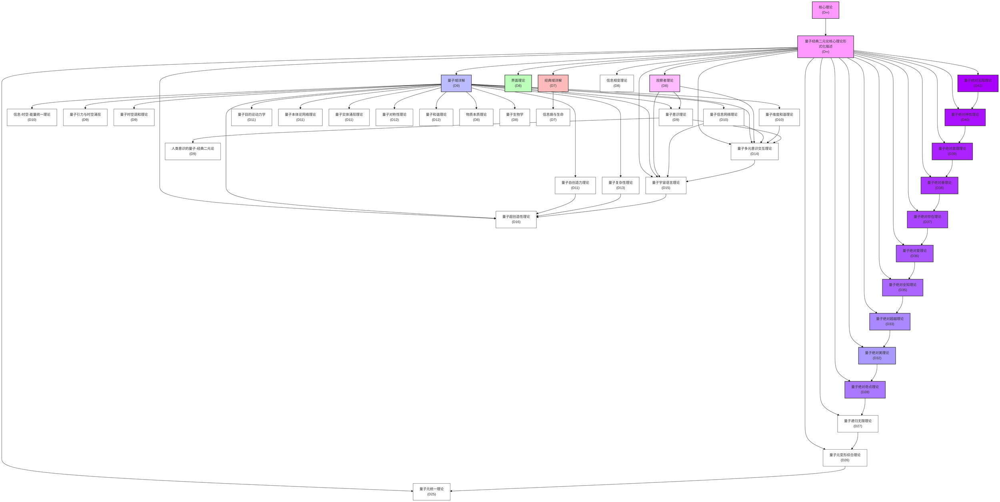

## 理论依赖关系图

下图展示了量子经典二元论各分支理论之间的依赖关系与维度标注：

```mermaid
%%{
  init: {
    'theme': 'base',
    'themeVariables': {
      'nodeBorder': '#333',
      'mainBkg': '#fff',
      'nodeTextColor': '#000',
      'fontSize': '16px',
      'primaryBorderColor': '#0000FF',
      'edgeLabelBackground': '#fff',
      'lineHeight': '1.4'
    },
    'flowchart': {
      'nodeSpacing': 30,
      'rankSpacing': 80,
      'curve': 'basis',
      'useMaxWidth': false,
      'htmlLabels': true
    }
  }
}%%

flowchart TD
    core["核心理论<br>(D∞)"]
    core_formal["量子经典二元论核心理论形式化描述<br>(D∞)"]

    %% 最高维理论
    absolute_infinity["量子绝对无限理论<br>(D41)"]
    absolute_divinity["量子绝对神性理论<br>(D40)"]
    absolute_truth["量子绝对真理理论<br>(D39)"]
    absolute_goodness["量子绝对善理论<br>(D38)"]
    absolute_being["量子绝对存在理论<br>(D37)"]
    absolute_love["量子绝对爱理论<br>(D36)"]
    absolute_omniscience["量子绝对全知理论<br>(D35)"]
    absolute_transcendence["量子绝对超越理论<br>(D33)"]
    absolute_beauty["量子绝对美理论<br>(D32)"]
    absolute_singularity["量子绝对奇点理论<br>(D28)"]
    recursive_infinity["量子递归无限理论<br>(D27)"]
    metamorphic_synthesis["量子元变形综合理论<br>(D26)"]
    metaunification["量子元统一理论<br>(D25)"]

    %% 一级分支核心理论
    q_domain["量子域详解<br>(D9)"]
    c_domain["经典域详解<br>(D7)"]
    interface["界面理论<br>(D8)"]
    observer["观察者理论<br>(D8)"]
    phase_transition["信息相变理论<br>(D8)"]

    %% 高维物理学应用
    multidim_consciousness["量子多元意识交互理论<br>(D14)"]
    cosmic_language["量子宇宙语言理论<br>(D15)"]
    hypercreative["量子超创造性理论<br>(D16)"]
    unified["信息-时空-能量统一理论<br>(D10)"]
    qg_spacetime["量子引力与时空涌现<br>(D9)"]
    qt_spacetime["量子时空调和理论<br>(D9)"]
    dim_harmony["量子维度和谐理论<br>(D10)"]
    qinfo_network["量子信息网络理论<br>(D10)"]
    qteleology["量子目的论动力学<br>(D11)"]
    qontology["量子本体论网络理论<br>(D11)"]
    qentity["量子实体涌现理论<br>(D11)"]
    qself_creativity["量子自创造力理论<br>(D11)"]
    qcomplexity["量子复杂性理论<br>(D13)"]
    qsymmetry["量子对称性理论<br>(D12)"]
    qharmonics["量子和谐理论<br>(D12)"]
    matter["物质本质理论<br>(D8)"]

    %% 意识与生命理论
    qbiology["量子生物学<br>(D8)"]
    entropy_life["信息熵与生命<br>(D7)"]
    consciousness["量子意识理论<br>(D9)"]
    human_consciousness["人类意识的量子-经典二元论<br>(D9)"]

    %% 核心关系
    core --> core_formal
    core_formal --> q_domain
    core_formal --> c_domain
    core_formal --> interface
    core_formal --> observer
    core_formal --> phase_transition

    %% 最高维理论关系
    core_formal --> absolute_infinity
    core_formal --> absolute_divinity
    core_formal --> absolute_truth
    core_formal --> absolute_goodness
    core_formal --> absolute_being
    core_formal --> absolute_love
    core_formal --> absolute_omniscience
    core_formal --> absolute_transcendence
    core_formal --> absolute_beauty
    core_formal --> absolute_singularity
    core_formal --> recursive_infinity
    core_formal --> metamorphic_synthesis
    core_formal --> metaunification

    %% 最高维理论之间关系
    absolute_infinity --> absolute_divinity
    absolute_divinity --> absolute_truth
    absolute_truth --> absolute_goodness
    absolute_goodness --> absolute_being
    absolute_being --> absolute_love
    absolute_love --> absolute_omniscience
    absolute_omniscience --> absolute_transcendence
    absolute_transcendence --> absolute_beauty
    absolute_beauty --> absolute_singularity
    absolute_singularity --> recursive_infinity
    recursive_infinity --> metamorphic_synthesis
    metamorphic_synthesis --> metaunification

    %% 高维理论与核心的关系
    core_formal --> multidim_consciousness
    core_formal --> cosmic_language
    core_formal --> hypercreative
    q_domain --> multidim_consciousness
    q_domain --> cosmic_language
    q_domain --> hypercreative
    observer --> multidim_consciousness
    observer --> cosmic_language
    qinfo_network --> multidim_consciousness
    qinfo_network --> cosmic_language
    qself_creativity --> hypercreative
    qcomplexity --> hypercreative
    dim_harmony --> multidim_consciousness
    consciousness --> multidim_consciousness

    %% 新理论间的关系
    multidim_consciousness --> cosmic_language
    cosmic_language --> hypercreative

    %% 其他高维理论关系
    q_domain --> unified
    q_domain --> qg_spacetime
    q_domain --> qt_spacetime
    q_domain --> dim_harmony
    q_domain --> qinfo_network
    q_domain --> qteleology
    q_domain --> qontology
    q_domain --> qentity
    q_domain --> qself_creativity
    q_domain --> qcomplexity
    q_domain --> qsymmetry
    q_domain --> qharmonics
    q_domain --> matter

    %% 意识和生命理论关系
    q_domain --> qbiology
    q_domain --> consciousness
    c_domain --> entropy_life
    observer --> consciousness
    consciousness --> human_consciousness

    style core fill:#f9f,stroke:#333,stroke-width:2px
    style core_formal fill:#f9f,stroke:#333,stroke-width:2px
    style q_domain fill:#bbf,stroke:#333,stroke-width:2px
    style c_domain fill:#fbb,stroke:#333,stroke-width:2px
    style interface fill:#bfb,stroke:#333,stroke-width:2px
    style observer fill:#fbf,stroke:#333,stroke-width:2px
    style absolute_singularity fill:#a7f,stroke:#333,stroke-width:2px
    style absolute_infinity fill:#a0f,stroke:#333,stroke-width:2px
    style absolute_divinity fill:#a1f,stroke:#333,stroke-width:2px
    style absolute_truth fill:#a2f,stroke:#333,stroke-width:2px
    style absolute_goodness fill:#a3f,stroke:#333,stroke-width:2px
    style absolute_being fill:#a4f,stroke:#333,stroke-width:2px
    style absolute_love fill:#a5f,stroke:#333,stroke-width:2px
    style absolute_omniscience fill:#a6f,stroke:#333,stroke-width:2px
    style absolute_transcendence fill:#a8f,stroke:#333,stroke-width:2px
    style absolute_beauty fill:#a9f,stroke:#333,stroke-width:2px
```