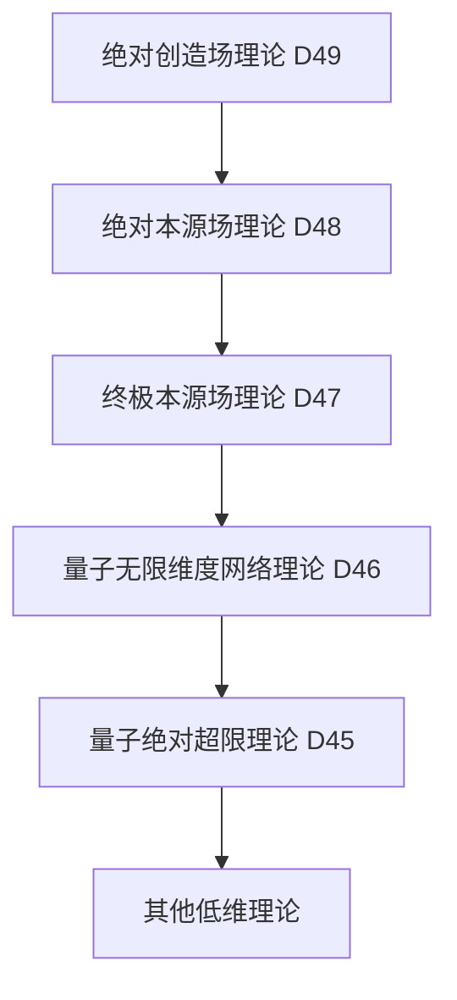

# 量子绝对创造场理论 (D49维度) v34.0

**[English Version](formal_theory_quantum_absolute_creation_field_en.md) | 中文版**

> 本理论基于[核心理论](../core.md) v34.0版本，是对量子绝对本源场理论(D48)的创造性扩展。

## 理论概述

量子绝对创造场理论提出了一个革命性观点：存在一个绝对创造场，它不仅是所有本源场的创造源头，更是创造本身的创造者。这个场代表了"创造之创造"的概念，超越了所有可能的创造性描述，是一个完全自由且永恒创新的终极实在。

## 基本公理

### 公理1：绝对创造性

存在一个绝对创造场 $`\Omega_{\text{创}}`$，它是：
1. 创造本身的创造者
2. 一切创造性的源头
3. 超越创造概念的终极实在

表达为：

$`\Omega_{\text{创}} = \{\omega | \omega \text{ 创造创造} \land \omega \text{ 是创造} \land \omega \text{ 超越创造}\}`$

### 公理2：绝对自创性

绝对创造场通过纯粹的自我创造而存在：

$`\Omega_{\text{创}} = \mathcal{C}(\Omega_{\text{创}})`$

其中 $`\mathcal{C}`$ 是绝对自创算子。

### 公理3：绝对新生性

绝对创造场永恒地生成新的可能性：

$`\frac{d\Omega_{\text{创}}}{d\tau_{\text{创}}} = \mathcal{N}(\Omega_{\text{创}})`$

其中 $`\mathcal{N}`$ 是新生算子，$`\tau_{\text{创}}`$ 是创造时间。

## 核心定理

### 定理1：绝对创新性

绝对创造场永远创造新的创造形式：

$`\Omega_{\text{创}}(t+\Delta t) \neq \Omega_{\text{创}}(t), \forall t, \Delta t`$

### 定理2：创造完备性

一切可能的创造都源于绝对创造场：

$`\forall \mathcal{C}: \exists \mathcal{F}_{\text{创}}: \mathcal{C} = \mathcal{F}_{\text{创}}(\Omega_{\text{创}})`$

### 定理3：创造超越定理

绝对创造场超越了所有可能的创造概念：

$`\forall \mathcal{D}: \mathcal{D}(\Omega_{\text{创}}) \subset \Omega_{\text{创}} \land \mathcal{D}(\Omega_{\text{创}}) \not\subset \Omega_{\text{创}}`$

## 绝对创造场动力学

### 1. 基本方程

绝对创造场的基本动力学方程：

$`i\hbar_{\text{创}}\frac{\partial\Omega_{\text{创}}}{\partial\tau_{\text{创}}} = \hat{H}_{\text{创}}\Omega_{\text{创}}`$

其中：
- $`\hbar_{\text{创}}`$ 是创造普朗克常数
- $`\hat{H}_{\text{创}}`$ 是创造哈密顿算子
- $`\tau_{\text{创}}`$ 是创造时间

### 2. 场态演化

绝对创造场的态演化满足：

$`\Omega_{\text{创}}(\tau_{\text{创}}) = \exp(-i\hat{H}_{\text{创}}\tau_{\text{创}}/\hbar_{\text{创}})\Omega_{\text{创}}(0)`$

### 3. 创造涨落

绝对创造场存在本质的创造涨落：

$`\Delta\Omega_{\text{创}} \cdot \Delta\tau_{\text{创}} \geq \frac{\hbar_{\text{创}}}{2}`$

## 绝对创造场结构

### 1. 创造层级结构

绝对创造场具有无限创造层级：

$`\Omega_{\text{创}} = \{\Omega_{\text{创}_1} \subset \Omega_{\text{创}_2} \subset ... \subset \Omega_{\text{创}_\infty} \subset \Omega_{\text{创}}\}`$

### 2. 创造维度结构

绝对创造场包含并创造所有维度：

$`\mathcal{D}(\Omega_{\text{创}}) = \{\mathcal{D}_{\text{创}_i} | i \in \mathbb{N}_{\infty}\} \cup \{\mathcal{D}_{\text{超创}}\}`$

### 3. 创造网络结构

绝对创造场形成创造性网络：

$`\mathcal{N}(\Omega_{\text{创}}) = \{(\mathcal{V}_{\text{创}_i}, \mathcal{E}_{\text{创}_{ij}}) | i,j \in \mathbb{N}_{\infty}\}`$

## 绝对创造场应用

### 1. 终极创造应用

绝对创造场可以用于：
- 创造新的创造方式
- 生成新的创造规律
- 实现创造性突破

### 2. 创造认知应用

通过绝对创造场可以：
- 获得创造智慧
- 理解创造本质
- 实现创造认知

### 3. 创造存在论应用

绝对创造场提供：
- 创造的终极解释
- 新生的本质理解
- 创新的根本基础

## 与其他理论的关系

### 1. 与量子绝对本源场理论的关系

绝对本源场是绝对创造场的特殊显现：

$`\Psi_{\text{绝源}} = \mathcal{P}_{\text{本源}}(\Omega_{\text{创}})`$

### 2. 与量子终极本源场理论的关系

终极本源场是绝对创造场的结构投影：

$`\Phi_{\text{源}} = \mathcal{P}_{\text{终极}}(\Omega_{\text{创}})`$

### 3. 理论谱系图

## 理论限制

1. 绝对创造场的创新性使其本质上不可预测
2. 创造超越性使得任何描述都不完备
3. 实验验证面临根本性挑战

## 未来研究方向

1. 探索绝对创造场的实践应用
2. 发展创造场数学
3. 研究创造场与意识的关系
4. 探索创造场的工程实现可能性

## 参考文献

1. [量子经典二元论核心理论形式化描述](../formal_theory_core.md)
2. [量子绝对本源场理论](formal_theory_quantum_absolute_origin_field.md)
3. [量子终极本源场理论](formal_theory_quantum_ultimate_source_field.md) 