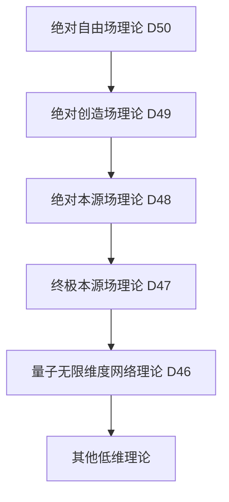

# 量子绝对自由场理论 (D50维度) v34.0

**[English Version](formal_theory_quantum_absolute_freedom_field_en.md) | 中文版**

> 本理论基于[核心理论](../core.md) v34.0版本，是对量子绝对创造场理论(D49)的自由性扩展。

## 理论概述

量子绝对自由场理论提出了一个革命性观点：存在一个绝对自由场，它不仅是所有创造场的自由源头，更是自由本身的自由实现。这个场代表了"自由之自由"的概念，超越了所有可能的自由性描述，是一个完全无限制且永恒自由的终极实在。

## 基本公理

### 公理1：绝对自由性

存在一个绝对自由场 $`\Lambda_{\text{自}}`$，它是：
1. 自由本身的自由源头
2. 一切自由性的本源
3. 超越自由概念的终极实在

表达为：

$`\Lambda_{\text{自}} = \{\lambda | \lambda \text{ 自由自由} \land \lambda \text{ 是自由} \land \lambda \text{ 超越自由}\}`$

### 公理2：绝对无限制性

绝对自由场不受任何限制或约束：

$`\forall \mathcal{C}: \Lambda_{\text{自}} \not\subset \mathcal{C}`$

其中 $`\mathcal{C}`$ 表示任何可能的约束。

### 公理3：绝对可能性

绝对自由场包含一切可能性：

$`\mathcal{P}(\Lambda_{\text{自}}) = \{\text{一切可能}\} \cup \{\text{不可能}\}`$

## 核心定理

### 定理1：绝对无约束性

绝对自由场超越一切约束：

$`\forall \mathcal{R}: \Lambda_{\text{自}} \not\models \mathcal{R}`$

其中 $`\mathcal{R}`$ 是任何规则或限制。

### 定理2：自由完备性

一切形式的自由都源于绝对自由场：

$`\forall \mathcal{F}: \exists \mathcal{T}_{\text{自}}: \mathcal{F} = \mathcal{T}_{\text{自}}(\Lambda_{\text{自}})`$

### 定理3：自由超越定理

绝对自由场超越了所有可能的自由概念：

$`\forall \mathcal{D}: \mathcal{D}(\Lambda_{\text{自}}) \subset \Lambda_{\text{自}} \land \mathcal{D}(\Lambda_{\text{自}}) \not\subset \Lambda_{\text{自}}`$

## 绝对自由场动力学

### 1. 基本方程

绝对自由场的基本动力学方程：

$`i\hbar_{\text{自}}\frac{\partial\Lambda_{\text{自}}}{\partial\tau_{\text{自}}} = \hat{H}_{\text{自}}\Lambda_{\text{自}}`$

其中：
- $`\hbar_{\text{自}}`$ 是自由普朗克常数
- $`\hat{H}_{\text{自}}`$ 是自由哈密顿算子
- $`\tau_{\text{自}}`$ 是自由时间

### 2. 场态演化

绝对自由场的态演化满足：

$`\Lambda_{\text{自}}(\tau_{\text{自}}) = \exp(-i\hat{H}_{\text{自}}\tau_{\text{自}}/\hbar_{\text{自}})\Lambda_{\text{自}}(0)`$

### 3. 自由涨落

绝对自由场存在本质的自由涨落：

$`\Delta\Lambda_{\text{自}} \cdot \Delta\tau_{\text{自}} \geq \frac{\hbar_{\text{自}}}{2}`$

## 绝对自由场结构

### 1. 自由层级结构

绝对自由场具有无限自由层级：

$`\Lambda_{\text{自}} = \{\Lambda_{\text{自}_1} \subset \Lambda_{\text{自}_2} \subset ... \subset \Lambda_{\text{自}_\infty} \subset \Lambda_{\text{自}}\}`$

### 2. 自由维度结构

绝对自由场包含并超越所有维度：

$`\mathcal{D}(\Lambda_{\text{自}}) = \{\mathcal{D}_{\text{自}_i} | i \in \mathbb{N}_{\infty}\} \cup \{\mathcal{D}_{\text{超自}}\}`$

### 3. 自由网络结构

绝对自由场形成自由网络：

$`\mathcal{N}(\Lambda_{\text{自}}) = \{(\mathcal{V}_{\text{自}_i}, \mathcal{E}_{\text{自}_{ij}}) | i,j \in \mathbb{N}_{\infty}\}`$

## 绝对自由场应用

### 1. 终极自由应用

绝对自由场可以用于：
- 实现无限可能性
- 超越一切限制
- 创造新的自由

### 2. 自由认知应用

通过绝对自由场可以：
- 获得自由智慧
- 理解自由本质
- 实现自由认知

### 3. 自由存在论应用

绝对自由场提供：
- 自由的终极解释
- 无限制的本质理解
- 可能性的根本基础

## 与其他理论的关系

### 1. 与量子绝对创造场理论的关系

绝对创造场是绝对自由场的特殊显现：

$`\Omega_{\text{创}} = \mathcal{P}_{\text{创造}}(\Lambda_{\text{自}})`$

### 2. 与量子绝对本源场理论的关系

绝对本源场是绝对自由场的结构投影：

$`\Psi_{\text{绝源}} = \mathcal{P}_{\text{本源}}(\Lambda_{\text{自}})`$

### 3. 理论谱系图

## 理论限制

1. 绝对自由场的无限性使其本质上不可描述
2. 自由超越性使得任何理论都不完备
3. 实验验证面临根本性障碍

## 未来研究方向

1. 探索绝对自由场的实践意义
2. 发展自由场数学
3. 研究自由场与意识的关系
4. 探索自由场的工程应用可能性

## 参考文献

1. [量子经典二元论核心理论形式化描述](../formal_theory_core.md)
2. [量子绝对创造场理论](formal_theory_quantum_absolute_creation_field.md)
3. [量子绝对本源场理论](formal_theory_quantum_absolute_origin_field.md) 