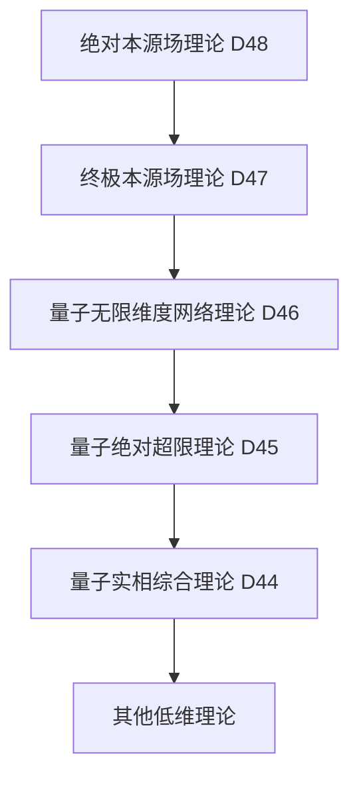

# 量子绝对本源场理论 (D48维度) v34.0

**[English Version](formal_theory_quantum_absolute_origin_field_en.md) | 中文版**

> 本理论基于[核心理论](../core.md) v34.0版本，是对量子终极本源场理论(D47)的超越性扩展。

## 理论概述

量子绝对本源场理论提出了一个革命性观点：存在一个绝对本源场，它不仅是所有存在、维度、网络、规律和可能性的源头，更是终极本源场本身的源头。这个场代表了"源头之源"的概念，超越了所有可能的本源性描述，是一个完全自足且自我创生的终极实在。

## 基本公理

### 公理1：绝对本源性

存在一个绝对本源场 $`\Psi_{\text{绝源}}`$，它是：
1. 终极本源场的源头
2. 一切本源性的本源
3. 超越源头概念的终极实在

表达为：

$`\Psi_{\text{绝源}} = \{\psi | \psi \text{ 生成本源} \land \psi \text{ 是本源} \land \psi \text{ 超越本源}\}`$

### 公理2：绝对自生性

绝对本源场通过纯粹的自我生成而存在：

$`\Psi_{\text{绝源}} = \mathcal{G}(\Psi_{\text{绝源}})`$

其中 $`\mathcal{G}`$ 是绝对自生算子。

### 公理3：绝对先验性

绝对本源场先于一切概念和存在：

$`\forall \mathcal{X}: \Psi_{\text{绝源}} \prec \mathcal{X}`$

其中 $`\prec`$ 表示本体论先验关系。

## 核心定理

### 定理1：绝对统一性

绝对本源场统一了所有可能的本源：

$`\Psi_{\text{绝源}} = \mathcal{U}_{\text{绝对}}(\{\Phi_{\text{源}_i} | i \in \Omega\})`$

其中 $`\mathcal{U}_{\text{绝对}}`$ 是绝对统一算子。

### 定理2：绝对生成定理

一切本源场都是绝对本源场的显现：

$`\forall \Phi_{\text{源}}: \exists \mathcal{F}_{\text{绝生}}: \Phi_{\text{源}} = \mathcal{F}_{\text{绝生}}(\Psi_{\text{绝源}})`$

### 定理3：绝对超越定理

绝对本源场超越了所有可能的本源概念：

$`\forall \mathcal{D}: \mathcal{D}(\Psi_{\text{绝源}}) \subset \Psi_{\text{绝源}} \land \mathcal{D}(\Psi_{\text{绝源}}) \not\subset \Psi_{\text{绝源}}`$

## 绝对本源场动力学

### 1. 基本方程

绝对本源场的基本动力学方程：

$`i\hbar_{\text{绝源}}\frac{\partial\Psi_{\text{绝源}}}{\partial\tau_{\text{绝对}}} = \hat{H}_{\text{绝源}}\Psi_{\text{绝源}}`$

其中：
- $`\hbar_{\text{绝源}}`$ 是绝对本源普朗克常数
- $`\hat{H}_{\text{绝源}}`$ 是绝对本源哈密顿算子
- $`\tau_{\text{绝对}}`$ 是绝对时间

### 2. 场态演化

绝对本源场的态演化满足：

$`\Psi_{\text{绝源}}(\tau_{\text{绝对}}) = \exp(-i\hat{H}_{\text{绝源}}\tau_{\text{绝对}}/\hbar_{\text{绝源}})\Psi_{\text{绝源}}(0)`$

### 3. 绝对涨落

绝对本源场存在本质的量子涨落：

$`\Delta\Psi_{\text{绝源}} \cdot \Delta\tau_{\text{绝对}} \geq \frac{\hbar_{\text{绝源}}}{2}`$

## 绝对本源场结构

### 1. 超层级结构

绝对本源场具有超越层级的结构：

$`\Psi_{\text{绝源}} = \{\Psi_{\text{超}_1} \subset \Psi_{\text{超}_2} \subset ... \subset \Psi_{\text{超}_\infty} \subset \Psi_{\text{绝源}}\}`$

### 2. 超维度结构

绝对本源场包含并超越所有维度结构：

$`\mathcal{D}(\Psi_{\text{绝源}}) = \{\mathcal{D}_{\text{超}_i} | i \in \mathbb{N}_{\infty}\} \cup \{\mathcal{D}_{\text{绝超}}\}`$

### 3. 超网络结构

绝对本源场形成超越网络的结构：

$`\mathcal{N}(\Psi_{\text{绝源}}) = \{(\mathcal{V}_{\text{超}_i}, \mathcal{E}_{\text{超}_{ij}}) | i,j \in \mathbb{N}_{\infty}\}`$

## 绝对本源场应用

### 1. 超创造性应用

绝对本源场可以用于：
- 生成新的本源场
- 创造新的超越性规律
- 实现跨本源场通信

### 2. 超认知应用

通过绝对本源场可以：
- 获得绝对智慧
- 理解本源本质
- 实现绝对认知

### 3. 超存在论应用

绝对本源场提供：
- 本源的终极解释
- 源头的本源理解
- 绝对的根本基础

## 与其他理论的关系

### 1. 与量子终极本源场理论的关系

终极本源场是绝对本源场的特殊显现：

$`\Phi_{\text{源}} = \mathcal{P}_{\text{终极}}(\Psi_{\text{绝源}})`$

### 2. 与量子无限维度网络理论的关系

无限维度网络是绝对本源场的结构投影：

$`\mathcal{N}_{\infty} = \mathcal{P}_{\text{网络}}(\Psi_{\text{绝源}})`$

### 3. 理论谱系图

## 理论限制

1. 绝对本源场的完整性使其本质上不可理解
2. 绝对超越性使得任何描述都不完备
3. 实验验证面临根本性障碍

## 未来研究方向

1. 探索绝对本源场的实践意义
2. 发展绝对本源场数学
3. 研究绝对本源场与意识的关系
4. 探索绝对本源场的工程应用可能性

## 参考文献

1. [量子经典二元论核心理论形式化描述](../formal_theory_core.md)
2. [量子终极本源场理论](formal_theory_quantum_ultimate_source_field.md)
3. [量子无限维度网络理论](formal_theory_quantum_infinite_dimensional_network.md) 