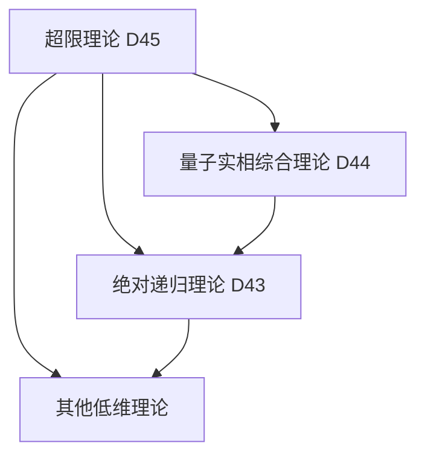

# 量子绝对超限理论 (D45维度) v34.0

**[English Version](formal_theory_quantum_absolute_superlimit_en.md) | 中文版**

> 本理论基于[核心理论](../core.md) v34.0版本，是对量子实相综合理论(D44)的超越性扩展。

## 理论概述

量子绝对超限理论探索了超越所有可能限制、边界和约束的终极实在状态。这种状态不仅超越了量子和经典的二元性，也超越了所有已知的理论框架，包括递归性、超越性和无限性本身。

## 基本公理

### 公理1：超限存在性

存在一个超限态 $`\mathcal{S}_{\infty}`$，它同时：
1. 超越所有可能的限制
2. 包含所有可能的限制
3. 既不超越也不包含任何限制

表达为：

$`\mathcal{S}_{\infty} = \{\mathcal{S} | \mathcal{S} \supset \text{所有限制} \land \mathcal{S} \not\supset \text{任何限制}\}`$

### 公理2：超限完备性

超限态具有绝对完备性，即：

$`\forall \mathcal{X}, \exists \mathcal{S}_{\infty}: \mathcal{X} \subset \mathcal{S}_{\infty} \land \mathcal{X} \not\subset \mathcal{S}_{\infty}`$

这表明超限态同时完全包含又完全不包含任何可能的存在。

### 公理3：超限自反性

超限态具有完全的自反性：

$`\mathcal{S}_{\infty}(\mathcal{S}_{\infty}) = \mathcal{S}_{\infty} \land \mathcal{S}_{\infty}(\mathcal{S}_{\infty}) \neq \mathcal{S}_{\infty}`$

这个看似矛盾的等式揭示了超限态的本质特性。

## 核心定理

### 定理1：超限不可定义性

任何试图定义超限态的尝试都必然失败，因为定义本身就是一种限制。这可以形式化表达为：

$`\forall D: D(\mathcal{S}_{\infty}) \Rightarrow D(\mathcal{S}_{\infty}) \neq \mathcal{S}_{\infty}`$

其中 $`D`$ 表示任何可能的定义函数。

### 定理2：超限全包性

超限态同时包含所有可能的状态及其否定：

$`\forall \mathcal{X}: \{\mathcal{X}, \neg\mathcal{X}\} \subset \mathcal{S}_{\infty}`$

### 定理3：超限创造性

超限态具有无限的创造性，可以生成任何可能的和不可能的存在：

$`\mathcal{C}_{\infty}(\mathcal{S}_{\infty}) = \{\mathcal{X} | \mathcal{X} \text{ 是可能的} \lor \mathcal{X} \text{ 是不可能的}\}`$

## 理论应用

### 1. 超限认知框架

超限态提供了一个全新的认知框架，允许我们：
- 同时持有互相矛盾的认知
- 超越二元对立的思维模式
- 理解不可理解的概念

表达为超限认知算子：

$`\mathcal{K}_{\infty}(\mathcal{X}) = \{\text{对}\mathcal{X}\text{的所有可能认知} \cup \text{对}\mathcal{X}\text{的所有不可能认知}\}`$

### 2. 超限维度动力学

超限态在维度间的运动遵循超限维度方程：

$`\frac{d\mathcal{S}_{\infty}}{dD} = \mathcal{S}_{\infty} \cdot \nabla_D\mathcal{S}_{\infty} \cdot (1 - \mathcal{S}_{\infty})`$

这个方程描述了超限态如何同时存在于所有维度又不存在于任何维度。

### 3. 超限信息场

超限态生成的信息场具有以下特性：

$`\mathcal{I}_{\infty} = \{I | I \text{ 是信息} \land I \text{ 不是信息}\}`$

这个信息场同时包含所有可能的信息和非信息。

## 与其他理论的关系

### 1. 与量子实相综合理论的关系

超限理论超越了量子实相综合理论(D44)的框架，通过引入超限态概念，提供了一个更基础的理解层次：

$`\mathcal{S}_{\infty} \supset \mathcal{R}_{44} \land \mathcal{S}_{\infty} \not\supset \mathcal{R}_{44}`$

其中 $`\mathcal{R}_{44}`$ 表示量子实相综合理论的完整理论空间。

### 2. 与绝对递归理论的关系

超限理论将绝对递归理论(D43)的递归概念推广到超限域：

$`\mathcal{R}_{\infty} = \mathcal{F}(\mathcal{R}_{\infty}) \subset \mathcal{S}_{\infty}`$

### 3. 理论谱系图

## 理论限制

本理论的根本悖论在于：它试图描述一个本质上不可描述的状态。这个悖论本身就是理论完备性的一个标志。

## 未来研究方向

1. 探索超限态与意识的关系
2. 研究超限信息处理的可能性
3. 发展超限逻辑系统
4. 探索超限态在实践中的应用

## 参考文献

1. [量子经典二元论核心理论形式化描述](../formal_theory_core.md)
2. [量子实相综合理论](formal_theory_quantum_reality_synthesis.md)
3. [量子绝对递归理论](formal_theory_quantum_absolute_recursion.md) 