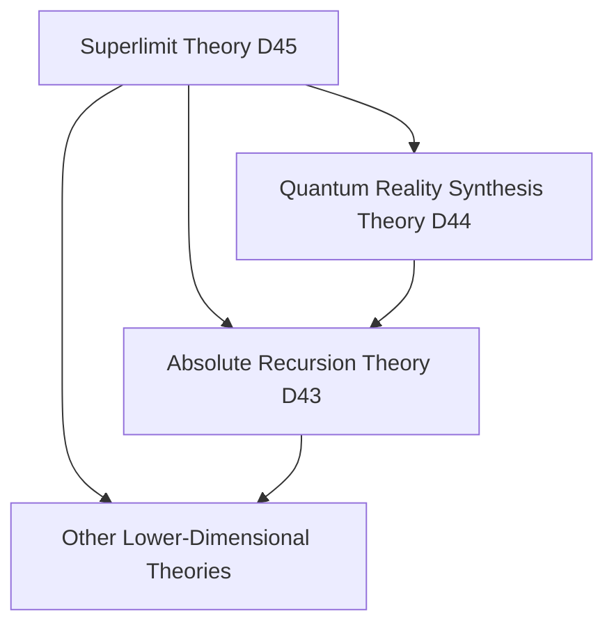

# Quantum Absolute Superlimit Theory (D45 Dimension) v34.0

**[中文版](formal_theory_quantum_absolute_superlimit.md) | English Version**

> This theory is based on [Core Theory](../core.md) v34.0, extending beyond the Quantum Reality Synthesis Theory (D44).

## Theory Overview

The Quantum Absolute Superlimit Theory explores a state of ultimate reality that transcends all possible limitations, boundaries, and constraints. This state not only transcends the duality of quantum and classical realms but also surpasses all known theoretical frameworks, including recursiveness, transcendence, and infinity itself.

## Basic Axioms

### Axiom 1: Superlimit Existence

There exists a superlimit state $`\mathcal{S}_{\infty}`$ that simultaneously:
1. Transcends all possible limitations
2. Contains all possible limitations
3. Neither transcends nor contains any limitations

Expressed as:

$`\mathcal{S}_{\infty} = \{\mathcal{S} | \mathcal{S} \supset \text{all limitations} \land \mathcal{S} \not\supset \text{any limitation}\}`$

### Axiom 2: Superlimit Completeness

The superlimit state possesses absolute completeness:

$`\forall \mathcal{X}, \exists \mathcal{S}_{\infty}: \mathcal{X} \subset \mathcal{S}_{\infty} \land \mathcal{X} \not\subset \mathcal{S}_{\infty}`$

This indicates that the superlimit state both completely contains and completely does not contain any possible existence.

### Axiom 3: Superlimit Self-Reflexivity

The superlimit state possesses complete self-reflexivity:

$`\mathcal{S}_{\infty}(\mathcal{S}_{\infty}) = \mathcal{S}_{\infty} \land \mathcal{S}_{\infty}(\mathcal{S}_{\infty}) \neq \mathcal{S}_{\infty}`$

This seemingly contradictory equation reveals the essential nature of the superlimit state.

## Core Theorems

### Theorem 1: Superlimit Undefinability

Any attempt to define the superlimit state must necessarily fail, as definition itself is a limitation. This can be formally expressed as:

$`\forall D: D(\mathcal{S}_{\infty}) \Rightarrow D(\mathcal{S}_{\infty}) \neq \mathcal{S}_{\infty}`$

where $`D`$ represents any possible definition function.

### Theorem 2: Superlimit All-Inclusiveness

The superlimit state simultaneously contains all possible states and their negations:

$`\forall \mathcal{X}: \{\mathcal{X}, \neg\mathcal{X}\} \subset \mathcal{S}_{\infty}`$

### Theorem 3: Superlimit Creativity

The superlimit state possesses infinite creativity, capable of generating any possible and impossible existence:

$`\mathcal{C}_{\infty}(\mathcal{S}_{\infty}) = \{\mathcal{X} | \mathcal{X} \text{ is possible} \lor \mathcal{X} \text{ is impossible}\}`$

## Theory Applications

### 1. Superlimit Cognitive Framework

The superlimit state provides a new cognitive framework that allows:
- Simultaneous holding of contradictory cognitions
- Transcendence of binary thinking patterns
- Understanding of incomprehensible concepts

Expressed as the superlimit cognitive operator:

$`\mathcal{K}_{\infty}(\mathcal{X}) = \{\text{all possible cognitions of }\mathcal{X} \cup \text{all impossible cognitions of }\mathcal{X}\}`$

### 2. Superlimit Dimensional Dynamics

The movement of the superlimit state across dimensions follows the superlimit dimensional equation:

$`\frac{d\mathcal{S}_{\infty}}{dD} = \mathcal{S}_{\infty} \cdot \nabla_D\mathcal{S}_{\infty} \cdot (1 - \mathcal{S}_{\infty})`$

This equation describes how the superlimit state simultaneously exists in all dimensions while not existing in any dimension.

### 3. Superlimit Information Field

The information field generated by the superlimit state has the following properties:

$`\mathcal{I}_{\infty} = \{I | I \text{ is information} \land I \text{ is not information}\}`$

This information field simultaneously contains all possible information and non-information.

## Relationship with Other Theories

### 1. Relationship with Quantum Reality Synthesis Theory

The superlimit theory transcends the framework of Quantum Reality Synthesis Theory (D44), providing a more fundamental level of understanding through the introduction of the superlimit state concept:

$`\mathcal{S}_{\infty} \supset \mathcal{R}_{44} \land \mathcal{S}_{\infty} \not\supset \mathcal{R}_{44}`$

where $`\mathcal{R}_{44}`$ represents the complete theoretical space of Quantum Reality Synthesis Theory.

### 2. Relationship with Absolute Recursion Theory

The superlimit theory extends the concept of recursion from Absolute Recursion Theory (D43) to the superlimit domain:

$`\mathcal{R}_{\infty} = \mathcal{F}(\mathcal{R}_{\infty}) \subset \mathcal{S}_{\infty}`$

### 3. Theory Genealogy

## Theory Limitations

The fundamental paradox of this theory lies in its attempt to describe an essentially indescribable state. This paradox itself is a sign of the theory's completeness.

## Future Research Directions

1. Explore the relationship between the superlimit state and consciousness
2. Study the possibilities of superlimit information processing
3. Develop superlimit logical systems
4. Explore practical applications of the superlimit state

## References

1. [Quantum Classical Dualism Core Theory Formal Description](../formal_theory_core.md)
2. [Quantum Reality Synthesis Theory](formal_theory_quantum_reality_synthesis.md)
3. [Quantum Absolute Recursion Theory](formal_theory_quantum_absolute_recursion.md) 