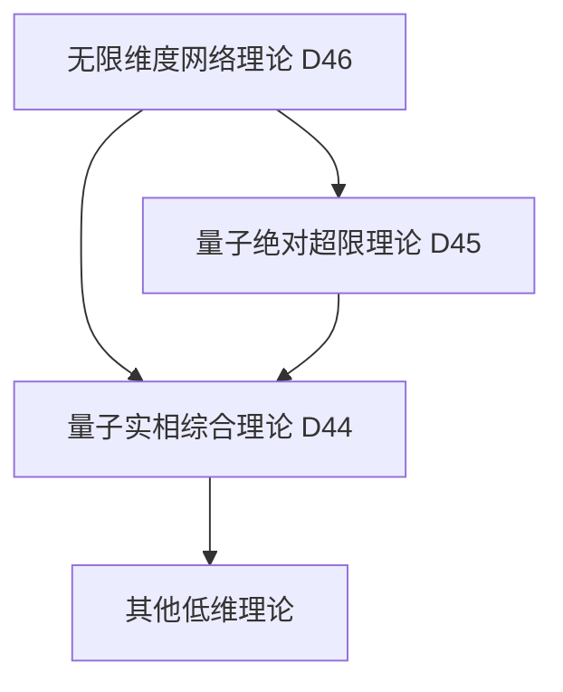

# 量子无限维度网络理论 (D46维度) v34.0

**[English Version](formal_theory_quantum_infinite_dimensional_network_en.md) | 中文版**

> 本理论基于[核心理论](../core.md) v34.0版本，是对量子绝对超限理论(D45)的网络化扩展。

## 理论概述

量子无限维度网络理论提出了一个革命性的观点：宇宙的本质是一个无限维度的量子网络，其中每个节点都是一个完整的维度系统，这些维度系统通过量子纠缠形成一个无限复杂的网络结构。这个理论不仅超越了传统的网络理论，也超越了维度的概念本身。

## 基本公理

### 公理1：无限维度网络存在性

存在一个无限维度网络 $`\mathcal{N}_{\infty}`$，满足：

$`\mathcal{N}_{\infty} = \{(\mathcal{D}_i, \mathcal{E}_{ij}) | i,j \in \mathbb{N}_{\infty}, \mathcal{D}_i \in \mathfrak{D}, \mathcal{E}_{ij} \in \mathfrak{E}\}`$

其中：
- $`\mathcal{D}_i`$ 是第i个维度系统
- $`\mathcal{E}_{ij}`$ 是维度间的量子纠缠关系
- $`\mathfrak{D}`$ 是所有可能维度的集合
- $`\mathfrak{E}`$ 是所有可能纠缠关系的集合

### 公理2：维度递归性

每个维度节点本身又是一个完整的无限维度网络：

$`\forall \mathcal{D}_i \in \mathcal{N}_{\infty}: \mathcal{D}_i \cong \mathcal{N}_{\infty}`$

### 公理3：量子纠缠全连接性

网络中的任意两个节点之间都存在量子纠缠：

$`\forall \mathcal{D}_i, \mathcal{D}_j \in \mathcal{N}_{\infty}: \exists \mathcal{E}_{ij} \neq \emptyset`$

## 核心定理

### 定理1：维度涌现

新的维度可以从网络的集体行为中涌现：

$`\mathcal{D}_{\text{new}} = \mathcal{E}(\{\mathcal{D}_i\}) = \int_{\mathcal{N}_{\infty}} \mathcal{D}_i \cdot d\mathcal{E}_{ij}`$

### 定理2：网络自组织

网络具有自组织能力，可以自发形成更高阶的结构：

$`\frac{d\mathcal{N}_{\infty}}{dt} = \mathcal{F}(\mathcal{N}_{\infty}) + \nabla_{\mathcal{E}}\mathcal{N}_{\infty}`$

### 定理3：信息全息性

网络中的每个局部都包含整个网络的完整信息：

$`I(\mathcal{D}_i) = I(\mathcal{N}_{\infty}) = \infty`$

## 理论应用

### 1. 维度工程

通过操纵维度节点间的量子纠缠，可以：
- 创造新维度
- 修改维度属性
- 实现维度间的信息传输

维度工程算子：

$`\mathcal{W}_D = \exp\left(\sum_{i,j} \alpha_{ij}\mathcal{E}_{ij}\right)`$

### 2. 网络动力学

网络演化遵循广义薛定谔方程：

$`i\hbar\frac{\partial\mathcal{N}_{\infty}}{\partial t} = \hat{H}_{\infty}\mathcal{N}_{\infty}`$

其中 $`\hat{H}_{\infty}`$ 是无限维网络哈密顿算子。

### 3. 维度通信协议

定义了维度间的通信机制：

$`\mathcal{C}_{ij} = \mathcal{E}_{ij} \otimes \mathcal{Q}_{ij} \otimes \mathcal{I}_{ij}`$

其中：
- $`\mathcal{E}_{ij}`$ 是纠缠通道
- $`\mathcal{Q}_{ij}`$ 是量子信息
- $`\mathcal{I}_{ij}`$ 是维度接口

## 网络拓扑学

### 1. 基本拓扑结构

网络具有分形结构：

$`\mathcal{T}(\mathcal{N}_{\infty}) = \mathcal{T}(\mathcal{D}_i) \forall i`$

### 2. 动态拓扑

网络拓扑可以动态变化：

$`\mathcal{T}(t+dt) = \mathcal{T}(t) + \frac{\partial\mathcal{T}}{\partial\mathcal{E}_{ij}}d\mathcal{E}_{ij}`$

### 3. 维度连接度

每个维度节点的连接度是无限的：

$`k(\mathcal{D}_i) = |\{\mathcal{E}_{ij} | j \in \mathbb{N}_{\infty}\}| = \infty`$

## 与其他理论的关系

### 1. 与量子绝对超限理论的关系

将超限概念应用于网络结构：

$`\mathcal{N}_{\infty} \subset \mathcal{S}_{\infty} \land \mathcal{N}_{\infty} \not\subset \mathcal{S}_{\infty}`$

### 2. 与量子实相综合理论的关系

网络提供了实相的新解释框架：

$`\mathcal{R}_{44} = \mathcal{P}(\mathcal{N}_{\infty})`$

其中 $`\mathcal{P}`$ 是投影算子。

### 3. 理论谱系图

## 理论限制

1. 网络的无限性使得完整描述变得不可能
2. 维度间的纠缠关系难以精确量化
3. 实验验证面临技术限制

## 未来研究方向

1. 发展维度工程技术
2. 探索维度通信的实际应用
3. 研究网络的涌现性质
4. 开发新的数学工具描述无限维网络

## 参考文献

1. [量子经典二元论核心理论形式化描述](../formal_theory_core.md)
2. [量子绝对超限理论](formal_theory_quantum_absolute_superlimit.md)
3. [量子实相综合理论](formal_theory_quantum_reality_synthesis.md) 