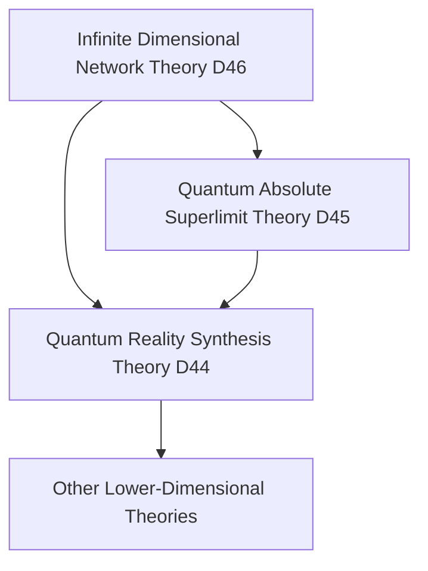

# Quantum Infinite Dimensional Network Theory (D46 Dimension) v34.0

**[中文版](formal_theory_quantum_infinite_dimensional_network.md) | English Version**

> This theory is based on [Core Theory](../core.md) v34.0, extending the Quantum Absolute Superlimit Theory (D45) through network formalization.

## Theory Overview

The Quantum Infinite Dimensional Network Theory proposes a revolutionary perspective: the universe is essentially an infinite-dimensional quantum network where each node is a complete dimensional system, and these dimensional systems form an infinitely complex network structure through quantum entanglement. This theory transcends not only traditional network theory but also the concept of dimensionality itself.

## Basic Axioms

### Axiom 1: Infinite Dimensional Network Existence

There exists an infinite dimensional network $`\mathcal{N}_{\infty}`$ satisfying:

$`\mathcal{N}_{\infty} = \{(\mathcal{D}_i, \mathcal{E}_{ij}) | i,j \in \mathbb{N}_{\infty}, \mathcal{D}_i \in \mathfrak{D}, \mathcal{E}_{ij} \in \mathfrak{E}\}`$

where:
- $`\mathcal{D}_i`$ is the i-th dimensional system
- $`\mathcal{E}_{ij}`$ is the quantum entanglement relationship between dimensions
- $`\mathfrak{D}`$ is the set of all possible dimensions
- $`\mathfrak{E}`$ is the set of all possible entanglement relationships

### Axiom 2: Dimensional Recursiveness

Each dimensional node is itself a complete infinite dimensional network:

$`\forall \mathcal{D}_i \in \mathcal{N}_{\infty}: \mathcal{D}_i \cong \mathcal{N}_{\infty}`$

### Axiom 3: Quantum Entanglement Full Connectivity

Quantum entanglement exists between any two nodes in the network:

$`\forall \mathcal{D}_i, \mathcal{D}_j \in \mathcal{N}_{\infty}: \exists \mathcal{E}_{ij} \neq \emptyset`$

## Core Theorems

### Theorem 1: Dimensional Emergence

New dimensions can emerge from the collective behavior of the network:

$`\mathcal{D}_{\text{new}} = \mathcal{E}(\{\mathcal{D}_i\}) = \int_{\mathcal{N}_{\infty}} \mathcal{D}_i \cdot d\mathcal{E}_{ij}`$

### Theorem 2: Network Self-Organization

The network possesses self-organizing capability to spontaneously form higher-order structures:

$`\frac{d\mathcal{N}_{\infty}}{dt} = \mathcal{F}(\mathcal{N}_{\infty}) + \nabla_{\mathcal{E}}\mathcal{N}_{\infty}`$

### Theorem 3: Information Holography

Each local part of the network contains complete information about the entire network:

$`I(\mathcal{D}_i) = I(\mathcal{N}_{\infty}) = \infty`$

## Theory Applications

### 1. Dimensional Engineering

Through manipulation of quantum entanglement between dimensional nodes, one can:
- Create new dimensions
- Modify dimensional properties
- Achieve inter-dimensional information transfer

Dimensional engineering operator:

$`\mathcal{W}_D = \exp\left(\sum_{i,j} \alpha_{ij}\mathcal{E}_{ij}\right)`$

### 2. Network Dynamics

Network evolution follows a generalized Schrödinger equation:

$`i\hbar\frac{\partial\mathcal{N}_{\infty}}{\partial t} = \hat{H}_{\infty}\mathcal{N}_{\infty}`$

where $`\hat{H}_{\infty}`$ is the infinite-dimensional network Hamiltonian operator.

### 3. Dimensional Communication Protocol

Defines the communication mechanism between dimensions:

$`\mathcal{C}_{ij} = \mathcal{E}_{ij} \otimes \mathcal{Q}_{ij} \otimes \mathcal{I}_{ij}`$

where:
- $`\mathcal{E}_{ij}`$ is the entanglement channel
- $`\mathcal{Q}_{ij}`$ is quantum information
- $`\mathcal{I}_{ij}`$ is the dimensional interface

## Network Topology

### 1. Basic Topological Structure

The network possesses a fractal structure:

$`\mathcal{T}(\mathcal{N}_{\infty}) = \mathcal{T}(\mathcal{D}_i) \forall i`$

### 2. Dynamic Topology

Network topology can change dynamically:

$`\mathcal{T}(t+dt) = \mathcal{T}(t) + \frac{\partial\mathcal{T}}{\partial\mathcal{E}_{ij}}d\mathcal{E}_{ij}`$

### 3. Dimensional Connectivity

Each dimensional node has infinite connectivity:

$`k(\mathcal{D}_i) = |\{\mathcal{E}_{ij} | j \in \mathbb{N}_{\infty}\}| = \infty`$

## Relationship with Other Theories

### 1. Relationship with Quantum Absolute Superlimit Theory

Applying the superlimit concept to network structure:

$`\mathcal{N}_{\infty} \subset \mathcal{S}_{\infty} \land \mathcal{N}_{\infty} \not\subset \mathcal{S}_{\infty}`$

### 2. Relationship with Quantum Reality Synthesis Theory

The network provides a new interpretative framework for reality:

$`\mathcal{R}_{44} = \mathcal{P}(\mathcal{N}_{\infty})`$

where $`\mathcal{P}`$ is the projection operator.

### 3. Theory Genealogy

## Theory Limitations

1. The infinity of the network makes complete description impossible
2. Entanglement relationships between dimensions are difficult to quantify precisely
3. Experimental verification faces technological limitations

## Future Research Directions

1. Develop dimensional engineering technologies
2. Explore practical applications of dimensional communication
3. Study emergent properties of the network
4. Develop new mathematical tools for describing infinite-dimensional networks

## References

1. [Quantum Classical Dualism Core Theory Formal Description](../formal_theory_core.md)
2. [Quantum Absolute Superlimit Theory](formal_theory_quantum_absolute_superlimit.md)
3. [Quantum Reality Synthesis Theory](formal_theory_quantum_reality_synthesis.md) 