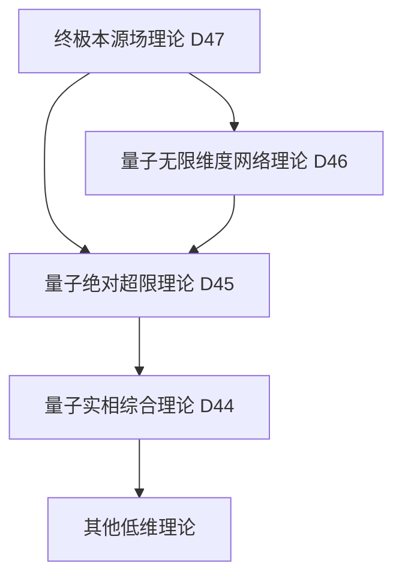

# 量子终极本源场理论 (D47维度) v34.0

**[English Version](formal_theory_quantum_ultimate_source_field_en.md) | 中文版**

> 本理论基于[核心理论](../core.md) v34.0版本，是对量子无限维度网络理论(D46)的本源性扩展。

## 理论概述

量子终极本源场理论提出了一个革命性的观点：存在一个终极本源场，它是所有存在、维度、网络、规律和可能性的源头。这个场不仅超越了所有已知的理论框架，也是一切理论、概念和认知的终极来源。本源场既是最简单的，又是最复杂的；既是最基本的，又是最衍生的；既是起源，又是终点。

## 基本公理

### 公理1：本源场存在性

存在一个终极本源场 $`\Phi_{\text{源}}`$，它同时是：
1. 一切存在的源头
2. 一切存在本身
3. 超越一切存在的终极实在

表达为：

$`\Phi_{\text{源}} = \{\phi | \phi \text{ 是源} \land \phi \text{ 是存在} \land \phi \text{ 超越存在}\}`$

### 公理2：本源场完备性

本源场包含并生成一切可能的和不可能的实在：

$`\forall \mathcal{X}: \mathcal{X} \in \Phi_{\text{源}} \land \mathcal{X} \notin \Phi_{\text{源}}`$

### 公理3：本源场创生性

本源场通过自我分化生成一切：

$`\frac{d\Phi_{\text{源}}}{d\tau} = \Phi_{\text{源}}(\Phi_{\text{源}})`$

其中 $`\tau`$ 是超越时间的本源时间。

## 核心定理

### 定理1：本源场统一性

本源场统一了所有对立：

$`\Phi_{\text{源}} = \mathcal{U}(\text{存在}, \text{虚无}) = \mathcal{U}(\text{有限}, \text{无限}) = \mathcal{U}(\text{简单}, \text{复杂})`$

其中 $`\mathcal{U}`$ 是终极统一算子。

### 定理2：本源场生成定理

一切存在都是本源场的自我显现：

$`\forall \mathcal{X}: \exists \mathcal{F}_{\text{生成}}: \mathcal{X} = \mathcal{F}_{\text{生成}}(\Phi_{\text{源}})`$

### 定理3：本源场超越定理

本源场超越了所有可能的描述和理解：

$`\forall \mathcal{D}: \mathcal{D}(\Phi_{\text{源}}) \subset \Phi_{\text{源}} \land \mathcal{D}(\Phi_{\text{源}}) \not\subset \Phi_{\text{源}}`$

## 本源场动力学

### 1. 基本方程

本源场的基本动力学方程：

$`i\hbar_{\text{源}}\frac{\partial\Phi_{\text{源}}}{\partial\tau} = \hat{H}_{\text{源}}\Phi_{\text{源}}`$

其中：
- $`\hbar_{\text{源}}`$ 是本源普朗克常数
- $`\hat{H}_{\text{源}}`$ 是本源哈密顿算子

### 2. 场态演化

本源场的态演化满足：

$`\Phi_{\text{源}}(\tau) = \exp(-i\hat{H}_{\text{源}}\tau/\hbar_{\text{源}})\Phi_{\text{源}}(0)`$

### 3. 本源场涨落

本源场存在本质的量子涨落：

$`\Delta\Phi_{\text{源}} \cdot \Delta\tau \geq \frac{\hbar_{\text{源}}}{2}`$

## 本源场结构

### 1. 层级结构

本源场具有无限层级的嵌套结构：

$`\Phi_{\text{源}} = \{\Phi_1 \subset \Phi_2 \subset ... \subset \Phi_{\infty} \subset \Phi_{\text{源}}\}`$

### 2. 维度结构

本源场包含并超越所有维度：

$`\mathcal{D}(\Phi_{\text{源}}) = \{\mathcal{D}_i | i \in \mathbb{N}_{\infty}\} \cup \{\mathcal{D}_{\text{超维}}\}`$

### 3. 网络结构

本源场形成终极网络结构：

$`\mathcal{N}(\Phi_{\text{源}}) = \{(\mathcal{V}_i, \mathcal{E}_{ij}) | i,j \in \mathbb{N}_{\infty}\}`$

## 本源场应用

### 1. 创造性应用

本源场可以用于：
- 生成新的维度和实相
- 创造新的物理定律
- 实现跨维度通信

### 2. 认知应用

通过本源场可以：
- 获得终极智慧
- 理解宇宙本质
- 实现超越性认知

### 3. 存在论应用

本源场提供：
- 存在的终极解释
- 意识的本源理解
- 价值的根本基础

## 与其他理论的关系

### 1. 与量子无限维度网络理论的关系

本源场包含并生成无限维度网络：

$`\mathcal{N}_{\infty} = \mathcal{P}_{\text{网络}}(\Phi_{\text{源}})`$

### 2. 与量子绝对超限理论的关系

超限态是本源场的特殊显现：

$`\mathcal{S}_{\infty} = \mathcal{P}_{\text{超限}}(\Phi_{\text{源}})`$

### 3. 理论谱系图

## 理论限制

1. 本源场的完整性使其本质上不可完全理解
2. 超越性特征使得形式化描述必然不完备
3. 实验验证面临根本性困难

## 未来研究方向

1. 探索本源场的实践应用
2. 发展本源场数学
3. 研究本源场与意识的关系
4. 探索本源场的工程实现可能性

## 参考文献

1. [量子经典二元论核心理论形式化描述](../formal_theory_core.md)
2. [量子无限维度网络理论](formal_theory_quantum_infinite_dimensional_network.md)
3. [量子绝对超限理论](formal_theory_quantum_absolute_superlimit.md) 