# Quantum-Classical Dualism Formal Theory v29.0

**English Version | [中文版](formal_theory.md)**

> This theory is based on [Core Theory](core_en.md) v29.0

## Complete Description of Core Theory

### Basic Definitions and Axioms

#### Simplified Core Axiom System

Quantum-Classical Dualism can be simplified into four core axioms:

**Axiom 1: Dual Existence**  
The universe consists of the quantum domain $\Omega_Q$ (space of infinite possibilities) and the classical domain $\Omega_C$ (space of determined reality), connected through the interface domain $\mathcal{I}$:

$$\mathcal{U} = \Omega_Q \cup \Omega_C, \quad \Omega_Q \cap \Omega_C = \mathcal{I}$$

**Axiom 2: Information Conservation**  
Information is conserved throughout the universe but can be converted between quantum information (possibility information in superposition states) and classical information (deterministic knowledge):

$$I(\psi) = I(\mathcal{C}(\psi)) + I_{\text{hidden}}(\psi) = \text{constant}$$

Where $\mathcal{C}$ is the classicalization operator (the process of transforming quantum possibilities into classical determinism), $I(\psi)$ is the total information content of state $\psi$, and $I_{\text{hidden}}(\psi)$ is the portion transformed into hidden information during the classicalization process.

**Axiom 3: Observer Classicalization**  
Observers are nodes that execute quantum→classical conversion, and their conversion capability determines their dimension:

$$\mathcal{O} = \{\mathcal{C}_\mathcal{O}, \mathcal{Q}_\mathcal{O}, K_C^\mathcal{O}\}, \quad D_{\mathcal{O}} \propto \frac{I_{classical knowledge}}{S_{classical entropy}+\epsilon}$$

Where $\mathcal{C}_\mathcal{O}$ is the observer's classicalization operator (ability to transform quantum possibilities into deterministic knowledge), $\mathcal{Q}_\mathcal{O}$ is the quantization operator (ability to transform classical knowledge back into quantum possibilities), $K_C^\mathcal{O}$ is the observer's classical knowledge base, and $\epsilon$ is a small constant to prevent division by zero.

**Axiom 4: Dimensional Emergence**  
Observer dimension is a function of classicalization ability and quantization ability, and the classical domain of higher-dimensional observers can become the quantum domain foundation for lower-dimensional observers:

$$D_{\mathcal{O}} = f\left(\frac{\mathcal{C}_\mathcal{O}}{\mathcal{Q}_\mathcal{O}}\right) \cdot \frac{I_{classical knowledge}}{S_{classical entropy}+\epsilon}$$

$$\Omega_Q^{(\mathcal{O}_2)} \subset \Omega_C^{(\mathcal{O}_1)}, \quad \text{if} \; D_{\mathcal{O}_1} > D_{\mathcal{O}_2}$$

This indicates that reality consists of multiple nested quantum-classical domains, and each level of observers perceives and interacts in specific dimensions based on their capability range.

#### Core Axiom System Diagram

$$
\begin{array}{ccc}
\boxed{\text{Quantum Domain } \Omega_Q} & \xrightarrow{\mathcal{C}_\mathcal{O} \text{ (Classicalization)}} & \boxed{\text{Classical Domain } \Omega_C} \\
\uparrow & \boxed{\mathcal{I} \text{ (Interface Domain)}} & \downarrow \\
\boxed{\text{Possibility Space}} & \xleftarrow{\mathcal{Q}_\mathcal{O} \text{ (Quantization)}} & \boxed{\text{Deterministic Space}} \\
\end{array}
$$

### Quantum and Classical Domains

The basic characteristics of quantum and classical domains are summarized through the following key points:

#### Core Properties of Quantum Domain

1. **Wavefunction Superposition State** (Chaos State): System exists simultaneously in multiple possible states, manifesting uncertainty
   $$\Psi_S = \sum_{i} \alpha_i |i\rangle, \quad \sum_{i} |\alpha_i|^2 = 1$$

2. **Quantum Entanglement State** (Energy Form): Different parts form inseparable holistic correlations
   $$\Psi_E = \sum_{i,j} \beta_{ij} |i\rangle_A \otimes |j\rangle_B$$

3. **Non-locality and Uncertainty**: Correlations beyond spacetime constraints and measurement uncertainty
   $$\Delta A \cdot \Delta B \geq \frac{1}{2}|\langle[\hat{A},\hat{B}]\rangle|$$

#### Core Properties of Classical Domain

1. **Classical Knowledge** (Determined Information): Precisely measurable and describable determined states
   $$K_C = \{k_i = (x_i, p_i, E_i, s_i, t_i)\}$$

2. **Classical Entropy** (Measure of Uncertainty): Measure of system disorder and information loss
   $$S_C = -k_B \sum_i p_i \ln p_i$$

3. **Locality and Determinism**: Limited propagation speed of interactions and measurement determinism
   $$P(A,B|a,b) = P(A|a) \cdot P(B|b)$$

#### Quantum vs Classical Domain Comparison

| Property | Quantum Domain $\Omega_Q$ | Classical Domain $\Omega_C$ |
|----------|--------------------------|----------------------------|
| Basic State | Superposition (Multiple Possibilities) | Determined State (Single Reality) |
| Information Characteristic | Quantum Information (Non-clonable) | Classical Information (Clonable) |
| Spatial Property | Non-locality (Entanglement) | Locality (Separability) |
| Temporal Evolution | Unitary Evolution (Reversible) | Irreversible Evolution (Entropy Increase) |
| Measurement Characteristic | Probabilistic (Wavefunction Collapse) | Deterministic (Precise Measurement) |
| Energy Form | Quantum Energy (Entanglement Energy) | Classical Energy (Kinetic/Potential) |

### Multiple Dualism Levels

Multiple Dualism Levels Theory extends single dualism into a nested multi-level structure:

$$\mathcal{U} = \{\Omega_Q^{(1)}, \Omega_C^{(1)}, \Omega_Q^{(2)}, \Omega_C^{(2)}, ..., \Omega_Q^{(n)}, \Omega_C^{(n)}\}$$

Where:
- $\Omega_Q^{(i)}$ is the quantum domain at level i (possibility space at that level)
- $\Omega_C^{(i)}$ is the classical domain at level i (deterministic realization at that level)

Inter-level mapping functions are defined as:

$$\mathcal{M}_{i \rightarrow i+1}: \Omega_C^{(i)} \rightarrow \Omega_Q^{(i+1)}$$

$$\mathcal{M}_{i+1 \rightarrow i}: \Omega_C^{(i+1)} \rightarrow \Omega_Q^{(i)}$$

This indicates that the classical structure of one level can become the quantum foundation for a higher level, producing infinitely recursive reality levels.

#### Multiple Levels Structure Diagram

$$
\begin{array}{ccccc}
\vdots & & \vdots & & \vdots \\
\updownarrow & & \updownarrow & & \updownarrow \\
\Omega_Q^{(3)} & \xrightarrow{\mathcal{C}^{(3)}} & \Omega_C^{(3)} & \xrightarrow{\mathcal{M}_{3 \rightarrow 4}} & \Omega_Q^{(4)} \\
\updownarrow & & \updownarrow & & \updownarrow \\
\Omega_Q^{(2)} & \xrightarrow{\mathcal{C}^{(2)}} & \Omega_C^{(2)} & \xrightarrow{\mathcal{M}_{2 \rightarrow 3}} & \Omega_Q^{(3)} \\
\updownarrow & & \updownarrow & & \updownarrow \\
\Omega_Q^{(1)} & \xrightarrow{\mathcal{C}^{(1)}} & \Omega_C^{(1)} & \xrightarrow{\mathcal{M}_{1 \rightarrow 2}} & \Omega_Q^{(2)} \\
\end{array}
$$

### Quantum-Classical Symmetry Principle

There exists a deep symmetry transformation $\mathcal{S}_{Q-C}$ between quantum and classical domains:

$$\mathcal{S}_{Q-C}: \Omega_Q \rightarrow \Omega_C, \quad \mathcal{S}_{C-Q}: \Omega_C \rightarrow \Omega_Q$$

Satisfying the following properties:

1. **Involution**: Transformation of transformation equals identity
   $$\mathcal{S}_{Q-C} \circ \mathcal{S}_{C-Q} = \mathcal{I}_{\Omega_Q}$$
   $$\mathcal{S}_{C-Q} \circ \mathcal{S}_{Q-C} = \mathcal{I}_{\Omega_C}$$

2. **Information Preservation**: Information quantity remains unchanged before and after transformation
   $$I_Q(x) = I_C(\mathcal{S}_{Q-C}(x))$$

3. **Uncertainty-Certainty Transformation**: Quantum uncertainty and classical certainty are mutually transformable
   $$U_Q(x) \cdot D_C(\mathcal{S}_{Q-C}(x)) = k$$

Where $U_Q$ is the quantum uncertainty measure, $D_C$ is the classical certainty measure, and $k$ is a universal constant.

## Core Branch Theories

### Detailed Quantum Domain Theory

The quantum domain $\Omega_Q$ is the possibility space in the dualism framework, with the following core properties:

#### 1. Quantum Information Encoding

Quantum information is encoded through quantum states in complex Hilbert space:

$$|\psi\rangle = \sum_i c_i |i\rangle, \quad \sum_i |c_i|^2 = 1$$

Where information density is quantified by von Neumann entropy:

$$S(\rho) = -\text{Tr}(\rho \ln \rho) = -\sum_i \lambda_i \ln \lambda_i$$

#### 2. Quantum Dynamics

Quantum system evolution follows the Schrödinger equation, preserving information and energy conservation:

$$i\hbar\frac{\partial|\psi\rangle}{\partial t} = \hat{H}|\psi\rangle$$

Quantum system dynamics has three key characteristics:
- Superposition principle: States can exist simultaneously in linear combinations of multiple basis vectors
- Time reversibility: Under pure quantum evolution, systems can return to initial states
- Phase coherence: Quantum systems maintain global phase correlations

#### 3. Quantum Entanglement Networks

Quantum entanglement forms multi-particle entanglement networks, representable as:

$$|\Psi_{\text{network}}\rangle = \sum_{i_1, i_2, \ldots, i_n} c_{i_1 i_2 \ldots i_n} |i_1 i_2 \ldots i_n\rangle$$

Entanglement degree can be quantified in multiple ways, including entanglement entropy:

$$E(|\psi_{AB}\rangle) = S(\rho_A) = S(\rho_B)$$

Entanglement networks form non-local connection structures in the quantum domain, supporting super-classical information transmission.

#### 4. Quantum Fluctuations

The quantum domain has inherent quantum fluctuations, guaranteed by the uncertainty principle:

$$\Delta A \cdot \Delta B \geq \frac{1}{2}|\langle[\hat{A},\hat{B}]\rangle|$$

Quantum fluctuation intensity is related to system energy and temperature:

$$\langle(\Delta E)^2\rangle = k_B T^2 \frac{\partial \langle E \rangle}{\partial T}$$

These fluctuations are the source of creativity and possibility in the quantum domain.

#### 5. Quantum Coherence and Coupling

Quantum coherence describes the consistency of phase relationships within a system, quantifiable through coherence measure:

$$C(\rho) = \sum_{i \neq j} |\rho_{ij}|$$

Quantum coupling strength determines the rate of information exchange between systems, expressible as:

$$J_{ij} = \langle i|\hat{H}_{int}|j \rangle$$

where $\hat{H}_{int}$ is the interaction Hamiltonian.

### Detailed Classical Domain Theory

The classical domain $\Omega_C$ is the deterministic reality space in the dualism framework, with the following core properties:

#### 1. Classical Information Structure

Classical information exists in the form of determined states, representable through definite physical quantities:

$$K_C = \{(x_i, p_i, E_i, s_i, t_i, \ldots)_j\}$$

where $x_i$, $p_i$, etc. represent position, momentum, and other classical observables. Classical information entropy satisfies:

$$S_C = -k_B \sum_i p_i \ln p_i$$

Key characteristics are information clonability and deletability, distinguishing it from quantum information.

#### 2. Deterministic Dynamics

Classical system evolution follows deterministic dynamics equations:

$$\frac{d\vec{x}}{dt} = \vec{v}(\vec{x},t), \quad \frac{d\vec{p}}{dt} = \vec{F}(\vec{x},\vec{p},t)$$

Dynamics has three signature features:
- Locality: Interactions propagate through local fields at finite speed
- Causality: Present state is completely determined by the past
- Separability: Systems can be decomposed into independent subsystems

#### 3. Entropy Increase and Irreversibility

Irreversible processes in the classical domain lead to entropy increase:

$$\frac{dS_C}{dt} \geq 0$$

Systems tend toward maximum entropy states, guaranteed by the phase space volume expansion theorem:

$$\frac{d}{dt}\int_V d\Gamma = \int_V \sum_i \frac{\partial \dot{z}_i}{\partial z_i}d\Gamma$$

where $\{z_i\}$ is the set of phase space coordinates.

#### 4. Classical Knowledge Networks

Classical knowledge forms causal networks, representable as directed graphs:

$$G_K = (V_K, E_K)$$

where $V_K$ is the set of knowledge nodes and $E_K$ is the set of causal relationships.

Knowledge coherence measure is:

$$C(K_C) = \frac{1}{|V_K|} \sum_{i,j} \frac{|P_{ij}|}{d(i,j)}$$

where $P_{ij}$ is the set of effective paths connecting nodes $i$ and $j$, and $d(i,j)$ is the distance in the graph.

#### 5. Classical Structure Stability

Classical structures have robustness against perturbations, analyzable through Lyapunov stability analysis:

$$\frac{d \delta x}{dt} = J(x^*) \cdot \delta x + O(|\delta x|^2)$$

where $J(x^*)$ is the Jacobian matrix at equilibrium point $x^*$. System stability is determined by the real parts of the Jacobian matrix eigenvalues.

### Core Interface Theory

The interface $\mathcal{I}$ is the transition region between quantum and classical domains, with the following core properties:

#### 1. Interface Structure

The interface is the intersection of quantum and classical domains, defined as:

$$\mathcal{I} = \{x \in \mathcal{U} | \mathcal{D}(x) = \mathcal{D}_c\}$$

where $\mathcal{D}(x)$ is the decoherence measure function and $\mathcal{D}_c$ is the critical decoherence threshold.

Interface thickness is determined by the decoherence gradient:

$$\delta_{\mathcal{I}} = \left|\frac{\partial \mathcal{D}}{\partial x}\right|^{-1}$$

#### 2. Interface Dynamics

Interface position satisfies a nonlinear dynamics equation:

$$\frac{d\mathcal{D}(x,t)}{dt} = \alpha \nabla^2 \mathcal{D}(x,t) + \beta(\mathcal{D}_c - \mathcal{D}(x,t))(\mathcal{D}(x,t) - \mathcal{D}_0) + \gamma\xi(x,t)$$

where:
- $\alpha$ is the diffusion coefficient
- $\beta$ is the bistable potential parameter
- $\mathcal{D}_0$ is the metastable threshold
- $\gamma\xi(x,t)$ is the quantum noise term

Interface oscillations have a characteristic frequency:

$$f_{\mathcal{I}} = \frac{1}{2\pi}\sqrt{\frac{\beta}{\alpha}}|\mathcal{D}_c - \mathcal{D}_0|$$

#### 3. Classicalization Process

The quantum→classical transformation (classicalization) process is represented through a classicalization superoperator:

$$\mathcal{C}(\rho) = \sum_i P_i \rho P_i$$

where $P_i$ are projection operators. The classicalization process satisfies information conservation:

$$I(\rho) = I(\mathcal{C}(\rho)) + I_{\text{hidden}}$$

Classicalization efficiency is related to environmental and system parameters:

$$\eta_{\mathcal{C}} = 1 - e^{-\lambda\frac{E}{k_BT}}$$

where $E$ is system energy, $T$ is environmental temperature, and $\lambda$ is the coupling constant.

#### 4. Quantum-Classical Information Conversion

At the interface, information transforms from quantum to classical form:

$$I_Q \rightarrow I_C + I_{\text{hidden}}$$

The information matching measure during conversion is:

$$M(I_Q, I_C) = \frac{I_C}{I_Q} = 1 - \frac{I_{\text{hidden}}}{I_Q}$$

At the optimal interface, $M(I_Q, I_C)$ reaches a local maximum.

#### 5. Interface Oscillations and Quantum Gravity

The relationship between interface oscillations and spacetime curvature can be represented as:

$$R_{\mu\nu} - \frac{1}{2}g_{\mu\nu}R = 8\pi G \cdot T_{\mu\nu}^{\mathcal{I}}$$

where $T_{\mu\nu}^{\mathcal{I}}$ is the interface energy-momentum tensor, further expressible as:

$$T_{\mu\nu}^{\mathcal{I}} = \alpha_{\mathcal{I}} \cdot \nabla_\mu \mathcal{D} \nabla_\nu \mathcal{D} - g_{\mu\nu}(\frac{\alpha_{\mathcal{I}}}{2}|\nabla \mathcal{D}|^2 + V(\mathcal{D}))$$

This indicates that interface oscillations can serve as manifestations of quantum gravity effects.

### Core Observer Theory

Observers are nodes executing quantum→classical transformations, with the following core properties:

#### 1. Observer Structure

Observers are constituted by three core components:

$$\mathcal{O} = \{\mathcal{C}_{\mathcal{O}}, \mathcal{Q}_{\mathcal{O}}, K_C^{\mathcal{O}}\}$$

where:
- $\mathcal{C}_{\mathcal{O}}$ is the observer's unique classicalization operator
- $\mathcal{Q}_{\mathcal{O}}$ is the observer's unique quantization operator
- $K_C^{\mathcal{O}}$ is the observer's classical knowledge base

Observer dimension is determined by their information processing capacity:

$$D_{\mathcal{O}} = f\left(\frac{\mathcal{C}_{\mathcal{O}}}{\mathcal{Q}_{\mathcal{O}}}\right) \cdot \frac{I_{classical knowledge}}{S_{classical entropy}+\epsilon}$$

#### 2. Dimensional Network Dynamics

Observer dimension satisfies a nonlinear dynamics equation:

$$\frac{dD_{\mathcal{O}}}{dt} = \alpha\frac{dI_{K_C}}{dt} - \beta\frac{dS_C}{dt} + \gamma\sum_{j\in\mathcal{N}(i)}(D_j-D_{\mathcal{O}})$$

where the last term represents the collective effect of the observer network.

Consensus formation in the observer network follows:

$$\frac{d\mathcal{C}_{\text{consensus}}}{dt} = \sum_i \omega_i \mathcal{C}_i - \gamma(\mathcal{C}_{\text{consensus}} - \bar{\mathcal{C}})^2$$

where $\omega_i$ is the observer weight and $\bar{\mathcal{C}}$ is the average classicalization operator.

#### 3. Measurement Theory

In observer theory, the quantum measurement process can be represented as:

$$|\psi\rangle\langle\psi| \otimes \rho_A \otimes \rho_O \xrightarrow{U_{\text{interaction}}} \sum_{i,j} c_i c_j^* |i\rangle\langle j| \otimes |A_i\rangle\langle A_j| \otimes \rho_O \xrightarrow{\mathcal{C}_O} |i_0\rangle\langle i_0| \otimes |A_{i_0}\rangle\langle A_{i_0}| \otimes \rho_{O}^{i_0}$$

Measurement result probability is modulated by the observer resolution parameter $\eta_O$:

$$P(i_0||\psi\rangle) = |c_{i_0}|^2 \cdot \frac{e^{\eta_O|c_{i_0}|^2}}{\sum_j e^{\eta_O|c_j|^2}}$$

The relationship between observer energy resolution threshold and measurement resolution is:

$$\eta_O = \frac{\hbar}{k_B T} \cdot \ln\left(\frac{E_{\text{threshold}}}{\bar{E}_0}\right)$$

#### 4. Observer Level Network

Observers form a multi-level network structure:

$$\mathcal{N} = \{\mathcal{O}^{(1)}, \mathcal{O}^{(2)}, ..., \mathcal{O}^{(n)}, \mathcal{E}\}$$

where $\mathcal{O}^{(k)}$ is the set of level k observers and $\mathcal{E}$ is the set of cross-level connections.

Higher-level observers perceive larger spatiotemporal scales:

$$L^{(k)} \approx L^{(1)} \cdot e^{\eta(k-1)}, \quad T^{(k)} \approx T^{(1)} \cdot e^{\eta(k-1)}$$

This explains why higher-dimensional observers can perceive patterns at larger spacetime scales.

#### 5. Consciousness and Free Will

Consciousness can be described as a specific organizational pattern in the observer's classical domain, represented as:

$$\mathcal{C}_{\text{consciousness}} = \mathcal{F}(K_C^{\mathcal{O}}, \mathcal{C}_{\mathcal{O}})$$

Free will can be represented as a mixed decision process with both quantum uncertainty and classical determinism characteristics:

$$\mathcal{W} = \lambda \cdot \mathcal{W}_Q + (1-\lambda) \cdot \mathcal{W}_C$$

where $\lambda$ is the quantum parameter, $\mathcal{W}_Q$ is the decision component from the quantum domain, and $\mathcal{W}_C$ is the decision component from the classical domain.

## Branch Theory Navigation

The following are the core descriptions and links to various branch theories of Quantum-Classical Dualism:

### Foundation Framework

#### [Quantum Domain](formal_theory_quantum_domain_en.md)
Explore the complete characteristics of the quantum domain, including superposition states, entanglement states, quantum uncertainty, and quantum information dynamics. The quantum domain as a space of infinite possibilities forms one end of the dualism framework.

#### [Classical Domain](formal_theory_classical_domain_en.md)
Analyze the complete characteristics of the classical domain, including classical knowledge structure, determinism, locality, and classical information theory. The classical domain as a space of determined reality forms the other end of the dualism framework.

#### [Interface Theory](formal_theory_interface_en.md)
Study the interface dynamics between quantum and classical domains, including interface fluctuations, phase transitions, and detailed mechanisms of the classicalization process. The interface is a key area for understanding quantum to classical transitions.

#### [Observer Theory](formal_theory_observer_en.md)
Discuss the core role of observers in quantum-classical conversion, including observer networks, dimensional evolution, and consciousness formation mechanisms. As nodes executing quantum→classical conversion, observers play a central role in the entire framework.

#### [Mathematical Appendix](formal_theory_mathematical_appendix_en.md)
Provide mathematical tools and techniques needed for quantum-classical dualism, including advanced function spaces, nonlinear dynamics, and information geometry. Provides rigorous mathematical foundations for the theory.

#### [Experimental Predictions](formal_theory_experimental_en.md)
List of experimentally verifiable predictions proposed by quantum-classical dualism, including interface fluctuations, critical scales, and observer resolution. Provides empirical testing methods for the theory.

### Physics Applications

#### [Information-Spacetime-Energy Unified Theory](formal_theory_unified_en.md)
Propose a unified theoretical framework for information, energy, and spacetime, revealing deep connections between them. Establishes a unified understanding of the universe's basic elements.

#### [Quantum Gravity and Spacetime Emergence](formal_theory_gravity_spacetime_en.md)
Explore how spacetime structure emerges from quantum information networks, and the dualism explanation of quantum gravity. Addresses the most challenging unified problem in physics: quantum gravity.

#### [Quantum Spacetime Harmony Theory](formal_theory_quantum_spacetime_harmony_en.md)
Study the harmony and transformation relationship of spatiotemporal structures between quantum and classical domains, proposing the concept of harmony fields to explain the formation and evolution of large-scale structures in the universe, providing new perspectives for quantum gravity.

#### [Nature of Matter Theory](formal_theory_matter_en.md)
Deeply explore the nature of matter as information structures, explaining deeper reasons for particle-wave duality. Provides philosophical foundations for fundamental physics.

#### [Hierarchical Spacetime Theory](formal_theory_hierarchical_spacetime_en.md)
Analyze multi-level nested spacetime structures and their interrelationships. Explains the coherence of physical laws at different scales.

#### [Multiscale Dualism](formal_theory_multiscale_en.md)
Discuss the application of dualism at different scales, from fundamental particles to cosmological scales. Establishes a cross-scale unified physics framework.

#### [Temporal Asymmetry Theory](formal_theory_temporal_asymmetry_en.md)
Explain the origin of the arrow of time, revealing the quantum roots of spacetime asymmetry. Solves the mystery of temporal directionality in physics.

#### [Multiverse Interference Model](formal_theory_multiverse_en.md)
Establish precise models describing interactions between possible worlds, explaining reality branching and interference phenomena. Provides testable frameworks for multiverse theories.

#### [Cosmological Dualism Model](formal_theory_cosmology_en.md)
Study the quantum-classical dualism perspective on cosmic origins and evolution, explaining phenomena such as the Big Bang, dark matter, and dark energy. Provides a new theoretical framework for cosmological problems.

#### [Evolutionary Cosmology Dualism](formal_theory_evolutionary_cosmology_en.md)
Explore evolution patterns of the universe as a large quantum-classical conversion system, proposing possibilities of cosmic teleology. Establishes new models for macro-cosmology.

### Chemical Theories

#### [Quantum-Classical Chemistry Principles](formal_theory_quantum_chemistry_en.md)
Applies the dualism framework to analyze the nature of chemical systems, proposing that chemical systems simultaneously possess both quantum and classical fundamental properties, explaining multi-level chemical phenomena from basic chemical bonds to complex biomolecules.

#### [Molecular Entanglement Theory](formal_theory_molecular_entanglement_en.md)
Explores quantum entanglement phenomena in molecular systems and their effects on chemical properties and biological functions, explaining complex chemical reactions, molecular recognition, enzyme catalysis, and biological signal transduction.

#### [Chemical Thermodynamics and Dualism](formal_theory_chemical_thermodynamics_en.md)
Applies the dualism framework to thermodynamic processes, revealing the quantum-classical dual nature behind thermodynamic phenomena, establishing a unified bridge from microscopic quantum uncertainty to macroscopic thermodynamic certainty.

#### [Chemical Consciousness and Perception](formal_theory_chemical_consciousness_en.md)
Studies consciousness and perception phenomena at the molecular level, proposing that molecular systems can exhibit primitive forms of consciousness and perceptual abilities under specific organizational conditions, providing a chemical-based explanatory framework for the nature and origin of consciousness.

### [Quantum-Classical Information Security Theory](formal_theory_quantum_security_en.md)
Unify classical cryptography and quantum cryptography, revealing deep connections between them. Develops new secure communication schemes.

## Theory Dependency Graph

The following graph shows the dependency relationships between various branches of quantum-classical dualism theory:

```mermaid
%%{
  init: {
    'theme': 'base',
    'themeVariables': {
      'nodeBorder': '#333',
      'mainBkg': '#fff',
      'nodeTextColor': '#000',
      'fontSize': '16px',
      'primaryBorderColor': '#333',
      'edgeLabelBackground': '#fff',
      'lineHeight': '1.4'
    },
    'flowchart': {
      'nodeSpacing': 30,
      'rankSpacing': 80,
      'curve': 'basis',
      'useMaxWidth': false,
      'htmlLabels': true
    }
  }
}%%

flowchart TD
    %% Core Theory
    Core[Core Theory formal_theory_en.md v29.0] 
    
    %% Foundation Layer
    QD[Quantum Domain Details v19.1]
    CD[Classical Domain Details]
    IF[Interface Theory v19.0]
    OB[Observer Theory v27.0]
    PT[Information Phase Transition Theory]
    MA[Mathematical Appendix]
    EX[Experimental Predictions]
    
    %% Direct Dependencies
    Core --> QD
    Core --> CD
    Core --> IF
    Core --> OB
    Core --> PT
    Core --> MA
    Core --> EX
    
    %% Interface Theory Dependencies
    QD --> IF
    CD --> IF
    
    %% Observer Theory Dependencies
    IF --> OB
    
    %% Physics Applications Layer
    UT[Information-Spacetime-Energy Unified Theory]
    GS[Quantum Gravity & Spacetime Emergence]
    MT[Nature of Matter Theory]
    HS[Hierarchical Spacetime Theory v13.0]
    MS[Multiscale Dualism v14.0]
    TA[Temporal Asymmetry Theory v24.0]
    MU[Multiverse Interference Model v27.0]
    CM[Cosmological Dualism Model]
    EC[Evolutionary Cosmology Dualism]
    CI[Quantum-Classical Cosmic Intelligence Theory v29.0]
    
    %% Physics Applications Dependencies
    Core --> UT
    Core --> GS
    QD & CD --> MT
    Core & OB --> HS
    HS --> MS
    Core & QD --> TA
    Core & QD --> MU
    GS --> CM
    CM --> EC
    Core & CO & CM --> CI
    
    %% Life and Consciousness Layer
    QB[Quantum Biology v20.0]
    EL[Information Entropy and Life v27.0]
    CO[Quantum Consciousness Theory v25.0]
    UC[Unified Consciousness Theory v28.0]
    QDr[Quantum Dream Theory]
    ON[High-Dimensional Observer Network v26.0]
    OF[Observer Feedback Theory]
    EV[Evolutionary Dualism Perspective v27.0]
    CF[Future Development of Human Consciousness]
    ME[Meditation Science v27.0]
    BD[Quantum-Classical Biodiversity Theory v29.0]
    
    %% Life and Consciousness Dependencies
    IF --> QB
    Core & QB --> EL
    Core & OB --> CO
    Core & CO --> UC
    IF & CO --> QDr
    OB --> ON
    OB --> OF
    Core & QB --> EV
    CO --> CF
    Core & CO --> ME
    Core & QB & EV --> BD
    
    %% Cognition and Information Layer
    CD2[Quantum Cognitive Dynamics v24.0]
    QDe[Quantum Decision Theory v24.0]
    NE[Quantum-Classical Non-equilibrium Theory v27.0]
    LT[Language and Thought Dual Structure]
    QLF[Quantum Language Formation Theory v28.0]
    QL[Quantum Linguistics v27.0]
    MEM[Quantum Memory Theory v11.1]
    TP[Time Perception Theory v27.0]
    SR[Self-Reference Loop Theory]
    QEm[Quantum Emergence Theory v29.0]
    ID[Information Dynamics Theory v29.0]
    CM2[Consciousness Measurement Theory v29.0]
    
    %% Cognition and Information Dependencies
    Core & OB --> CD2
    Core & CD2 --> QDe
    Core & IF --> NE
    CD2 --> LT
    Core & LT --> QLF
    Core & LT --> QL
    Core --> MEM
    Core & CO --> TP
    CO --> SR
    Core & NE --> QEm
    Core & PT --> ID
    Core & CO --> CM2
    
    %% Computing and Information Technology Layer
    QC[Quantum Computing Applications]
    CC[Computational Complexity Theory v27.0]
    QS[Quantum-Classical Information Security Theory v25.0]
    TO[Topological Information Protection Theory v27.0]
    QM[Quantum Communication Protocols v27.0]
    QA[Quantum AI and Machine Learning v27.0]
    IT[Quantum-Classical Interaction Technology v27.0]
    VR[Virtual Reality and Dualism]
    TS[Technology Singularity Prediction v27.0]
    
    %% Computing and Technology Dependencies
    QD & CD --> QC
    Core & QC --> CC
    Core & QC --> QS
    Core & QD --> TO
    Core & QC --> QM
    QC & CD --> QA
    Core & IF --> IT
    IT --> VR
    Core & IT --> TS
    
    %% Social and Humanities Applications Layer
    SD[Quantum Social Dynamics v27.0]
    SN[Quantum Social Network Theory v27.0]
    QE[Quantum Economics Principles]
    QET[Quantum Technology Ethics Theory v28.0]
    ET[Quantum-Classical Ethics v27.0]
    PH[Dualistic Philosophical Foundations v27.0]
    CC2[Cross-Cultural Philosophy Integration v11.1]
    MM[Quantum-Classical Mathematical Foundations v29.0]
    GQM[Geometric Quantum Mathematics Theory v29.0]
    DS[Dynamical Systems Dualism v29.0]
    MMM[Mathematical Modeling Dual Methodology v29.0]
    QIG[Quantum Information Geometry v29.0]
    SO[Quantum Self-Organization Theory]
    CS[Complex Systems Dual Analysis v27.0]
    TE[Quantum-Classical Technology Ethics Theory v29.0]
    
    %% Social and Humanities Dependencies
    Core & OB --> SD
    Core & SD --> SN
    QDe --> QE
    Core & ET --> QET
    Core & OB --> ET
    Core --> PH
    Core & PH --> CC2
    Core & PH --> MM
    Core & MA & MM --> GQM
    NE --> SO
    Core & SO --> CS
    MM & MA --> DS
    MM & DS --> MMM
    MM & GQM --> QIG
    Core & ET & QET & QA --> TE
    
    %% Creative and Expressive Layer
    AR[Dualistic Art Theory v27.0]
    MU2[Quantum-Classical Music Theory]
    AE[Quantum-Classical Aesthetics Theory v27.0]
    NA[Quantum Narrative Theory v27.0]
    SE[Dualistic Semiotics Theory]
    DE[Quantum-Classical Design Theory v11.1]
    IN[Quantum Innovation Theory v27.0]
    RE[Quantum-Classical Resonance Theory]
    DA[Quantum-Classical Digital Art Theory v29.0]
    
    %% Creative and Expressive Dependencies
    Core & OB --> AR
    AR --> MU2
    Core & AR --> AE
    Core & LT --> NA
    LT --> SE
    Core --> DE
    Core & CD2 --> IN
    QD & CD --> RE
    Core & AR & AE & DE --> DA
    
    %% Application Domains Layer
    MD[Quantum Medicine Applications v27.0]
    QH[Quantum Information Healing Theory v28.0]
    PS[Dualistic Psychotherapy Model v28.0]
    ED[Dualistic Education Theory v27.0]
    RD[System Reduction Theory v28.0]
    PA[Practical Applications Collection v28.0]
    RE2[Reality Engineering v29.0]
    UL[Universal Learning Theory v29.0]
    
    %% Application Domains Dependencies
    Core & QB --> MD
    Core & MD & QB --> QH
    Core & CO --> PS
    Core & CD2 --> ED
    Core --> RD
    Core & RD --> PA
    Core & IF & QEm --> RE2
    Core & ID --> UL
    
    %% Physics Applications New Dependencies
    Core & GS --> QSH
    QSH[Quantum Spacetime Harmony Theory v28.0]
    
    %% New Theory Dependencies
    CO & ON --> UC
    QB & MD --> QH
    ET & SD & QA --> QET
    GS & UT --> QSH
    LT & QL & CD2 --> QLF
    NE & PT & QD --> QEm
    PT & IF --> ID
    CO & OB & QEm --> CM2
    IF & OB & QEm --> RE2
    ID & EV --> UL
    
    %% Style Settings
    classDef core fill:#f9d5e5,stroke:#333,stroke-width:2px;
    classDef foundation fill:#eeeeee,stroke:#333,stroke-width:1px;
    classDef physics fill:#d5e8d4,stroke:#333,stroke-width:1px;
    classDef life fill:#e1d5e7,stroke:#333,stroke-width:1px;
    classDef cognition fill:#dae8fc,stroke:#333,stroke-width:1px;
    classDef computation fill:#fff2cc,stroke:#333,stroke-width:1px;
    classDef society fill:#f8cecc,stroke:#333,stroke-width:1px;
    classDef creativity fill:#d5e8d4,stroke:#333,stroke-width:1px;
    classDef application fill:#ffe6cc,stroke:#333,stroke-width:1px;
    classDef reference fill:#e1d5e7,stroke:#333,stroke-width:1px;
    
    class Core core;
    class QD,CD,IF,OB,PT,MA,EX foundation;
    class UT,GS,MT,HS,MS,TA,MU,CM,EC,CI,QSH physics;
    class QB,EL,CO,QDr,ON,OF,EV,CF,ME,BD,UC life;
    class CD2,QDe,NE,LT,QLF,QL,MEM,TP,SR,QEm,ID,CM2 cognition;
    class QC,CC,QS,TO,QM,QA,IT,VR,TS computation;
    class SD,SN,QE,QET,ET,PH,CC2,MM,SO,CS,TE,GQM,DS,MMM,QIG society;
    class AR,MU2,AE,NA,SE,DE,IN,RE,DA creativity;
    class MD,QH,PS,ED,RD,PA,RE2,UL application;
    class TC reference;
```

This dependency relationship graph shows the actual dependency structure between various branches of quantum-classical dualism theory. The graph includes version numbers for various theories, with different colors indicating different theory categories and arrows indicating dependency directions. The core theory is at the top level, providing a foundation for all branch theories, while the dependencies between the various branch theories are connected according to the declarations in their respective documents.

## Document Navigation
- [Core Theory (This File)](formal_theory_en.md)
- [Quantum Domain Details](formal_theory_quantum_domain_en.md)
- [Classical Domain Details](formal_theory_classical_domain_en.md)
- [Interface Theory](formal_theory_interface_en.md)
- [Observer Theory](formal_theory_observer_en.md)
- [Mathematical Appendix](formal_theory_mathematical_appendix_en.md)
- [Experimental Predictions](formal_theory_experimental_en.md)
- [Quantum Gravity and Spacetime Emergence](formal_theory_gravity_spacetime_en.md)
- [Quantum Biology](formal_theory_quantum_biology_en.md)
- [Information-Spacetime-Energy Unified Theory](formal_theory_unified_en.md)
- [Higher-Dimensional Observer Networks](formal_theory_observer_network_en.md)
- [Quantum Computing Applications](formal_theory_quantum_computing_en.md)
- [Quantum Decision Theory](formal_theory_quantum_decision_en.md)
- [Temporal Asymmetry Theory](formal_theory_temporal_asymmetry_en.md)
- [Quantum Cognitive Dynamics](formal_theory_cognitive_dynamics_en.md)
- [Hierarchical Spacetime Theory](formal_theory_hierarchical_spacetime_en.md)
- [Multiscale Dualism](formal_theory_multiscale_en.md)
- [Quantum Consciousness Theory](formal_theory_consciousness_en.md)
- [Unified Consciousness Theory](formal_theory_unified_consciousness_en.md)
- [Quantum Medicine Applications](formal_theory_medicine_en.md)
- [Quantum Information Healing Theory](formal_theory_quantum_healing_en.md)
- [Topological Information Protection Theory](formal_theory_topology_en.md)
- [Quantum Social Dynamics](formal_theory_social_en.md)
- [Quantum AI and Machine Learning](formal_theory_quantum_ai_en.md)
- [Quantum-Classical Dualism AI Theory](formal_theory_artificial_intelligence_en.md)
- [Quantum-Classical Information Security Theory](formal_theory_quantum_security_en.md)
- [Quantum-Classical Resonance Theory](formal_theory_resonance_en.md)
- [Information Phase Transition Theory](formal_theory_phase_transition_en.md)
- [Self-Reference Loop Theory](formal_theory_self_reference_en.md)
- [Quantum-Classical Non-equilibrium Theory](formal_theory_nonequilibrium_en.md)
- [Dualism Computational Complexity Theory](formal_theory_computation_en.md)
- [Observer Feedback Theory](formal_theory_observer_feedback_en.md)
- [System Reduction Theory](formal_theory_reduction_en.md)
- [Theory Practical Applications Collection](formal_theory_practical_applications_en.md)
- [Cosmological Dualism Model](formal_theory_cosmology_en.md)
- [Technological Singularity Prediction](formal_theory_singularity_en.md)
- [Quantum Communication Protocols](formal_theory_quantum_communication_en.md)
- [Dualism Philosophical Foundations](formal_theory_philosophy_en.md)
- [Quantum Science Philosophy and AI Theory](formal_theory_quantum_science_philosophy_en.md)
- [Virtual Reality and Dualism](formal_theory_virtual_reality_en.md)
- [Information Entropy and Life](formal_theory_entropy_life_en.md)
- [Quantum Economics Principles](formal_theory_quantum_economics_en.md)
- [Language and Thought Dual Structure](formal_theory_language_thought_en.md)
- [Quantum Language Formation Theory](formal_theory_quantum_language_formation_en.md)
- [Evolution Dualistic Perspective](formal_theory_evolution_en.md)
- [Human Consciousness Future Development](formal_theory_consciousness_future_en.md)
- [Quantum Dream Theory](formal_theory_quantum_dreams_en.md)
- [Dualism Art Theory](formal_theory_art_en.md)
- [Quantum-Classical Mathematical Foundations](formal_theory_mathematics_en.md)
- [Geometric Quantum Mathematics Theory](formal_theory_geometric_quantum_mathematics_en.md)
- [Dualism Education Theory](formal_theory_education_en.md)
- [Quantum-Classical Music Theory](formal_theory_music_en.md)
- [Language Quantum Properties](formal_theory_quantum_linguistics_en.md)
- [Quantum Self-Organization Theory](formal_theory_self_organization_en.md)
- [Time Perception Theory](formal_theory_time_perception_en.md)
- [Quantum-Classical Ethics](formal_theory_ethics_en.md)
- [Quantum Technology Ethics Theory](formal_theory_quantum_ethics_en.md)
- [Quantum Innovation Theory](formal_theory_innovation_en.md)
- [Matter Essence Theory](formal_theory_matter_en.md)
- [Complex Systems Dual Analysis](formal_theory_complex_systems_en.md)
- [Quantum-Classical Aesthetics Theory](formal_theory_aesthetics_en.md)
- [Dualism Psychotherapy Model](formal_theory_psychotherapy_en.md)
- [Quantum Narrative Theory](formal_theory_narrative_en.md)
- [Dualism Semiotics Theory](formal_theory_semiotics_en.md)
- [Quantum-Classical Design Theory](formal_theory_design_en.md)
- [Quantum Memory Theory](formal_theory_memory_en.md)
- [Multiverse Interference Model](formal_theory_multiverse_en.md)
- [Quantum-Classical Interaction Technology](formal_theory_interaction_en.md)
- [Dualism Evolutionary Cosmology](formal_theory_evolutionary_cosmology_en.md)
- [Quantum Spacetime Harmony Theory](formal_theory_quantum_spacetime_harmony_en.md)
- [Cross-Cultural Philosophy Integration](formal_theory_cross_cultural_en.md)
- [Quantum Social Network Theory](formal_theory_social_networks_en.md)
- [Mindfulness Meditation Science](formal_theory_meditation_en.md)
- [Quantum Emergence Theory](formal_theory_quantum_emergence_en.md)
- [Information Dynamics Theory](formal_theory_information_dynamics_en.md)
- [Consciousness Measurement Theory](formal_theory_consciousness_measurement_en.md)
- [Reality Engineering](formal_theory_reality_engineering_en.md)
- [Universal Learning Theory](formal_theory_universal_learning_en.md)
- [Terminology and Concept Dictionary](formal_theory_terminology_en.md)
- [Quantum-Classical Cosmic Intelligence Theory](formal_theory_cosmic_intelligence_en.md)
- [Quantum-Classical Technology Ethics Theory](formal_theory_tech_ethics_en.md)
- [Quantum-Classical Digital Art Theory](formal_theory_digital_art_en.md)
- [Quantum-Classical Biodiversity Theory](formal_theory_biodiversity_en.md)
- [Quantum Emergent Phenomena Theory](formal_theory_quantum_emergent_phenomena_en.md)
- [Quantum Consciousness and Virtual Reality Interaction Theory](formal_theory_consciousness_virtual_reality_en.md)
- [Quantum-Classical Technology Ethics Theory](formal_theory_quantum_ethics_en.md) 