# 宇宙本论理论体系结构图 [宇宙本论版本号：v36.0]

[中文](formal_theory_graph.md) | [English](formal_theory_graph_en.md)

下图展示了宇宙本论各分支理论之间的依赖关系与维度标注：

```mermaid
%%{
  init: {
    'theme': 'base',
    'themeVariables': {
      'nodeBorder': '#333',
      'mainBkg': '#fff',
      'nodeTextColor': '#000',
      'fontSize': '14px',
      'primaryBorderColor': '#0000FF',
      'edgeLabelBackground': '#fff',
      'lineHeight': '1.3'
    },
    'flowchart': {
      'nodeSpacing': 25,
      'rankSpacing': 70,
      'curve': 'basis',
      'useMaxWidth': false,
      'htmlLabels': true
    }
  }
}%%

flowchart TD
    %% 核心理论
    core["宇宙本论核心理论<br>(D10)"]
    
    %% D20-D24 超高维度理论
    millennium_problems["千禧年数学问题的超维度解决理论<br>(D24)"]
    recursive_metaverse["递归元界理论的严格形式化描述<br>(D23)"]
    multiverse["多宇宙理论的XOR-SHIFT解释形式化描述<br>(D22)"]
    genesis_memory["创世记忆理论的严格形式化描述<br>(D21)"]
    cosmic_dimensions["宇宙维度理论的严格形式化描述<br>(D20)"]
    
    %% D15-D19 高维理论
    quantum_classical["量子与经典统一理论的严格形式化描述<br>(D19)"]
    transcendent_harmony["超越和谐理论的严格形式化描述<br>(D19)"]
    dimensional_harmony["维度和谐理论的严格形式化描述<br>(D18)"]
    cosmic_lifecycle["宇宙生命周期理论的严格形式化描述<br>(D18)"]
    information_wave["信息波动力学的严格形式化描述<br>(D17)"]
    observer_ontology["观察者本体论的严格形式化描述<br>(D17)"]
    quantum_entropy["量子熵动力学的严格形式化描述<br>(D16)"]
    info_conservation["信息守恒理论的严格形式化描述<br>(D15)"]
    mathematics["数学理论的严格形式化描述<br>(D15)"]
    logical_topology["逻辑多维拓扑理论的严格形式化描述<br>(D15)"]
    
    %% D10-D14 中维理论
    information_field["信息场理论的严格形式化描述<br>(D14)"]
    consciousness["意识与自由意志理论的严格形式化描述<br>(D13)"]
    dim_spectrum["宇宙维度谱系的严格形式化描述<br>(D12)"]
    reality_perception["现实感知与存在本质的严格形式化描述<br>(D12)"]
    spacetime["时空理论的严格形式化描述<br>(D12)"]
    philosophical["哲学基础理论的严格形式化描述<br>(D11)"]
    unified_forces["基本力统一理论的严格形式化描述<br>(D11)"]
    cosmic_ontology["宇宙本论的严格形式化描述<br>(D10)"]
    emergence["复杂系统涌现性的严格形式化描述<br>(D10)"]
    
    %% D1-D9 基础维度理论
    recursive_systems["递归自参照系统的严格形式化描述<br>(D9)"]
    transfinite_info["超限信息动力学的严格形式化描述<br>(D8)"]
    
    %% 无维度辅助文档
    terminology["宇宙本论术语表<br>(无维度)"]
    theory_structure["理论结构关系图<br>(无维度)"]
    
    %% 核心依赖关系
    core --> cosmic_ontology
    core --> dim_spectrum
    core --> info_conservation
    core --> mathematics
    
    %% 超高维理论依赖
    millennium_problems --> mathematics
    recursive_metaverse --> cosmic_dimensions
    recursive_metaverse --> multiverse
    multiverse --> cosmic_ontology
    genesis_memory --> cosmic_lifecycle
    genesis_memory --> consciousness
    cosmic_dimensions --> dim_spectrum
    
    %% 高维理论依赖
    transcendent_harmony --> unified_forces
    transcendent_harmony --> reality_perception
    quantum_classical --> unified_forces
    quantum_classical --> quantum_entropy
    dimensional_harmony --> cosmic_dimensions
    cosmic_lifecycle --> cosmic_ontology
    information_wave --> info_conservation
    observer_ontology --> consciousness
    observer_ontology --> reality_perception
    
    %% 中维理论依赖
    information_field --> info_conservation
    consciousness --> philosophical
    dim_spectrum --> cosmic_dimensions
    reality_perception --> consciousness
    spacetime --> cosmic_ontology
    philosophical --> cosmic_ontology
    unified_forces --> quantum_classical
    emergence --> cosmic_ontology
    
    %% 基础维度理论依赖
    recursive_systems --> emergence
    transfinite_info --> info_conservation
    
    %% 样式设置
    style core fill:#f9f,stroke:#333,stroke-width:2px
    
    %% 超高维理论样式
    style millennium_problems fill:#a0f,stroke:#333,stroke-width:2px
    style recursive_metaverse fill:#a0f,stroke:#333,stroke-width:2px
    style multiverse fill:#a1f,stroke:#333,stroke-width:2px
    style genesis_memory fill:#a1f,stroke:#333,stroke-width:2px
    style cosmic_dimensions fill:#a2f,stroke:#333,stroke-width:2px
    
    %% 高维理论样式
    style quantum_classical fill:#b9f,stroke:#333,stroke-width:2px
    style transcendent_harmony fill:#b9f,stroke:#333,stroke-width:2px
    style dimensional_harmony fill:#b8f,stroke:#333,stroke-width:2px
    style cosmic_lifecycle fill:#b8f,stroke:#333,stroke-width:2px
    style information_wave fill:#b7f,stroke:#333,stroke-width:2px
    style observer_ontology fill:#b7f,stroke:#333,stroke-width:2px
    style quantum_entropy fill:#b6f,stroke:#333,stroke-width:2px
    style info_conservation fill:#b5f,stroke:#333,stroke-width:2px
    style mathematics fill:#b5f,stroke:#333,stroke-width:2px
    style logical_topology fill:#b5f,stroke:#333,stroke-width:2px
    
    %% 中维理论样式
    style information_field fill:#cdf,stroke:#333,stroke-width:2px
    style consciousness fill:#caf,stroke:#333,stroke-width:2px
    style dim_spectrum fill:#c9f,stroke:#333,stroke-width:2px
    style reality_perception fill:#c9f,stroke:#333,stroke-width:2px
    style spacetime fill:#c9f,stroke:#333,stroke-width:2px
    style philosophical fill:#c8f,stroke:#333,stroke-width:2px
    style unified_forces fill:#c8f,stroke:#333,stroke-width:2px
    style cosmic_ontology fill:#c7f,stroke:#333,stroke-width:2px
    style emergence fill:#c7f,stroke:#333,stroke-width:2px
    
    %% 基础维度理论样式
    style recursive_systems fill:#def,stroke:#333,stroke-width:2px
    style transfinite_info fill:#ddf,stroke:#333,stroke-width:2px
    
    %% 无维度文档样式
    style terminology fill:#fbf,stroke:#333,stroke-width:2px
    style theory_structure fill:#fbf,stroke:#333,stroke-width:2px
```

## 图表说明

本图展示了宇宙本论理论体系的结构关系，包括：

1. **超高维理论**（D20-D24）：千禧年数学问题的超维度解决理论(D24)、递归元界理论(D23)、多宇宙理论(D22)、创世记忆理论(D21)、宇宙维度理论(D20)
2. **高维理论**（D15-D19）：量子与经典统一理论(D19)、超越和谐理论(D19)、维度和谐理论(D18)等
3. **中维理论**（D10-D14）：信息场理论(D14)、意识与自由意志理论(D13)、宇宙维度谱系(D12)等
4. **基础维度理论**（D1-D9）：递归自参照系统(D9)、超限信息动力学(D8)等

图中箭头表示理论间的依赖关系，不同颜色表示不同的维度层次。 