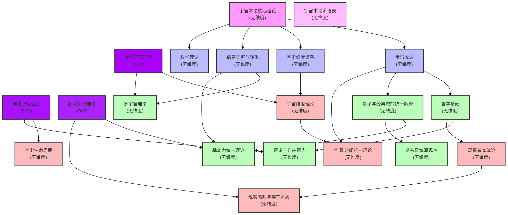

# 宇宙本论理论体系结构图 [宇宙本论版本号：1.0]

[中文](formal_theory_graph.md) | [English](formal_theory_graph_en.md)

下图展示了宇宙本论各分支理论之间的依赖关系与维度标注：

## 图表说明

本图展示了宇宙本论理论体系的结构关系，包括：

1. **超维度理论**（D19-D23）：递归元界理论(D23)、创世记忆理论(D21)、超越和谐理论(D19)
2. **核心理论**：宇宙本论、宇宙维度谱系、信息守恒与转化、数学理论等
3. **基础理论**：包括哲学基础、量子与经典域统一解释、意识与自由意志等
4. **扩展理论**：多宇宙理论、基本力统一理论、复杂系统涌现性等

图中箭头表示理论间的依赖关系，不同颜色表示不同的理论分类。 