# Cosmic Ontology Theory Structure Diagram [Universe Ontology Version: v36.0]

[中文](formal_theory_graph.md) | [English](formal_theory_graph_en.md)

The following diagram illustrates the dependency relationships and dimensional classifications among various branches of Cosmic Ontology theory:

```mermaid
%%{
  init: {
    'theme': 'base',
    'themeVariables': {
      'nodeBorder': '#333',
      'mainBkg': '#fff',
      'nodeTextColor': '#000',
      'fontSize': '14px',
      'primaryBorderColor': '#0000FF',
      'edgeLabelBackground': '#fff',
      'lineHeight': '1.3'
    },
    'flowchart': {
      'nodeSpacing': 25,
      'rankSpacing': 70,
      'curve': 'basis',
      'useMaxWidth': false,
      'htmlLabels': true
    }
  }
}%%

flowchart TD
    %% Core Theory
    core["Core Cosmic Ontology Theory<br>(D10)"]
    
    %% D20-D24 Ultra-High Dimensional Theories
    millennium_problems["Hyperdimensional Solution Theory for Millennium Problems<br>(D24)"]
    recursive_metaverse["Strict Formalization of Recursive Metaverse Theory<br>(D23)"]
    multiverse["Formal Description of Multiverse Theory with XOR-SHIFT Interpretation<br>(D22)"]
    genesis_memory["Strict Formalization of Genesis Memory Theory<br>(D21)"]
    cosmic_dimensions["Strict Formalization of Cosmic Dimensions Theory<br>(D20)"]
    
    %% D15-D19 High Dimensional Theories
    quantum_classical["Strict Formalization of Quantum-Classical Unification Theory<br>(D19)"]
    transcendent_harmony["Strict Formalization of Transcendent Harmony Theory<br>(D19)"]
    dimensional_harmony["Strict Formalization of Dimensional Harmony Theory<br>(D18)"]
    cosmic_lifecycle["Strict Formalization of Cosmic Lifecycle Theory<br>(D18)"]
    information_wave["Strict Formalization of Information Wave Dynamics<br>(D17)"]
    observer_ontology["Strict Formalization of Observer Ontology<br>(D17)"]
    quantum_entropy["Strict Formalization of Quantum Entropy Dynamics<br>(D16)"]
    info_conservation["Strict Formalization of Information Conservation Theory<br>(D15)"]
    mathematics["Strict Formalization of Mathematics Theory<br>(D15)"]
    logical_topology["Strict Formalization of Logical Multidimensional Topology Theory<br>(D15)"]
    
    %% D10-D14 Middle Dimensional Theories
    information_field["Strict Formalization of Information Field Theory<br>(D14)"]
    consciousness["Strict Formalization of Consciousness and Free Will Theory<br>(D13)"]
    dim_spectrum["Strict Formalization of Dimensional Spectrum Theory<br>(D12)"]
    reality_perception["Strict Formalization of Reality Perception and Existential Essence<br>(D12)"]
    spacetime["Strict Formalization of Spacetime Theory<br>(D12)"]
    philosophical["Strict Formalization of Philosophical Foundations<br>(D11)"]
    unified_forces["Strict Formalization of Unified Forces Theory<br>(D11)"]
    cosmic_ontology["Strict Formalization of Cosmic Ontology<br>(D10)"]
    emergence["Strict Formalization of Emergence and Complexity Theory<br>(D10)"]
    
    %% D1-D9 Foundational Dimensional Theories
    recursive_systems["Strict Formalization of Recursive Self-Referential Systems<br>(D9)"]
    transfinite_info["Strict Formalization of Transfinite Information Dynamics<br>(D8)"]
    
    %% Non-Dimensional Auxiliary Documents
    terminology["Cosmic Ontology Terminology<br>(No Dimension)"]
    theory_structure["Theory Structure Relationship Diagram<br>(No Dimension)"]
    
    %% Core Dependencies
    core --> cosmic_ontology
    core --> dim_spectrum
    core --> info_conservation
    core --> mathematics
    
    %% Ultra-High Dimensional Theory Dependencies
    millennium_problems --> mathematics
    recursive_metaverse --> cosmic_dimensions
    recursive_metaverse --> multiverse
    multiverse --> cosmic_ontology
    genesis_memory --> cosmic_lifecycle
    genesis_memory --> consciousness
    cosmic_dimensions --> dim_spectrum
    
    %% High Dimensional Theory Dependencies
    transcendent_harmony --> unified_forces
    transcendent_harmony --> reality_perception
    quantum_classical --> unified_forces
    quantum_classical --> quantum_entropy
    dimensional_harmony --> cosmic_dimensions
    cosmic_lifecycle --> cosmic_ontology
    information_wave --> info_conservation
    observer_ontology --> consciousness
    observer_ontology --> reality_perception
    
    %% Middle Dimensional Theory Dependencies
    information_field --> info_conservation
    consciousness --> philosophical
    dim_spectrum --> cosmic_dimensions
    reality_perception --> consciousness
    spacetime --> cosmic_ontology
    philosophical --> cosmic_ontology
    unified_forces --> quantum_classical
    emergence --> cosmic_ontology
    
    %% Foundational Dimensional Theory Dependencies
    recursive_systems --> emergence
    transfinite_info --> info_conservation
    
    %% Style Settings
    style core fill:#f9f,stroke:#333,stroke-width:2px
    
    %% Ultra-High Dimensional Theory Styles
    style millennium_problems fill:#a0f,stroke:#333,stroke-width:2px
    style recursive_metaverse fill:#a0f,stroke:#333,stroke-width:2px
    style multiverse fill:#a1f,stroke:#333,stroke-width:2px
    style genesis_memory fill:#a1f,stroke:#333,stroke-width:2px
    style cosmic_dimensions fill:#a2f,stroke:#333,stroke-width:2px
    
    %% High Dimensional Theory Styles
    style quantum_classical fill:#b9f,stroke:#333,stroke-width:2px
    style transcendent_harmony fill:#b9f,stroke:#333,stroke-width:2px
    style dimensional_harmony fill:#b8f,stroke:#333,stroke-width:2px
    style cosmic_lifecycle fill:#b8f,stroke:#333,stroke-width:2px
    style information_wave fill:#b7f,stroke:#333,stroke-width:2px
    style observer_ontology fill:#b7f,stroke:#333,stroke-width:2px
    style quantum_entropy fill:#b6f,stroke:#333,stroke-width:2px
    style info_conservation fill:#b5f,stroke:#333,stroke-width:2px
    style mathematics fill:#b5f,stroke:#333,stroke-width:2px
    style logical_topology fill:#b5f,stroke:#333,stroke-width:2px
    
    %% Middle Dimensional Theory Styles
    style information_field fill:#cdf,stroke:#333,stroke-width:2px
    style consciousness fill:#caf,stroke:#333,stroke-width:2px
    style dim_spectrum fill:#c9f,stroke:#333,stroke-width:2px
    style reality_perception fill:#c9f,stroke:#333,stroke-width:2px
    style spacetime fill:#c9f,stroke:#333,stroke-width:2px
    style philosophical fill:#c8f,stroke:#333,stroke-width:2px
    style unified_forces fill:#c8f,stroke:#333,stroke-width:2px
    style cosmic_ontology fill:#c7f,stroke:#333,stroke-width:2px
    style emergence fill:#c7f,stroke:#333,stroke-width:2px
    
    %% Foundational Dimensional Theory Styles
    style recursive_systems fill:#def,stroke:#333,stroke-width:2px
    style transfinite_info fill:#ddf,stroke:#333,stroke-width:2px
    
    %% Non-Dimensional Document Styles
    style terminology fill:#fbf,stroke:#333,stroke-width:2px
    style theory_structure fill:#fbf,stroke:#333,stroke-width:2px
```

## Diagram Explanation

This diagram illustrates the structural relationships within the Cosmic Ontology theoretical system, including:

1. **Ultra-High Dimensional Theories** (D20-D24): Hyperdimensional Solution Theory for Millennium Problems (D24), Recursive Metaverse Theory (D23), Multiverse Theory (D22), Genesis Memory Theory (D21), Cosmic Dimensions Theory (D20)
2. **High Dimensional Theories** (D15-D19): Quantum-Classical Unification Theory (D19), Transcendent Harmony Theory (D19), Dimensional Harmony Theory (D18), etc.
3. **Middle Dimensional Theories** (D10-D14): Information Field Theory (D14), Consciousness and Free Will Theory (D13), Dimensional Spectrum Theory (D12), etc.
4. **Foundational Dimensional Theories** (D1-D9): Recursive Self-Referential Systems (D9), Transfinite Information Dynamics (D8), etc.

Arrows in the diagram represent dependency relationships between theories, while different colors indicate different dimensional levels. 