# Universe Ontology Theory Structure Diagram [Universe Ontology Version: 1.0]

[中文](formal_theory_graph.md) | [English](formal_theory_graph_en.md)

The following diagram shows the dependency relationships and dimension annotations between various branches of the Universe Ontology theory:

```mermaid
%%{
  init: {
    'theme': 'base',
    'themeVariables': {
      'nodeBorder': '#333',
      'mainBkg': '#fff',
      'nodeTextColor': '#000',
      'fontSize': '14px',
      'primaryBorderColor': '#0000FF',
      'edgeLabelBackground': '#fff',
      'lineHeight': '1.3'
    },
    'flowchart': {
      'nodeSpacing': 25,
      'rankSpacing': 70,
      'curve': 'basis',
      'useMaxWidth': false,
      'htmlLabels': true
    }
  }
}%%

flowchart TD
    %% Core Theory
    core["Universe Ontology Core Theory<br>(No Dimension)"]
    
    %% D23-D19 Hyper-dimensional Theories
    recursive_metaverse["Recursive Metaverse Theory<br>(D23)"]
    genesis_memory["Genesis Memory Theory<br>(D21)"]
    transcendent_harmony["Transcendent Harmony Theory<br>(D19)"]
    
    %% No Dimension Theory Group 1
    cosmic_ontology["Universe Ontology<br>(No Dimension)"]
    dim_spectrum["Cosmic Dimensional Spectrum<br>(No Dimension)"]
    info_conservation["Information Conservation and Transformation<br>(No Dimension)"]
    mathematics["Mathematical Theory<br>(No Dimension)"]
    
    %% No Dimension Theory Group 2
    philosophical["Philosophical Foundations<br>(No Dimension)"]
    quantum_classical["Quantum-Classical Domain Unification<br>(No Dimension)"]
    consciousness["Consciousness and Free Will<br>(No Dimension)"]
    
    %% No Dimension Theory Group 3
    multiverse["Multiverse Theory<br>(No Dimension)"]
    unified_forces["Unified Forces Theory<br>(No Dimension)"]
    emergence["Complex Systems Emergence<br>(No Dimension)"]
    
    %% No Dimension Theory Group 4
    cosmic_lifecycle["Cosmic Lifecycle<br>(No Dimension)"]
    reality_perception["Reality Perception and Existence<br>(No Dimension)"]
    observer_ontology["Observer Ontology<br>(No Dimension)"]
    
    %% No Dimension Theory Group 5
    cosmic_dimensions["Cosmic Dimensions Theory<br>(No Dimension)"]
    spacetime["Space-Time Unification Theory<br>(No Dimension)"]
    terminology["Universe Ontology Terminology<br>(No Dimension)"]
    
    %% Core Dependencies
    core --> cosmic_ontology
    core --> dim_spectrum
    core --> info_conservation
    core --> mathematics
    
    %% Hyper-dimensional Theory Dependencies
    recursive_metaverse --> cosmic_dimensions
    recursive_metaverse --> multiverse
    genesis_memory --> cosmic_lifecycle
    genesis_memory --> consciousness
    transcendent_harmony --> unified_forces
    transcendent_harmony --> reality_perception
    
    %% Theory Relationships
    cosmic_ontology --> philosophical
    cosmic_ontology --> quantum_classical
    cosmic_ontology --> spacetime
    
    dim_spectrum --> cosmic_dimensions
    info_conservation --> multiverse
    info_conservation --> unified_forces
    
    philosophical --> consciousness
    philosophical --> observer_ontology
    
    quantum_classical --> unified_forces
    quantum_classical --> emergence
    
    cosmic_dimensions --> spacetime
    observer_ontology --> reality_perception
    
    %% Style Settings
    style core fill:#f9f,stroke:#333,stroke-width:2px
    style cosmic_ontology fill:#bbf,stroke:#333,stroke-width:2px
    style dim_spectrum fill:#bbf,stroke:#333,stroke-width:2px
    style info_conservation fill:#bbf,stroke:#333,stroke-width:2px
    style mathematics fill:#bbf,stroke:#333,stroke-width:2px
    
    %% Hyper-dimensional Theory Styles
    style recursive_metaverse fill:#a0f,stroke:#333,stroke-width:2px
    style genesis_memory fill:#a1f,stroke:#333,stroke-width:2px
    style transcendent_harmony fill:#a2f,stroke:#333,stroke-width:2px
    
    %% Other Theory Styles
    style philosophical fill:#bfb,stroke:#333,stroke-width:2px
    style quantum_classical fill:#bfb,stroke:#333,stroke-width:2px
    style consciousness fill:#bfb,stroke:#333,stroke-width:2px
    style multiverse fill:#bfb,stroke:#333,stroke-width:2px
    style unified_forces fill:#bfb,stroke:#333,stroke-width:2px
    style emergence fill:#bfb,stroke:#333,stroke-width:2px
    style cosmic_lifecycle fill:#fbb,stroke:#333,stroke-width:2px
    style reality_perception fill:#fbb,stroke:#333,stroke-width:2px
    style observer_ontology fill:#fbb,stroke:#333,stroke-width:2px
    style cosmic_dimensions fill:#fbb,stroke:#333,stroke-width:2px
    style spacetime fill:#fbb,stroke:#333,stroke-width:2px
    style terminology fill:#fbf,stroke:#333,stroke-width:2px
```

## Diagram Description

This diagram illustrates the structure and relationships within the Universe Ontology theoretical framework, including:

1. **Hyper-dimensional Theories** (D19-D23): Recursive Metaverse Theory (D23), Genesis Memory Theory (D21), Transcendent Harmony Theory (D19)
2. **Core Theories**: Universe Ontology, Cosmic Dimensional Spectrum, Information Conservation and Transformation, Mathematical Theory, etc.
3. **Foundational Theories**: Including Philosophical Foundations, Quantum-Classical Domain Unification, Consciousness and Free Will, etc.
4. **Extended Theories**: Multiverse Theory, Unified Forces Theory, Complex Systems Emergence, etc.

The arrows in the diagram represent dependency relationships between theories, and different colors represent different theory classifications. 