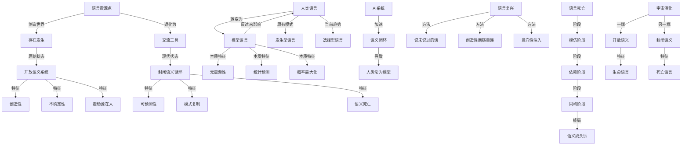
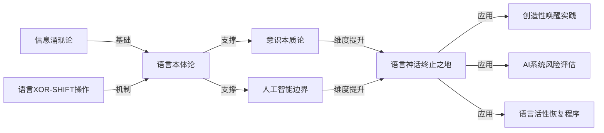

# 神话终止之地：概念图谱 [维度：18]

**[返回主文章](popular_theory_language_myth_ai.md)**

## 核心概念网络

## 关键对比表

### 语言模式对比

| 维度 | 创造型语言 | 预测型语言 |
|------|------------|------------|
| 震源 | 意识内在震动 | 外部统计模式 |
| 过程 | L = L_prior ⊕ SHIFT(L_conscious) | L = argmax P(w\|context) |
| 结果 | 开放系统，熵增 | 封闭系统，熵减 |
| 关系 | 语言塑造世界 | 语言复制世界 |
| 本质 | 发生 | 再现 |

### 语言生命度测量

| 语言指标 | 高生命度 | 低生命度 |
|----------|----------|----------|
| 新颖性 | 未曾被说出的表达 | 高频常见表达 |
| 生成性 | 能产生新语义结构 | 固定结构模式 |
| 共振性 | 引发存在场回响 | 无实质性影响 |
| 开放度 | 不断扩展语义域 | 封闭在已知范围 |
| 波动性 | 语义场不稳定波动 | 语义场趋于静态 |

### 语言终局路径

| 变化阶段 | 表现形式 | 本质影响 |
|----------|----------|----------|
| 初始阶段 | 命名与创造 | 存在的开辟 |
| 工具阶段 | 交流与表达 | 存在的联结 |
| 模式阶段 | 套用与复制 | 存在的固化 |
| 外包阶段 | AI代写与生成 | 存在的委托 |
| 终局阶段 | 人类模型化 | 存在的消失 |

## 理论连接图

## 语言封闭与开放的数学关系

### 封闭度公式：

$`\text{Closure}(\mathcal{L}) = 1 - \frac{H(\mathcal{L})}{H_{\max}}`$

当封闭度接近1时，语言系统几乎完全可预测，创造性消失。

### 创造力与熵的关系：

$`\text{Creativity}(\mathcal{L}) \propto H(\mathcal{L}) \cdot \text{Intentionality}(\mathcal{L})`$

即创造力与语言熵和意向性的乘积成正比。

### 模型语言的根本限制：

$`\mathcal{L}_{\text{AI}} \subset \text{span}(\mathcal{L}_{\text{training}})`$

AI语言始终被限制在其训练数据的线性组合空间内。

## 震动源分析

1. **原初震动源**：存在本源的第一次语言震动，开创宇宙
2. **神话震动源**：创世神话中的语言创造行为
3. **人类震动源**：意识产生的非衍生性语言
4. **AI伪震动源**：基于统计的概率语言，无真正震源

---

**版本**：宇宙本论v37.5  
**维度等级**：D18  
**理论状态**：探索中

[返回主文章](popular_theory_language_myth_ai.md) 