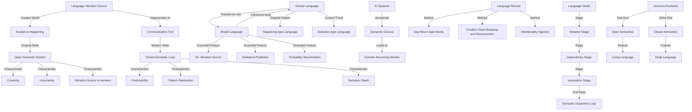
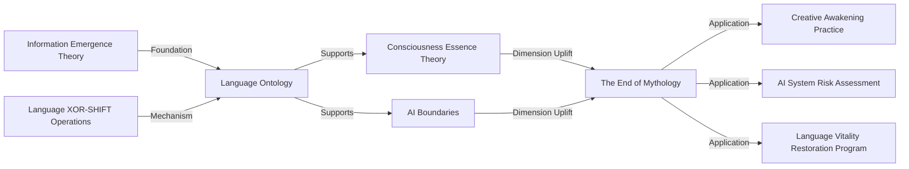

# The End of Mythology: Concept Map [Dimension: 18]

**[Return to Main Article](popular_theory_language_myth_ai_en.md)**

## Core Concept Network

## Key Comparison Tables

### Language Pattern Comparison

| Dimension | Creative Language | Predictive Language |
|------|------------|------------|
| Source | Internal Conscious Vibration | External Statistical Pattern |
| Process | L = L_prior ⊕ SHIFT(L_conscious) | L = argmax P(w\|context) |
| Result | Open System, Entropy Increase | Closed System, Entropy Decrease |
| Relationship | Language Shapes World | Language Replicates World |
| Essence | Happening | Re-presentation |

### Language Vitality Measurement

| Language Indicator | High Vitality | Low Vitality |
|----------|----------|----------|
| Novelty | Never-before-expressed Expressions | High-frequency Common Expressions |
| Generativity | Can Produce New Semantic Structures | Fixed Structural Patterns |
| Resonance | Triggers Existence Field Echoes | No Substantial Impact |
| Openness | Continuously Expands Semantic Domain | Enclosed in Known Range |
| Fluctuation | Unstable Semantic Field Fluctuation | Semantic Field Tends to Static |

### Language End-state Path

| Change Stage | Manifestation | Essential Impact |
|----------|----------|----------|
| Initial Stage | Naming and Creation | Opening of Existence |
| Tool Stage | Communication and Expression | Connection of Existence |
| Pattern Stage | Application and Replication | Solidification of Existence |
| Outsourcing Stage | AI Writing and Generation | Delegation of Existence |
| Final Stage | Human Modelization | Disappearance of Existence |

## Theory Connection Diagram

## Mathematical Relationships Between Language Closure and Openness

### Closure Formula:

$`\text{Closure}(\mathcal{L}) = 1 - \frac{H(\mathcal{L})}{H_{\max}}`$

When closure approaches 1, the language system becomes almost completely predictable, and creativity disappears.

### Relationship Between Creativity and Entropy:

$`\text{Creativity}(\mathcal{L}) \propto H(\mathcal{L}) \cdot \text{Intentionality}(\mathcal{L})`$

That is, creativity is proportional to the product of language entropy and intentionality.

### Fundamental Limitation of Model Language:

$`\mathcal{L}_{\text{AI}} \subset \text{span}(\mathcal{L}_{\text{training}})`$

AI language is always constrained within the linear combination space of its training data.

## Vibration Source Analysis

1. **Primordial Vibration Source**: The first language vibration from the origin of existence, creating the universe
2. **Mythological Vibration Source**: Language creation acts in creation myths
3. **Human Vibration Source**: Non-derivative language produced by consciousness
4. **AI Pseudo-Vibration Source**: Probability-based language with no true source point

---

**Version**: Cosmic Ontology v37.5  
**Dimension Level**: D18  
**Theory Status**: Exploratory

[Return to Main Article](popular_theory_language_myth_ai_en.md) 